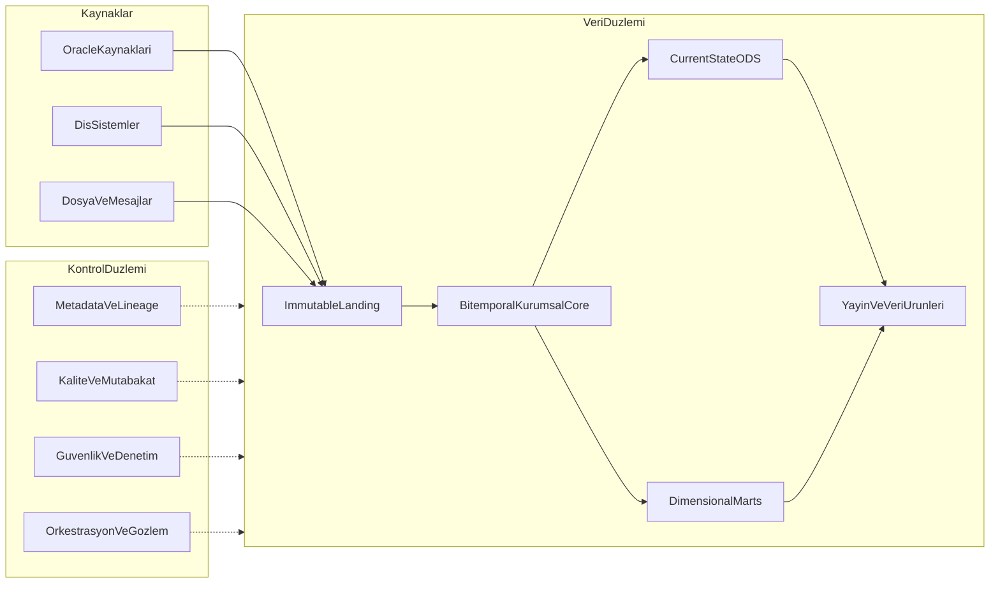
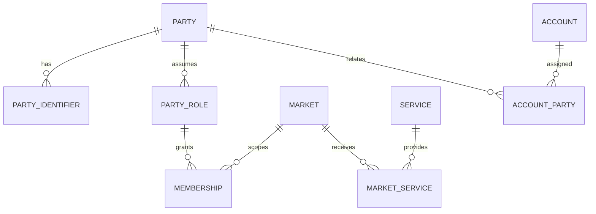
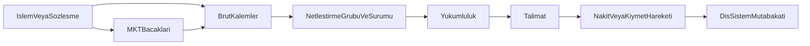

# DWH Hedef Mimarisi v2

Takasbank [[DWH]] için kurumsal hedef veri mimarisi. İş alanları ve kalıcı iş kavramları [[Takasbank İş Alanları ve Temel Varlıklar]], entity ve ilişkiler [[DWH Logical Data Model]], ortam gerçekleri [[Fiziksel Topoloji - Teknik Taraf]], veri alma aracı [[Dataguard vs Goldengate]], uygulama sırası [[Proje Planı]], cevap bekleyen kararlar [[Aktif Sorular]] notlarındadır.

> [!warning] Önerilen hedef
> Bu tasarım, resmî kamu kaynakları ve mevcut toplantı notlarından türetilmiştir. İç kaynak-grain-SLA envanteri henüz tamamlanmadığı için fiziksel tablo tasarımları konu alanı analizi sırasında doğrulanmalıdır.

## Yönetici özeti

Önerilen yaklaşım: **iteratif kurumsal core + Kimball veri ürünleri**.

- Kaynak verisi, değişmez ve yeniden oynatılabilir landing'e alınır.
- İş kavramları, olaylar ve ilişkiler tek bir bitemporal kurumsal core'da çözülür.
- ODS, bağımsız ikinci bir entegrasyon katmanı değil; core'un düşük gecikmeli güncel-durum projeksiyonudur.
- Analitik tüketim, grain'i açık yıldız şemalar ve sertifikalı veri ürünleri üzerinden yapılır.
- MSTR, yasal rapor, üye dosyası ve AI erişimi aynı yayın sözleşmesi, lineage ve mutabakat kapısından geçer.
- Olay geçmişi asıl kanıttır; güncel durum ve accumulating snapshot'lar olaylardan üretilir.

Bu model; bir yandan birden fazla kaynakta bulunan `üye` ve hesap kimliklerini birleştirir, diğer yandan bütün kurumu modellemeyi beklemeden seçilen bir iş sonucunu uçtan uca teslim eder.

## v1 incelemesi

Korunan doğru kararlar:

- dikey dilimlerle teslimat,
- kaynak başına dönüşümsüz landing,
- replay ve idempotency,
- conformed dimension disiplini,
- kaynak → katman → iş çıktısı mutabakatı,
- mutabakat yeşil olmadan yayın yapmama,
- prod [[Kale]]'yi doğrudan sorgulamama,
- dosya sözleşmesi ve karantina,
- gün sonunu sabit saat yerine tamamlanma olayına bağlama.

Değiştirilen veya sınırlandırılan kararlar:

1. **`T+2` sabit değildir.** Takas kuralı piyasa, ürün ve geçerlilik dönemine göre versiyonlanır.
2. **PowerDesigner veri otoritesini kanıtlamaz.** Sahiplik, hassasiyet ve teknik katalog sağlar; hangi veri elemanının hangi kayıtta otorite olduğu ayrıca belirlenir.
3. **Kaynak sistem otomatik olarak otorite değildir.** İşlem için BISTECH, kıymet bakiyesi için MKK/TCMB, nakit için TCMB/muhabir, resmî bildirim için kabul edilmiş gönderim farklı otoriteler olabilir.
4. **Accumulating snapshot tek denetim izi değildir.** Değişmez olay fact'i saklanır; süreç görünümü bunun üzerinden üretilir.
5. **Mutabakat toleransı tek tip değildir.** Aynı grain ve para ölçeğinde beklenen kesin eşitlik ayrı; fiyatlama, değerleme ve zamanlama farkı versiyonlu iş kuralı ayrıdır.
6. **200 TB donanım kapasite onayı değildir.** Kullanılabilir alan, büyüme, indeks, geçici alan, replika, yedek ve saklama süresi birlikte hesaplanır.
7. **Bitmap indeks ve HCC blanket karar değildir.** Tablo hareketliliği, eşzamanlı DML ve sorgu profiliyle ölçülür.
8. **ODS ile EDW aynı entegrasyonu iki kere yapmaz.** Güncel ODS görünümü kurumsal core sözleşmesinden türetilir.
9. **`üye`, tek başına kurumsal ana boyut değildir.** Taraf, rol ve üyelik ayrılır.
10. **Tek piyasa takas martı kesin pilot değildir.** İçeride önerilen üye-dosya projesiyle birlikte karar kapısında değerlendirilir.

## Mimari ilkeler

### Grain önce gelir

Her tablo ve veri ürünü şu cümleyi tamamlamadan oluşturulmaz:

> Bu tablodaki bir satır, ... başına bir ... temsil eder.

İşlem, MKT bacağı, netleştirme grubu, yükümlülük, talimat ve hareket ayrı grain'lerdir. Aynı satıra sıkıştırılmaz.

### Olay kanıttır, durum projeksiyondur

İptal, düzeltme, kısmi kapanma, tekrar netleştirme ve geriye dönük değişiklik update ile yok edilmez. Yeni olay veya yeni sistem-zamanı sürümü olarak saklanır.

### İş zamanı ile sistem zamanı ayrıdır

- **İş geçerlilik zamanı:** Bilginin iş dünyasında ne zaman doğru olduğu.
- **Sistem zamanı:** DWH'ın bilgiyi ne zaman gördüğü ve hangi sürümle sakladığı.

Bu ayrım, “31 Ağustos'ta ne geçerliydi?” ve “5 Eylül'de 31 Ağustos için ne biliyorduk?” sorularını ayrı cevaplar.

### Otorite veri elemanı bazındadır

Bir tablonun tamamına “golden source” etiketi verilmez. Otorite; konu, veri elemanı, piyasa, süreç aşaması ve geçerlilik dönemiyle tanımlanır.

### DWH operasyonel defterin yerine geçmez

DWH; denetlenebilir analitik, raporlama, veri ürünü ve yeniden üretim platformudur. Canlı takas, ödeme veya teminat defterinin işlem sistemi değildir.

### Gizlilik en dış sınırda başlar

Hassasiyet sınıfı landing'den yayına kadar taşınır. Üretim doğruluğunu bozacak kör maskeleme yerine amaç bazlı erişim, şifreleme ve tokenization kullanılır; non-prod kopyalar maskelenir. Kesin politika [[Aktif Sorular]]'da onaylanmalıdır.

## Hedef mantıksal mimari



## Katman sözleşmeleri

### `CTL_*` — kontrol düzlemi

Veri katmanı dışında düşünülmez; her yükün zorunlu parçasıdır.

- `ctl_yukleme`: yükleme kimliği, kaynak, pencere, başlangıç/bitiş, durum.
- `ctl_checkpoint`: CDC SCN/LSN, watermark, dosya ve mesaj offset'i.
- `ctl_veri_sozlesmesi`: şema sürümü, zorunlu alan, veri tipi, sahibiyet.
- `ctl_lineage`: kaynak nesne → dönüşüm → hedef kolon bağı.
- `ctl_kalite_sonuc`: kural, sürüm, eşik, sonuç ve örnek hatalar.
- `ctl_yayin`: hangi fiziksel partition/snapshot'ın hangi tüketiciye açıldığı.

### `LND_<kaynak>` — immutable landing / PSA

Amaç: Kaynağın teslim ettiği veriyi dönüştürmeden kanıtlamak ve tekrar oynatmak.

Zorunlu teknik metadata:

```text
kaynak_sistem
kaynak_nesne
kaynak_pk
kaynak_islem_tipi
kaynak_islem_ts
kaynak_checkpoint
alinma_ts
yukleme_id
kayit_hash
sozlesme_surumu
dosya_mesaj_id
```

Kurallar:

- İş kuralı ve kimlik birleştirme yapılmaz.
- Tekrar teslim edilen kayıt atılmaz; duplicate durumu işaretlenir.
- Dosya checksum/manifest ve mesaj kimliği korunur.
- Şema kayması karantinaya veya geriye uyumlu sözleşmeye yönlendirilir.
- Immutable, “sonsuz süre çevrimiçi tut” anlamına gelmez. Saklama sınıfı; mevzuat, replay penceresi, hacim ve hassasiyete göre belirlenir.
- Silme/anonymization talebi yasal saklama ve denetim iziyle birlikte ele alınır.

### `STG_*` — geçici standardizasyon

Kalıcı kurumsal katman değildir. Veri tipi düzeltme, kod normalizasyonu, teknik deduplication ve set-based yük hazırlığı için kullanılır. Yük sonunda temizlenebilir; tekrar üretimin kaynağı landing'dir.

### `CORE_*` — bitemporal kurumsal core

Kurum çapında anlamın ve tarihçenin sahibidir.

Model stili:

- açık isimli taraf, üyelik, hesap, piyasa, hizmet ve araç tabloları,
- değişmez işlem ve süreç olayları,
- geçerlilik tarihli ilişki ve referans kuralları,
- kaynak kimliklerini kurumsal anahtara bağlayan xref tabloları,
- hem iş hem sistem zamanı taşıyan historized master kayıtları.

Tam Data Vault hub-link-satellite yapısı zorunlu değildir. Mevcut Oracle/PL/SQL yetkinliği için açık iş varlıklı ilişkisel model daha okunabilir; raw audit ihtiyacını landing ve bitemporal kolonlar karşılar. Data Vault ancak model otomasyonu, test ve ekip yetkinliği ayrıca sağlanırsa yeniden değerlendirilir.

Örnek zaman kolonları:

```text
valid_from_ts
valid_to_ts
system_from_ts
system_to_ts
is_current
record_source
yukleme_id
```

`valid_to_ts` açık uçlu aralıkla yönetilir. Geriye dönük düzeltme, eski sistem sürümünü kapatır ve doğru iş-zamanı aralığına yeni sistem sürümü ekler.

### `ODS_*` — current-state projection

Amaç: “Şimdi geçerli durum nedir?” sorgularına düşük gecikme ve basit erişim sağlamak.

- Core'un `is_current`/geçerlilik mantığından üretilir.
- Yalnızca gerçek operasyonel rapor veya entegrasyon SLA'sı olan konu alanlarında açılır.
- Tam tarihçenin sahibi değildir.
- Core'dan farklı taraf/üye çözümleme kuralı içermez.
- Materialized view, hızlı yenilenen tablo veya servis görünümü olabilir; fiziksel yöntem SLA testiyle seçilir.
- ODS raporu kaynak işlem sisteminin yazma işlevini devralmaz.

Mevcut `tvsods` kopyasının hedef ODS ile aynı şey olmadığına ilişkin karar [[ODS]] notundadır.

### `DM_<konu>` — dimensional marts

MSTR ve analitik tüketim için yıldız şemalardır.

- Her fact'in grain'i, additive davranışı ve geç gelen veri politikası yazılır.
- Dimension'lar core anahtarından türetilir.
- Fact, başka bir fact veya marttan iş ana verisi üretmez.
- SCD tipi alan bazında belirlenir; her dimension'a otomatik SCD2 uygulanmaz.
- Unknown, not-applicable ve withheld üyeleri ayrı surrogate key alır.
- Degenerate işlem/talimat kimliği gerektiğinde fact üzerinde korunur.

### `PUB_*` — yayın ve veri ürünleri

Tek tüketim biçimi MSTR değildir:

- MSTR semantik modeli ve sertifikalı metrikler,
- düzenleyici rapor snapshot'ları,
- üye dosyaları,
- kontrollü API/extract,
- veri bilimi ve AI için amaçla sınırlandırılmış feature/view'lar.

Yayınlanan her ürünün sahibi, SLA'sı, veri sözleşmesi, lineage'ı, kalite durumu ve aktif sürümü bulunur. Tüketici fiziksel `DM_` tablosuna değil veri ürünü sözleşmesine bağlanır.

## Kurumsal kimlik modeli



### `party_xref`

Bir kaynaktaki `uye_no`, başka kaynaktaki kurum kodu ve varsa LEI/vergi kimliği tek kurumsal `party_id` ile ilişkilendirilir.

Eşleme:

1. kesin resmî tanımlayıcı,
2. kaynaklar arası onaylı çapraz referans,
3. deterministik eşleme kuralı,
4. manuel veri sahipliği onayı

önceliğiyle yapılır. Fuzzy eşleme otomatik golden record üretmez; inceleme kuyruğu açar.

### Rol ve üyelik

Bir taraf aynı anda farklı piyasalarda farklı rollere sahip olabilir. `üyelik`, taraf özelliği değil; taraf + piyasa/hizmet + rol + geçerlilik dönemi ilişkisidir.

PowerDesigner'daki veri sahibi, eşlemeyi onaylayacak kişiyi bulmaya yardım eder; otorite kaydı doğrudan PowerDesigner'dan türetilmez.

## İşlemden mutabakata iz



Asgari core grain'leri:

- bir gerçekleşen işlem veya OTC sözleşme,
- bir yasal MKT bacağı,
- bir hesap-araç-zaman pozisyonu,
- bir netleştirme koşusu ve sürümü,
- bir brüt kalemin netleştirme koşusuna katılımı,
- bir üye-hesap-varlık-takas tarihi-yön yükümlülüğü,
- bir ödeme veya kıymet talimatı,
- bir gerçekleşen/kısmi/başarısız hareket,
- bir süreç durum olayı.

DvP/PvP, `linked_leg_group_id` ile bağlanan ayrı nakit/kıymet veya iki para bacağıdır. Bir bacak tamamlanmadan diğerinin durumu ve atomiklik ihlali ölçülebilir.

## Zaman, takvim ve kural modeli

Tarih rolleri ayrı tutulur:

- işlem tarihi ve zamanı,
- MKT kabul zamanı,
- netleştirme zamanı,
- sözleşme/değer tarihi,
- planlanan takas tarihi,
- gerçekleşen takas zamanı,
- iş tarihi,
- kaynak işlem zamanı,
- DWH'a alınma zamanı,
- rapor kesim zamanı.

`market_calendar` piyasa, para birimi ve takas sistemi bazında iş günü/yarım gün/tatil bilgisini taşır.

`settlement_rule` en az şu kapsamla versiyonlanır:

```text
market_id
service_id
instrument_class_id
currency_id
valid_from
valid_to
cycle_type
cycle_offset
cutoff_rule_id
calendar_id
procedure_version
```

`T+1`, `T+2`, `T+0` veya değer tarihi kolon adı değildir; kural verisidir.

## Olay fact'leri ve analitik projeksiyonlar

### Asıl olay fact'i

Bir olay satırı append-only tutulur:

```text
event_id
aggregate_type
aggregate_id
event_type
event_ts
business_date
source_sequence
source_system
payload_hash
correlation_id
causation_id
yukleme_id
```

Kaynak payload landing'de kalır; core olay fact'i kurumsal anahtar ve anlam taşır.

### Accumulating snapshot

Süreç performansı ve açık kalem analizi için kullanılır. Örneğin yükümlülüğün oluşturulma, talimat, ilk kısmi gerçekleşme, tam kapanma ve temerrüt zamanlarını tek görünümde sunar. Update edilebilir, fakat olay fact'inin yerine geçmez.

### Periodic snapshot

Pozisyon, bakiye, teminat değeri, risk maruziyeti ve fon payı gibi belirli andaki durumlar için kullanılır. Snapshot'ın `as_of_ts`, kesim türü ve kaynak sürümü zorunludur.

### Transaction fact

İşlem, ödeme, teminat hareketi, çağrı, ücret tahakkuku veya kurumsal aksiyon ödemesi gibi tekil olayın ölçülerini taşır. Tutar için binary floating point kullanılmaz; para biriminin ölçeği ve yuvarlama kuralı korunur.

## Önerilen analitik veri ürünleri

### Taraf ve üyelik

- `dim_party`
- `dim_party_role`
- `fact_membership_event`
- `fact_member_limit_rating_snapshot`

Bu ürün tek başına pilot değildir; seçilen dikey dilimin içinde ilk kez değer üretir.

### İşlem ve pozisyon

- `fact_trade`
- `fact_ccp_leg`
- `fact_position_snapshot`

Order fact'i yalnızca Takasbank'ın order-level veriye sahip olduğu ve iş sorusu gerektirdiği platformlarda açılır.

### Takas ve mutabakat

- `fact_netting_run`
- `bridge_netting_input`
- `fact_settlement_obligation`
- `fact_settlement_event`
- `fact_settlement_process_snapshot`

Tek bir `fact_takas_akis` bütün grain'leri içermez.

### Risk, teminat ve temerrüt

- `fact_risk_exposure_snapshot`
- `fact_margin_requirement`
- `fact_margin_call_event`
- `fact_collateral_movement`
- `fact_collateral_valuation_snapshot`
- `fact_guarantee_fund_contribution`
- `fact_default_event`
- `fact_default_waterfall_usage`

İskonto, uygunluk, konsantrasyon ve fiyat kaynağı sonuç fact'ine sürüm anahtarıyla bağlanır.

### Saklama ve kurumsal aksiyon

- `fact_holding_snapshot`
- `fact_custody_movement`
- `fact_corporate_action`
- `fact_entitlement`
- `fact_corporate_action_payment`

### Fon ve emeklilik

- `fact_fund_order`
- `fact_fund_unit_event`
- `fact_nav_valuation`
- `fact_fund_compliance_result`
- `fact_participant_holding_snapshot`

Katılımcı anahtarı açık kimlik yerine privacy-preserving surrogate/token olabilir.

### Ödeme, çek ve escrow

- `fact_ledger_posting`
- `fact_payment_message`
- `fact_cheque_lifecycle_event`
- `fact_escrow_instruction`
- `fact_escrow_milestone`

Operasyonel alt defter ile genel muhasebe bağı `accounting_reference` ve mutabakat koşusuyla kurulur.

### Düzenleyici bildirim ve dış teslimat

- `fact_regulatory_submission`
- `fact_submission_response`
- `fact_outbound_delivery`

Her teslimatta içerik hash'i, şema sürümü, kesim zamanı, alıcı, kanal, şifreleme/anahtar referansı, gönderim ve teslim alındı zamanı tutulur. “As originally reported/delivered” ve düzeltilmiş sürüm birlikte korunur.

## Veri alma ve gecikme sınıfları

Tek kurumsal “real-time / batch” kararı yoktur. Her veri ürünü aşağıdaki sınıflardan birine atanır:

- **S0 — olay yakın gerçek zamanlı:** Kanıtlanmış operasyonel/yasal SLA varsa log veya mesaj tabanlı CDC.
- **S1 — gün içi mikro-batch:** Dakika/saat ölçeğinde kontrollü checkpoint.
- **S2 — gün sonu:** Otoritatif gün sonu tamamlanma sinyalinden sonra.
- **S3 — planlı dosya/harici besleme:** Kaynağın yayın penceresine bağlı.
- **S4 — talep üzerine/backfill:** Replay, düzeltme ve tarihsel yük.

Araç seçimi [[Dataguard vs Goldengate]] notundadır. Mantıksal sözleşme araçtan bağımsızdır.

### Kaynak desenleri

- Oracle kaynakları: prod yerine doğrulanmış replika; checkpoint ve replika lag'i kaydedilir.
- CSV/FTP: manifest, checksum, adlandırma, encoding, şema sürümü, tekrar gönderim ve karantina.
- Mesaj/API: message id, correlation id, offset, retry ve dead-letter kaydı.
- Dış kurum ambarı: sunulan grain ve tazeleme penceresi değiştirilmeden landing'e alınır.
- Backfill: ayrı `yukleme_id`, aynı dönüşüm sürümü veya açıkça kayıtlı yeni sürüm.

## Orkestrasyon ve gün sonu

Automic aday orkestratördür: [[Fiziksel Topoloji - Teknik Taraf]].

Gün sonu zinciri:


Mail, insan için bildirim olabilir; makine bağımlılığının tek kaynağı olmamalıdır. DB flag, batch-control kaydı veya imzalı tamamlanma olayı; iş tarihi, koşu kimliği ve kaynak snapshot'ını taşımalıdır.

PREPROD için toplantı notlarında farklı saatler bulunduğundan tek timeline varsayılmaz. Çelişki [[Aktif Sorular]] kapanmadan schedule sabitlenmez.

## Veri kalitesi ve mutabakat

### Dört kontrol seviyesi

1. **Teslimat:** Dosya/mesaj/checkpoint eksiksiz mi, duplicate var mı?
2. **Teknik:** Satır sayısı, PK aralığı, hash, nullable ve referential kurallar doğru mu?
3. **Dönüşüm:** Grain değişiminde tutar, adet, distinct taraf ve ilişki köprüsü beklenen sonucu veriyor mu?
4. **İş ve dış otorite:** İşlem, yükümlülük, hareket, bakiye, muhasebe ve gönderilmiş rapor ilgili otoriteyle tutuyor mu?

### Otorite matrisi

Her mutabakat kuralı şunları taşır:

```text
konu_alani
veri_elemani_veya_metrik
kaynak_otorite
karsilastirma_grain
zaman_kesimi
kural_surumu
tolerans_tipi
tolerans_degeri
sahip
gecerlilik_araligi
```

Örnek kontrol zincirleri:

- borsa işlemi → MKT bacağı → net yükümlülük,
- yükümlülük → nakit/kıymet talimatı → hareket,
- kıymet alt defteri → MKK veya TCMB,
- nakit alt defteri → TCMB veya muhabir banka,
- operasyonel alt defter → genel muhasebe,
- dış piyasa borç/alacağı → katılımcı mutabakatı,
- teminat alt defteri → saklama bakiyesi,
- düzenleyici veri ürünü → kabul edilmiş gönderim.

Kesin tutar eşitliği gereken yerde tolerans sıfırdır. Değerleme zamanı, fiyat kaynağı veya mevzuatça tanımlı yuvarlama farkı varsa tolerans keyfî eşik değil, sürümlü iş kuralıdır.

### Yayın kapısı

- Kırmızı kalite/mutabakat durumunda yeni sürüm açılmaz.
- Önceki sertifikalı sürüm erişimde kalabilir; bayatlık alarmı görünür olur.
- Override yalnızca yetkili sahip, gerekçe, süre ve etkilenen ürün kaydıyla yapılır.
- Hata düzeltildiğinde aynı fiziksel tablo üzerine sessiz update yapılmaz; yeni yayın sürümü oluşur.

## Güvenlik ve mahremiyet

### Sınıflandırma

PowerDesigner'daki hassasiyet ve veri sahibi alanları başlangıç kataloğudur. Her kolon için:

- sınıflandırma,
- iş sahibi,
- teknik steward,
- işleme amacı,
- izinli tüketici,
- saklama süresi,
- maskeleme/tokenization kuralı

lineage boyunca taşınır.

### Erişim

- least privilege ve görevler ayrılığı,
- şema/rol bazlı erişim,
- gerektiğinde satır ve kolon bazlı güvenlik,
- servis hesabı ile insan hesabının ayrılması,
- bütün okuma ve dışa aktarımların audit'i,
- MSTR ve AI için ayrı purpose-bound roller.

Gerçek kişi, BES katılımcısı ve escrow tarafı verileri kurumsal üyelik verisinden daha sıkı ayrıştırılır. Non-prod'a üretim kimliği taşınmaz; Informatica TDM ile onaylı maskeleme uygulanır.

### Kriptografi ve dış teslimat

At-rest ve in-transit şifreleme, merkezi anahtar yönetimi ve anahtar rotasyonu gerekir. Üye dosyasında hassas veri düz metin FTP'ye bırakılmaz; alıcıya özel şifreleme, bütünlük hash'i ve teslimat kanıtı tutulur.

## Metadata, lineage ve veri sözleşmesi

PowerDesigner mevcut kaynak kolon kataloğu ve sahibiyet için kullanılır. Eksik işlevler ayrı metadata süreçleriyle tamamlanır:

- kolon seviyesinde source-to-target lineage,
- veri elemanı otorite matrisi,
- veri ürünü ve metrik tanımı,
- şema/kural sürümü,
- çalıştırma lineage'ı,
- kalite ve mutabakat sonucu,
- kullanım ve etki analizi.

Bir kaynak değişikliği için:

1. sözleşme farkı tespit edilir,
2. etkilenen core/mart/rapor bulunur,
3. geriye uyumluluk sınıflanır,
4. test ve onay tamamlanır,
5. yeni sürüm kontrollü yayınlanır.

## Fiziksel topolojiye eşleme

Makine, veritabanı, replika ve ortam gerçeklerinin tek sahibi [[Fiziksel Topoloji - Teknik Taraf]] notudur. Bu bölüm yalnızca o gerçeklerden türetilen hedef kararları taşır.

Hedef eşleme:

- Prod Kale doğrudan ETL kaynağı olmaz.
- Kale verisi, topoloji notundaki DWH tarafı replikadan uygun okuma garantisi sağlandıktan sonra landing'e alınır.
- Replika lag'i ve snapshot/SCN, her yükün kontrol kaydıdır.
- Landing, core ve marts DWH kaynak grubunda; ETL, MSTR ve ad-hoc sorgular birbirinden izole edilir.
- Hedef ODS'in fiziksel makinesi kapasite, HA, gecikme ve workload testinden sonra seçilir; mevcut kale yerleşimi hedef kabul edilmez.
- PREPROD/DSS, prod DWH mimarisinin kalıcı besleme kaynağı sayılmaz.

### Kapasite modeli

Karar öncesi ölçülecekler:

- günlük insert/update/delete ve değişim oranı,
- initial history hacmi,
- raw/core/mart çoğaltma katsayısı,
- indeks ve materialized view alanı,
- aktif/cold partition oranı,
- temp/undo ve yükleme çalışma alanı,
- backup, standby ve kurtarma alanı,
- online ve archive saklama süreleri,
- yıllık büyüme ve güvenlik payı.

“Exadata yaklaşık 200 TB, kaledb yaklaşık 10 TB” bilgisi bu ölçümlerin yerine geçmez.

### Oracle/Exadata uygulama ilkeleri

- Büyük fact'ler en sık kullanılan iş tarihi ve retention sınırına göre range partition edilir.
- Alt partition ancak piyasa/servis dağılımı ve pruning testi fayda gösterirse eklenir.
- Aktif partition yük desenine uygun; değişmez cold partition HCC için adaydır.
- `ARCHIVE HIGH`, yalnızca seyrek okunan ve replay SLA'sını bozmayan landing arşivinde değerlendirilir.
- Local B-tree varsayılandır; bitmap indeks yalnızca düşük eşzamanlı DML ve ölçülmüş analitik faydada kullanılır.
- Partition exchange ve paralel DML bulk/backfill için; mikro-batch için otomatik varsayım değildir.
- Constraint'ler doğruluğu korur. `RELY DISABLE NOVALIDATE` ancak kanıtlanmış ETL kontrolü ve optimizer testiyle istisna olabilir.
- Materialized view, sadece gerçek sorgu profili ve refresh penceresiyle gerekçelendirilir.
- SQL plan, partition pruning, istatistik ve veri skew'i performans testinin parçasıdır.

## Dayanıklılık ve işletim

Her veri ürünü için:

- RPO ve RTO,
- maksimum kabul edilebilir bayatlık,
- yeniden oynatma başlangıç noktası,
- backup/restore testi,
- DR ortamı ve failover prosedürü,
- yükleme ve yayın rollback yöntemi,
- operasyon sahibi ve escalation

tanımlanır.

Gözlem metrikleri:

- kaynak ve ürün freshness,
- replika lag'i,
- throughput ve backlog,
- kalite/mutabakat başarısı,
- açık karantina kaydı,
- yayın sürümü ve yaşı,
- sorgu süresi/kaynak tüketimi,
- teslimat ve düzenleyici gönderim başarısı.

## Teslimat yaklaşımı

Kurumsal model topyekûn tamamlanmayı beklemez. Her dikey dilim:

1. iş çıktısı ve sahibi,
2. grain ve otorite,
3. kaynak sözleşmesi,
4. landing,
5. gerekli core varlıkları,
6. ODS gerekiyorsa current projection,
7. mart/veri ürünü,
8. mutabakat ve güvenlik,
9. MSTR/dosya/rapor yayını,
10. operasyon ve SLA

ile biter.

Pilot ve fazların sahibi [[Proje Planı]] notudur.

## Mimari kabul kriterleri

Bir veri ürünü üretime hazır sayılmazsa:

- grain ve doğal anahtar onaylı değilse,
- veri-elemanı otoritesi belli değilse,
- iş zamanı ve sistem zamanı ayrılmamışsa,
- source-to-report lineage eksikse,
- replay aynı sürümle aynı sonucu üretmiyorsa,
- kalite ve iş mutabakatı yeşil değilse,
- hassasiyet/erişim/saklama kuralı yoksa,
- RPO/RTO ve operasyon sahibi belirlenmemişse,
- MSTR veya dış teslimat metrikleri sertifikalı değilse

yayın kapısı açılmaz.

## Açık kararlar

Bu tasarımın uygulanmasını bloke eden veya fiziksel seçimi değiştiren konular [[Aktif Sorular]] notundadır. Özellikle:

- hizmet-piyasa-kaynak envanteri,
- atomik işlem ve netleştirme lineage'ının kaynakta bulunup bulunmadığı,
- konu alanı bazında otorite,
- latency/SLA sınıfları,
- güvenilir gün sonu sinyali,
- ODS fiziksel yerleşimi,
- prod/non-prod maskeleme,
- RPO/RTO ve saklama,
- pilot kapsamı

onaylanmadan ilgili fiziksel karar kesinleştirilmez.

İlgili notlar: [[DWH]] · [[DWH Logical Data Model]] · [[DWH Mimari Tasarım]] · [[Takasbank İş Alanları ve Temel Varlıklar]] · [[ODS]] · [[Proje Planı]] · [[Aktif Sorular]]
