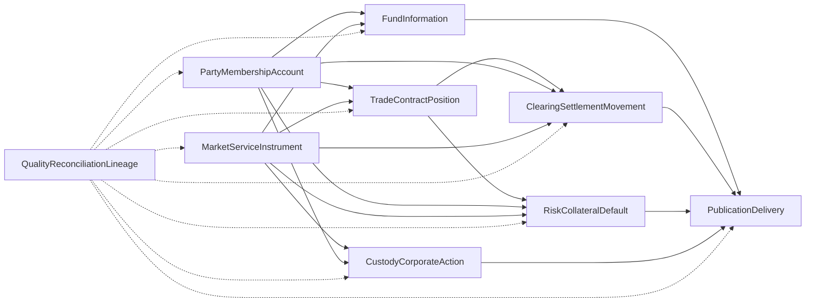
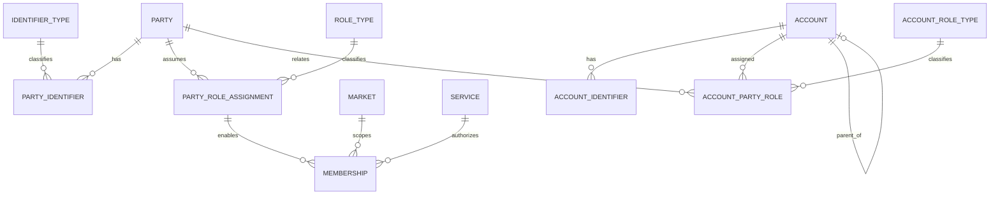
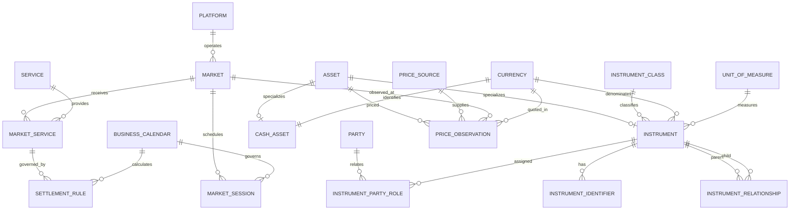
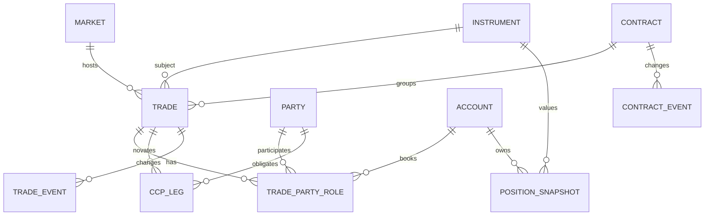
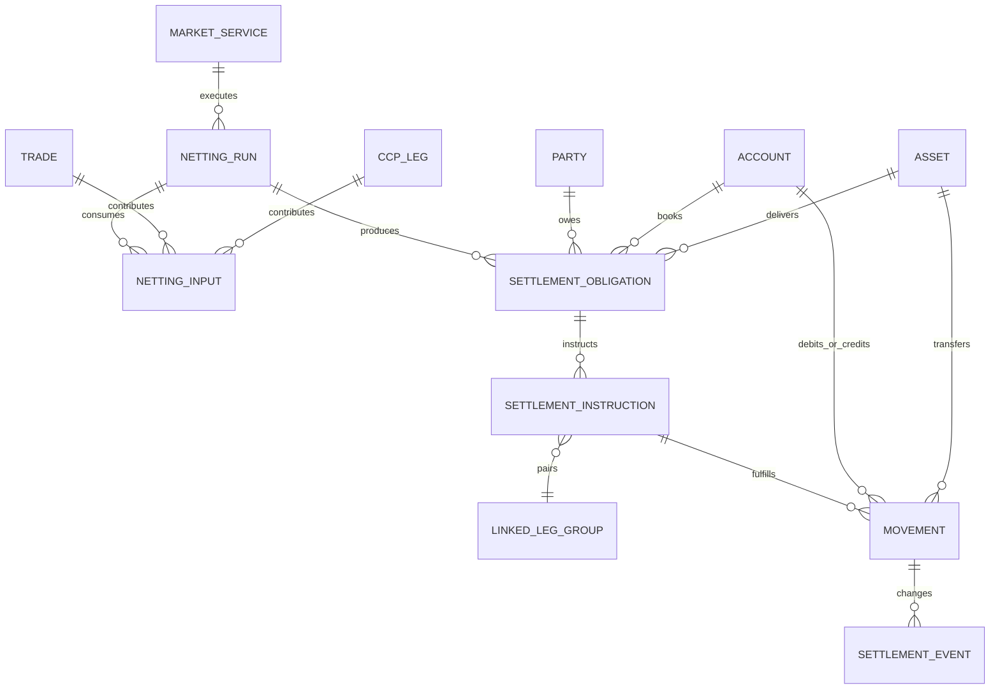
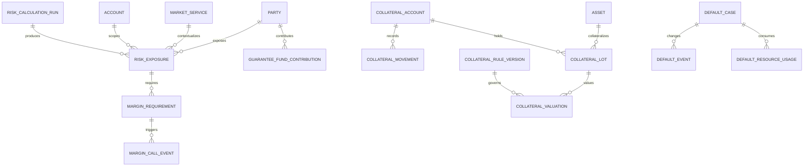
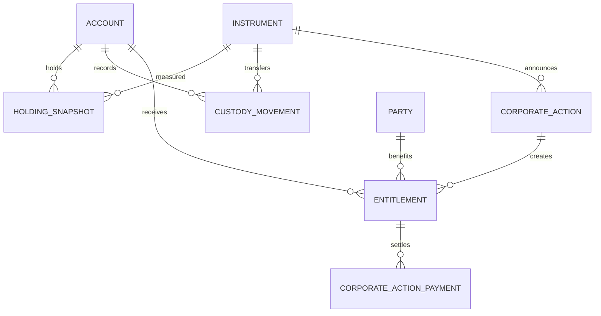
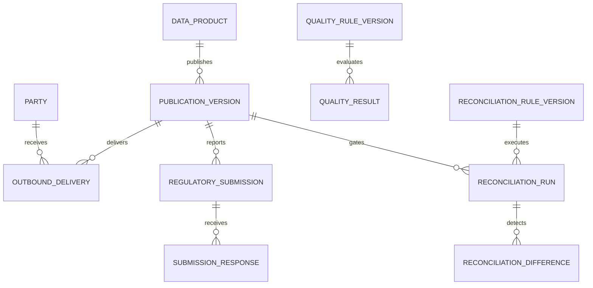
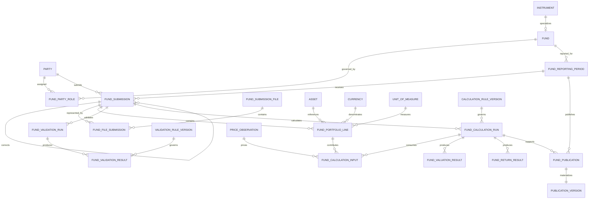
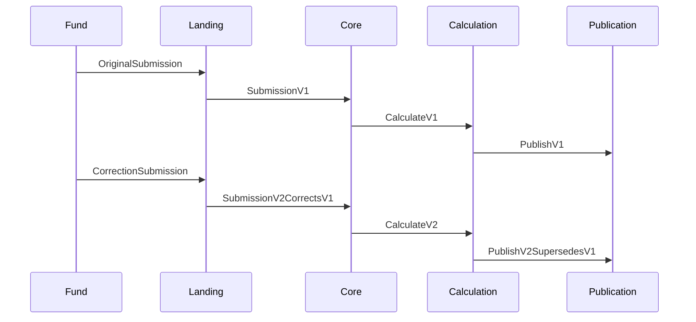

# DWH Logical Data Model

Takasbank [[DWH Hedef Mimarisi v2]] için mantıksal veri modeli. Kurumsal omurgayı tanımlar ve ilk ayrıntılı konu alanı olarak **Fon Bilgilendirme** sürecini modeller.

İş tanımları [[Takasbank İş Alanları ve Temel Varlıklar]], kaynak sunum [[DWH Sunum Temmuz 2025]], mimari çıkarımlar [[DWH Mimari Hafıza - Temmuz 2025 Sunumu]], uygulama adımları [[Proje Planı]], doğrulanması gereken konular [[Aktif Sorular]] notlarındadır.

> [!info] Mantıksal model sınırı
> Bu not entity, ilişki, grain, business key, zaman ve bütünlük kurallarını tanımlar. Oracle veri tipi, şema adı, partition, indeks, tablespace, HCC ve materialized view fiziksel model kararlarıdır; burada belirlenmez.

## Tasarım hedefleri

- Piyasa ve UG bazında çoğalan `üye`, hesap, araç ve ödeme tanımlarını ortaklaştırmak.
- İşlemi; MKT bacağı, netleştirme, yükümlülük, talimat ve hareketten ayırmak.
- Düzeltme, iptal ve geriye dönük değişikliği geçmişi ezmeden saklamak.
- Bir rapor veya dosyadaki her ölçüyü kaynak olay ve hesaplama sürümüne kadar izlemek.
- MSTR, CSV, webservis ve düzenleyici raporları aynı sertifikalı yayın varlıklarından üretmek.
- Kurumsal modeli tümüyle bitirmeyi beklemeden konu alanı bazında genişletebilmek.

## Modelleme kuralları

### Entity türleri

- **Master entity:** Taraf, hesap, piyasa, hizmet, araç ve fon gibi kalıcı iş kimliği.
- **Relationship entity:** Üyelik, taraf-hesap rolü veya piyasa-hizmet ataması gibi zaman içinde değişen çoktan çoğa ilişki.
- **Event entity:** Bildirim, işlem, hareket, düzeltme veya teslimat gibi gerçekleşmiş ve geri alınmayan olay.
- **Snapshot entity:** Pozisyon, bakiye veya değerleme gibi belirli `as_of` anındaki durum.
- **Rule entity:** Takas, fiyatlama, validasyon veya hesaplama kuralının yürürlük tarihli sürümü.
- **Run entity:** Netleştirme, hesaplama, validasyon, mutabakat veya yayın çalıştırması.

### Kimlikler

Her kurumsal entity:

- kaynaklardan bağımsız bir `*_id`,
- varsa doğal business key,
- bir veya daha fazla kaynak kimliği,
- `record_source`,
- ilk görülme zamanı

taşır.

Kaynak PK kurumsal PK yapılmaz. `SOURCE_IDENTIFIER` ilişki varlıkları kaynak kodlarını kurumsal kimliğe bağlar.

### Zaman

Mutable master, relationship ve rule entity'lerinde:

```text
valid_from_ts
valid_to_ts
system_from_ts
system_to_ts
```

bulunur.

Event entity'leri update edilmez; düzeltme veya iptal yeni event'tir. Snapshot entity'leri `as_of_ts` ve snapshot türü taşır.

### Para ve ölçü

- Tutar, para birimi olmadan anlamlı değildir.
- Miktar, ölçü birimi olmadan anlamlı değildir.
- Fiyat; kotasyon para birimi, fiyat birimi ve fiyat zamanı taşır.
- Dönüşüm sonucu orijinal tutar/miktarı ezmez.

### Kaynak ve lineage

Her event, snapshot ve hesaplama sonucu:

- `source_record_ref`,
- `load_run_id`,
- `rule_version_id`,
- gerekiyorsa `calculation_run_id`

ile kaynağına bağlanabilir.

## Kurumsal domain haritası



Model paketleri bağımsız silo değildir. Ortak party, account, market, service, instrument, currency, unit ve calendar kimliklerini paylaşır.

## Paket 1 — Party, rol, üyelik ve hesap



### `PARTY`

**Grain:** Bir tüzel kişi, gerçek kişi veya kurum kimliği.

**Business key:** Tek başına evrensel business key yoktur. Onaylı kimlik eşleme sonucu kurumsal `party_id` oluşur.

**Temel özellikler:**

- party type,
- legal/display name,
- residence/country,
- lifecycle status.

LEI, vergi kimliği ve kaynak üye kodu doğrudan PARTY üzerinde tekrar eden kolonlar değil, `PARTY_IDENTIFIER` kayıtlarıdır.

### `PARTY_IDENTIFIER`

**Grain:** Bir party'nin belirli tür ve otorite tarafından verilmiş bir kimliği.

**Örnek türler:** LEI, vergi kimliği, MERSİS, Takasbank üye kodu, kaynak kurum kodu.

**Bütünlük:**

- Aynı identifier type + issuer + value aynı geçerlilik anında iki aktif party'ye bağlanamaz; istisna inceleme kaydı gerektirir.
- Maskelenmiş/tokenized değer, orijinal identifier'ın yeni türü olarak işaretlenir; aynı alanı ezmez.

### `PARTY_ROLE_ASSIGNMENT`

**Grain:** Bir party'nin belirli kapsam ve geçerlilik dönemindeki rolü.

**Örnek roller:** Üye, MKT üyesi, fon kurucusu, fon işletmecisi, dağıtıcı, yatırımcı, ihraççı, muhabir banka.

Rol, PARTY üzerinde boolean kolon yapılmaz.

### `MEMBERSHIP`

**Grain:** Bir party rolünün belirli market/service kapsamındaki üyelik veya yetkisi.

**Temel ilişkiler:** PARTY_ROLE_ASSIGNMENT, MARKET, SERVICE.

**Özellikler:** membership type, direct/general indicator, admission date, suspension/termination reason.

### `ACCOUNT`

**Grain:** İşlem, nakit, kıymet, saklama veya teminatın izlenebildiği kurumsal hesap.

**Business key:** Account authority + account number + account type + validity.

Hesabın sahibi veya amacı ACCOUNT kolonuna gömülmez; `ACCOUNT_PARTY_ROLE` ile tarihçeli ilişkilendirilir.

### `ACCOUNT_PARTY_ROLE`

**Grain:** Bir party'nin bir account üzerindeki belirli tarih aralığındaki rolü.

**Örnek roller:** Owner, beneficial owner, operator, custodian, clearing member, customer.

Portföy/müşteri ve serbest/bloke gibi hesap rolleri `ACCOUNT_ROLE_TYPE` ile ifade edilir.

## Paket 2 — Piyasa, platform, hizmet, takvim ve araç



### `PLATFORM`

**Grain:** İşlem veya hizmetin işletildiği teknik/iş platformu.

Platform ile piyasa aynı entity değildir. Bir platform birden fazla market taşıyabilir.

### `MARKET`

**Grain:** Ekonomik işlemlerin gerçekleştiği piyasa veya işlem yeri.

**Business key:** Market authority + market code.

Piyasa sahibi, platform ve hizmet kabiliyeti ayrı ilişkilerden gelir.

### `SERVICE`

**Grain:** Takasbank'ın sunduğu tek iş kabiliyeti.

**Örnekler:** Clearing, CCP, collateral management, custody, payment, reporting.

### `MARKET_SERVICE`

**Grain:** Bir markette belirli geçerlilik döneminde sunulan service.

Bu ilişki “her piyasada MKT vardır” varsayımını engeller. Düzenleyici dayanak ve yürürlük dönemi taşır.

### `MARKET_SESSION`

**Grain:** Bir marketin belirli iş tarihindeki seans veya operasyon penceresi.

**Özellikler:** session type, planned/actual open-close, cutoff, status.

Gerçek kapanış olayı ile planlanan saat ayrılır.

### `BUSINESS_CALENDAR`

**Grain:** Bir takvim için bir tarih.

Piyasa, para birimi ve ödeme sistemi takvimleri ilişkilendirilebilir. İş günü, yarım gün ve tatil kuralı içerir.

### `ASSET`

**Grain:** Hesapta tutulabilen, teslim edilebilen, fiyatlanabilen veya teminat olabilen tek varlık kimliği.

Soyut üst tiptir. En az iki alt tipi vardır:

- `INSTRUMENT`: Menkul kıymet, fon, sözleşme ürünü, emtia veya enerji ürünü.
- `CASH_ASSET`: Belirli bir currency'yi temsil eden nakit varlık.

Bu üst tip, settlement obligation ve movement üzerinde “instrument mı currency mi?” şeklinde tekrarlanan polymorphic FK oluşmasını engeller.

### `INSTRUMENT`

**Grain:** Bir finansal araç, fon, sözleşme ürünü, emtia veya enerji ürünü kimliği.

**Business key:** Otorite + identifier; ISIN her alt tipte zorunlu değildir.

### `INSTRUMENT_IDENTIFIER`

**Grain:** Bir instrument'ın belirli identifier type ve otoritedeki kimliği.

**Örnekler:** ISIN, CFI, FISN, piyasa sembolü, fon kodu.

### `INSTRUMENT_PARTY_ROLE`

**Grain:** Bir party'nin bir instrument/fund üzerindeki yürürlük tarihli rolü.

**Örnekler:** Issuer, founder, operator, portfolio manager.

### `PRICE_SOURCE`

**Grain:** Fiyatı yayımlayan veya hesaplayan tek kaynak/otorite kimliği.

Kaynak sistem ile price source aynı olmak zorunda değildir; veri bir sistemden taşınırken fiyatın iş otoritesi başka kurum veya model olabilir.

### `PRICE_OBSERVATION`

**Grain:** Asset + price source + observation timestamp + quote currency + price type için tek gözlem.

Reported price ile bağımsız/hesaplamada seçilen fiyat farklı observation/source olarak tutulur. Fiyatın sonradan düzeltilmesi eski gözlemi silmez.

### `SETTLEMENT_RULE`

**Grain:** Bir market service + instrument class + currency kapsamı için bir yürürlük dönemindeki takas kuralı.

**Özellikler:** cycle type, offset, value-date behavior, cutoff rule, calendar, procedure version.

## Paket 3 — İşlem, sözleşme ve pozisyon



### `TRADE`

**Grain:** Bir piyasada gerçekleşmiş tek ekonomik işlem.

**Business key:** Source system + market + source trade identifier.

İşlem iptal veya düzeltmesi TRADE kaydını silmez; `TRADE_EVENT` ile yaşam döngüsü oluşur.

### `TRADE_PARTY_ROLE`

**Grain:** Bir party/account'ın bir trade üzerindeki rolü.

**Örnekler:** Buyer, seller, executing member, clearing member, client.

### `CCP_LEG`

**Grain:** MKT uygulaması sonucu oluşan tek yasal işlem bacağı.

MKT hizmeti olmayan marketlerde üretilmez.

### `CONTRACT`

**Grain:** Bir veya daha fazla işlemi kapsayan ekonomik/yasal sözleşme.

OTC, repo, swap veya vadeli sözleşmede trade ile birebir olmak zorunda değildir.

### `POSITION_SNAPSHOT`

**Grain:** Account + instrument/contract + position type + `as_of_ts` başına bir durum.

İşlem toplamı değildir; kaynak veya hesaplama koşusundan üretilen snapshot'tır.

## Paket 4 — Netleştirme, yükümlülük ve mutabakat



### `NETTING_RUN`

**Grain:** Bir market service, netting set, iş tarihi ve run version için tek netleştirme koşusu.

Yeniden netleştirme yeni run version üretir; önceki sonuç silinmez.

### `NETTING_INPUT`

**Grain:** Bir trade veya CCP leg'in bir netting run'a katılımı.

Brüt tutar/miktar ve nete katkı yönü korunur.

Bir NETTING_INPUT, market service modeline göre ya TRADE ya da CCP_LEG referansı taşır; ikisini birden taşıyamaz.

### `SETTLEMENT_OBLIGATION`

**Grain:** Party + account + deliverable asset/currency + planned settlement date + direction + obligation set için tek borç/alacak.

Bir obligation birden fazla kısmi movement ile kapanabilir.

### `SETTLEMENT_INSTRUCTION`

**Grain:** Bir obligation için dış/iç mutabakat sistemine gönderilen tek talimat sürümü.

Ret, iptal ve yeniden gönderim event olarak korunur.

### `LINKED_LEG_GROUP`

**Grain:** Birlikte gerçekleşmesi gereken DvP/PvP talimat bacakları grubu.

### `MOVEMENT`

**Grain:** Bir account'ta gerçekleşen tek nakit veya varlık debit/credit olayı.

Instruction ile movement birebir olmak zorunda değildir.

## Paket 5 — Risk, teminat ve temerrüt



### Temel grain'ler

- `RISK_CALCULATION_RUN`: Bir model/rule version + scope + as-of zamanı için koşu.
- `RISK_EXPOSURE`: Party/account/market/position set + risk type + as-of zamanı.
- `MARGIN_REQUIREMENT`: Exposure + margin type + currency için hesaplanan gereksinim.
- `MARGIN_CALL_EVENT`: Çağrının oluşturulması, değiştirilmesi, karşılanması veya ihlali.
- `COLLATERAL_LOT`: Kaynakta ayrıştırılabilen tek teminat lotu.
- `COLLATERAL_MOVEMENT`: Teminat yatırma, çekme, bloke veya serbest bırakma olayı.
- `COLLATERAL_VALUATION`: Lot + as-of + price/rule version için sonuç.
- `DEFAULT_CASE`: Bir party/market service kapsamındaki temerrüt vakası.
- `DEFAULT_RESOURCE_USAGE`: Temerrüt şelalesindeki tek kaynak kullanım olayı.

Hareket ile değerleme aynı entity değildir. Bir teminat lotu hareket etmeden birçok kez değerlenebilir.

## Paket 6 — Saklama ve kurumsal aksiyon



- `HOLDING_SNAPSHOT`: Account + instrument + balance type + as-of zamanı.
- `CUSTODY_MOVEMENT`: Account + instrument için tek debit/credit olayı.
- `CORPORATE_ACTION`: Instrument + action type + event identifier.
- `ENTITLEMENT`: Corporate action + eligible party/account + right type.
- `CORPORATE_ACTION_PAYMENT`: Bir entitlement'ın tek nakit/kıymet gerçekleşmesi.

MKK, TCMB veya başka dış kayıtla yapılan kontrol modelin mutabakat paketindedir; dış bakiye holding kaydını sessizce ezmez.

## Paket 7 — Yayın, teslimat, kalite ve mutabakat



### `DATA_PRODUCT`

**Grain:** Sahibi, tüketicisi ve SLA'sı olan tek mantıksal veri ürünü.

### `PUBLICATION_VERSION`

**Grain:** Bir data product'ın belirli kesim, hesaplama ve schema version ile yayınlanan immutable sürümü.

### `OUTBOUND_DELIVERY`

**Grain:** Bir publication version'ın belirli alıcı ve kanala tek gönderim denemesi.

Retry yeni attempt oluşturur. İçerik hash'i, alıcı, kanal, gönderim ve teslim alındı zamanı korunur.

### `REGULATORY_SUBMISSION`

**Grain:** Bir publication version'ın belirli kurum, rapor türü ve reporting period için resmî gönderimi.

### `SUBMISSION_RESPONSE`

**Grain:** Düzenleyici sistemden gelen tek kabul, ret veya uyarı cevabı.

### `QUALITY_RESULT`

**Grain:** Bir quality rule version'ın belirli entity set/run üzerindeki sonucu.

### `RECONCILIATION_RUN`

**Grain:** Bir reconciliation rule version + kesim + iki karşılaştırma seti için koşu.

### `RECONCILIATION_DIFFERENCE`

**Grain:** Bir reconciliation run içindeki tek karşılaştırma anahtarı ve metrik farkı.

## Fon Bilgilendirme — ayrıntılı logical model

Bu paket [[DWH Sunum Temmuz 2025#Slayt 15 — Fon Bilgilendirme Platformu]] sürecinin kaynak isimlerinden bağımsız mantıksal karşılığıdır.

### Süreç grain zinciri

```text
Reporting period
  → submission
    → submission file
      → portfolio line
    → validation run/result
    → calculation run
      → valuation result
      → return result
    → publication version
      → CSV/API delivery
```

Her ok birebir değildir. Bir reporting period içinde birden fazla original/correction submission; bir submission üzerinde birden fazla validation/calculation run olabilir.

### ER modeli



### `FUND`

**Grain:** Tek yatırım/emeklilik fonu.

**İlişki:** `INSTRUMENT` alt tipidir; fonun genel araç tanımlayıcılarını tekrar etmez.

**Business key adayları:** Fon kodu ve varsa ISIN; otorite ve yürürlük dönemiyle birlikte.

**Fon alt tipi:** Yatırım fonu, emeklilik fonu ve diğer fon sınıfları referans veridir.

### `FUND_PARTY_ROLE`

**Grain:** Bir party'nin bir fund üzerindeki belirli geçerlilik dönemindeki rolü.

**Örnek roller:** Founder, operator, portfolio manager, custodian, distributor, pension company.

Fonun “üyesi” ile kurucusu aynı kavram yapılmaz.

### `FUND_REPORTING_PERIOD`

**Grain:** Fund + business date + reporting cycle type için tek raporlama dönemi.

**Temel özellikler:**

- planned open/cutoff,
- actual close,
- status,
- calendar reference,
- restatement state.

Saat fiziksel job'a gömülmez; bu entity veya ilişkili session/rule üzerinden yönetilir.

### `FUND_SUBMISSION`

**Grain:** Bir fund reporting period için submitting party tarafından yapılan tek original veya correction bildirimi.

**Business key:** Source system + source submission identifier.

**Temel özellikler:**

- submission type,
- received timestamp,
- business effective timestamp,
- source sequence,
- status,
- `corrects_submission_id`,
- declared reporting date.

**Bütünlük kuralları:**

- Correction, aynı fund/reporting period kapsamındaki önceki submission'a bağlanır.
- Önceki submission silinmez veya update ile içerik değiştirmez.
- Birden fazla correction zinciri sıralanabilir olmalıdır.
- “Geçerli son bildirim”, yayın cutoff'u ve sistem zamanı verilmeden hesaplanmaz.

### `FUND_SUBMISSION_FILE`

**Grain:** Kanala ulaşan tek fiziksel dosya veya mesaj envelope'u.

**Temel özellikler:**

- original file name,
- content hash,
- schema version,
- encoding,
- received channel,
- received timestamp,
- record count,
- quarantine status.

Aynı içerik hash'i tekrar gelirse kayıt atılmaz; duplicate ilişkisi kurulur.

### `FUND_FILE_SUBMISSION`

**Grain:** Bir submission'ın bir submission file içinde temsil edildiği tek ilişki.

Bir dosyada birden fazla fon bildirimi veya bir bildirimin birden fazla dosya parçası bulunması ihtimalini many-to-many olarak karşılar. Gerçek cardinality kaynak sözleşmesiyle daraltılabilir.

### `FUND_PORTFOLIO_LINE`

**Grain:** Bir fund submission içindeki tek kaynak satırı/pozisyon bileşeni.

Kesin grain dosya şemasıyla doğrulanmalıdır. Minimum aday:

```text
submission
line_number
holding_or_input_type
referenced_asset
account_or_portfolio_bucket
quantity
unit
reported_price
price_currency
reported_market_value
```

**Bütünlük:**

- Asset bulunamıyorsa satır silinmez; unresolved identifier ile kalite sonucu oluşur.
- Cash satırı instrument'a zorla bağlanmaz; ilgili CASH_ASSET'e bağlanır.
- Reported price ve DWH calculation price aynı alan değildir.
- Kaynak line number ve raw record ref korunur.

### `FUND_VALIDATION_RUN`

**Grain:** Bir submission + validation rule set version için tek kontrol koşusu.

**Özellikler:** start/end, run status, accepted/rejected indicator, rule-set version.

### `FUND_VALIDATION_RESULT`

**Grain:** Bir validation run + rule version + scope key için tek sonuç.

Scope; submission, portfolio line veya fund-period olabilir.

**Özellikler:** severity, outcome, observed value, expected value, reason code.

### `VALIDATION_RULE_VERSION`

**Grain:** Bir validasyon kuralının bir yürürlük/sürüm kaydı.

Kural metni, owner, severity, effective interval ve implementation reference taşır.

### `FUND_CALCULATION_RUN`

**Grain:** Bir accepted submission + calculation rule-set version + as-of zamanı için tek hesaplama koşusu.

Correction geldikten sonra yeni run oluşur. Eski hesaplama sonucu silinmez.

### `FUND_CALCULATION_INPUT`

**Grain:** Bir calculation run içinde belirli input role ile kullanılan tek portfolio line ve/veya price observation referansı.

Hesaplama sonucu yalnızca “submission'dan üretildi” seviyesinde kalmaz; hangi satır ve hangi fiyat gözleminin kullanıldığı kanıtlanır. Aynı portfolio line farklı price observation veya rule version ile yeniden hesaplanabilir.

### `CALCULATION_RULE_VERSION`

**Grain:** Fon değerleme/getiri hesaplama kuralının bir sürümü ve geçerlilik aralığı.

Formül, yuvarlama, price source policy, calendar ve owner referansları taşır.

### `FUND_VALUATION_RESULT`

**Grain:** Calculation run + valuation metric + currency için tek sonuç.

**Örnek metric'ler:** Portfolio value, net asset value, unit price.

Reported value ile calculated value ayrı metric/source olarak tutulur; karşılaştırma `RECONCILIATION_RUN` ile yapılır.

### `FUND_RETURN_RESULT`

**Grain:** Calculation run + return horizon + return method için tek getiri sonucu.

Horizon ve method kolon adı olarak çoğaltılmaz; referans/rule ile modellenir.

### `FUND_PUBLICATION`

**Grain:** Fund reporting period için seçilen calculation run'ın tek yayın kararı.

**Temel özellikler:**

- selected submission,
- selected calculation run,
- cutoff timestamp,
- publication status,
- approval reference,
- supersedes publication.

FUND_PUBLICATION, genel `PUBLICATION_VERSION` ile birebir ilişki kurarak CSV ve API'nin aynı sertifikalı veriyi kullanmasını sağlar.

## Fon düzeltme ve as-of davranışı

Örnek yaşam döngüsü:



Sorgu davranışları:

- **Current:** Son sertifikalı publication.
- **As of business time:** İstenen iş tarihinde geçerli sonuç.
- **As known at system time:** DWH'ın belirli anda bildiği sürüm.
- **Originally published:** İlk yayınlanan sürüm.
- **Restated:** Düzeltmeler sonrası son yayın.

Bu görünümler aynı fiziksel satıra update ederek üretilemez; submission, run ve publication version zinciri gerekir.

## Fon kalite ve mutabakat kuralları

Mantıksal olarak bulunması gereken kontroller:

### Teslimat

- Dosya hash'i ve schema version tanınıyor mu?
- Beklenen fund/reporting period bildirimi geldi mi?
- Duplicate veya sıra boşluğu var mı?
- Record count dosya manifestiyle eşit mi?

### Kimlik ve referans

- Fund identifier tek kurumsal FUND'a çözülüyor mu?
- Submitting party'nin ilgili fund üzerindeki rolü geçerli mi?
- Instrument/currency/unit tanımları çözülebiliyor mu?

### İç bütünlük

- Quantity, price ve market value ilişkisi kural toleransında mı?
- Aynı line business key'i aynı submission içinde beklenmedik tekrar ediyor mu?
- Toplamlar kaynak control total ile uyumlu mu?

### Hesaplama

- Calculation rule version reporting period için yürürlükte mi?
- Price source ve price timestamp kayıtlı mı?
- Reported ve calculated değer farkı onaylı kuralla açıklanıyor mu?
- Correction sonrası etkilenen sonuçların tamamı yeniden üretildi mi?

### Yayın

- Yalnızca accepted submission ve başarılı calculation run yayınlanıyor mu?
- Publication reconciliation yeşil mi?
- CSV ve API aynı publication version'ı gösteriyor mu?
- Superseded sürüm immutable ve erişilebilir mi?

## Fon modelinden dimensional mart'a geçiş

Logical core doğrudan MSTR yıldız şeması değildir. İlk mart adayları:

### Dimension'lar

- `dim_fund`
- `dim_party`
- `dim_instrument`
- `dim_currency`
- `dim_date`
- `dim_reporting_cycle`
- `dim_rule_version`
- `dim_submission_status`

### Fact'ler

- `fact_fund_submission`: Bir submission başına.
- `fact_fund_portfolio_snapshot`: Fund + reporting period + portfolio line grain'inde.
- `fact_fund_validation`: Validation run + rule + scope grain'inde.
- `fact_fund_valuation`: Calculation run + metric + currency grain'inde.
- `fact_fund_return`: Calculation run + horizon + method grain'inde.
- `fact_fund_publication`: Fund + reporting period + publication version grain'inde.
- `fact_outbound_delivery`: Publication + recipient + channel + attempt grain'inde.

MSTR aggregate'leri martta bulunabilir; correction ve audit zincirinin sahibi core'dur.

## Fon kaynak-to-logical eşleme çerçevesi

Kaynak tablo/kolonları henüz doğrulanmadığı için kesin mapping yazılmaz. Analiz şablonu:

```text
Source object
Source column
Source PK
Source meaning
Logical entity
Logical attribute
Transformation rule
Authority
Sensitivity
Valid-time source
Event-time source
Data owner
```

İlk eşleme sırası:

1. fund ve submitting party kimlikleri,
2. reporting period/cutoff,
3. submission ve correction bağı,
4. dosya/mesaj envelope'u,
5. portfolio line grain'i,
6. reported price/value alanları,
7. calculation run ve rule version,
8. mevcut rapor sonuçları,
9. CSV/webservis yayın anahtarı.

## Logical model bütünlük kuralları

1. Bir kaynak kimliği aynı geçerlilik anında birden fazla kurumsal entity'ye sessizce bağlanamaz.
2. Membership olmadan market/service bağlamında yetkili party kabul edilmez.
3. Market service ilişkisinde CCP yoksa CCP_LEG üretilemez.
4. Net obligation, input lineage olmadan sertifikalı sayılamaz.
5. Movement toplamı obligation'ı kapatırken currency/instrument, direction ve unit korunur.
6. Correction event'i önceki event'i silmez.
7. Snapshot `as_of_ts` olmadan oluşturulamaz.
8. Hesaplama sonucu rule version ve input set olmadan yayınlanamaz.
9. Publication version kalite ve mutabakat kapısı geçmeden aktif olamaz.
10. Outbound delivery yalnızca immutable publication version'a referans verir.
11. Veri sahibi ve otorite aynı kavram değildir; ikisi ayrı metadata'dır.
12. Source system kodu iş anlamı olarak kullanılmaz.

## Logical-to-physical geçiş kapıları

Fiziksel modelleme öncesinde her entity için:

- grain,
- natural/business key,
- cardinality,
- optionality,
- referential davranış,
- valid/system time,
- veri hacmi ve değişim oranı,
- retention,
- hassasiyet,
- source authority,
- correction/delete davranışı,
- sorgu ve yük SLA'sı

onaylanmalıdır.

Bu onaydan sonra Oracle tablo dağılımı, partition anahtarı, indeks, compression ve materialized view seçilir.

## Açık model kararları

Logical modelin kesinleşmesini bekleyen kararların tek sahibi: [[Aktif Sorular#Fon Bilgilendirme logical model]].

Bu kararlar kapanmadan business key, correction zinciri, portfolio line grain'i, hesaplama otoritesi veya API sözleşmesi fiziksel modele sabitlenmez.

İlgili notlar: [[DWH Hedef Mimarisi v2]] · [[Takasbank İş Alanları ve Temel Varlıklar]] · [[DWH Sunum Temmuz 2025]] · [[DWH Mimari Hafıza - Temmuz 2025 Sunumu]] · [[Proje Planı]] · [[Aktif Sorular]]
