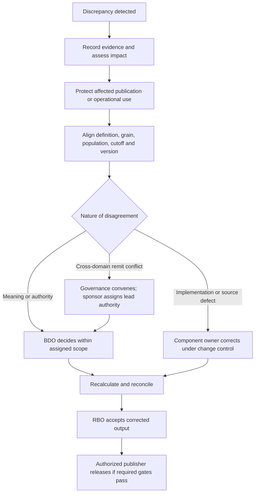

# DWH Ownership Operating Model

An end-to-end proposal for an on-premises enterprise data warehouse, operational reporting, MicroStrategy reporting, APIs, member files, and regulatory outputs.

> [!important] Document status
> This is a proposed operating model, not an approved bank policy or a record of existing appointments. Role names describe responsibilities; they do not establish new departments or assign authority to people mentioned in meeting notes. “Must” and “required” below describe the proposed control standard if adopted. Approval thresholds, personnel, service hours, retention periods, and jurisdiction-specific obligations must be populated through the bank's existing authorities before use.

## How to use this document

For a new product, begin with the role charters and fill in **T1–T3** before agreeing production commitments. For a disputed number, follow **section 9** and **T4**. For a production failure, use **section 11** and the product's approved incident runbook. Before release or publication, use **T5** and verify the separate authorities in **section 6**.

### Contents

- [Purpose and scope](#1-purpose-and-scope)
- [Principles and vocabulary](#2-principles-and-vocabulary)
- [Role charters](#3-role-charters)
- [Asset ownership](#4-assign-ownership-to-assets-and-relationships)
- [Appointment and handover](#5-appointment-delegation-and-handover)
- [Decision rights and RACI](#6-decision-rights-and-raci-register)
- [Lifecycle and acceptance gates](#7-lifecycle-workflow-and-acceptance-gates)
- [Team contracts](#8-contracts-between-teams)
- [Disputed numbers](#9-disputed-numbers-from-detection-to-decision)
- [Quality and remediation](#10-data-quality-ownership-and-remediation)
- [Incidents and recovery](#11-production-incidents-publication-and-recovery)
- [Changes and versioning](#12-change-management-and-versioning)
- [Access, retention and evidence](#13-access-privacy-retention-and-evidence)
- [Cross-domain and vendor responsibilities](#14-cross-domain-and-vendor-responsibilities)
- [Retirement](#15-retirement-and-archival-workflow)
- [Governance routines and measures](#16-governance-routines-and-measures)
- [Worked examples](#17-worked-examples)
- [Reusable templates](#18-reusable-records-and-templates)
- [Adoption checklist](#19-adoption-and-readiness-checklist)
- [References](#20-references-and-interpretation)

## 1. Purpose and scope

Ownership means a named person has the authority, capacity, and obligation to make a defined decision and ensure the resulting work is completed. A team mailbox is a contact mechanism, not an accountable owner.

This model answers five questions for every material dataset, metric, report, and service:

1. Who decides what the information means and what counts as correct?
2. Who supplies and transforms it, and who fixes defects at each stage?
3. Who decides whether an output is fit for its intended use and may be published?
4. Who restores the service and coordinates dependencies when something fails?
5. Who funds, changes, transfers, and ultimately retires it?

The scope runs from source entry and external feeds through replication, ingestion, history, integration, operational read models, marts, semantic models, presentation, and delivery. It also covers manual adjustments, spreadsheets used in official reporting, vendor-operated components, backups, archives, and disaster recovery.

The model applies regardless of whether a report is served from KALE, a replica, an ODS, the EDW, MicroStrategy, or an application. Ownership follows business meaning and service responsibility rather than database location.

### Repository context and boundaries

The repository describes PowerDesigner as a source of table/column ownership and sensitivity metadata. Those entries should seed discovery, but a technical table owner is not automatically the business owner of a metric or the signatory of a report. See [[PowerDesigner Bilgilendirme]].

Operational business teams, UG application teams, and reporting teams already participate in report delivery. The model formalizes their handoffs; it does not assume that today's organization has the proposed roles assigned. See [[Takasbank Genel Bilgilendirme]] and [[Takasbank Genel Bilgilendirme 2]].

This note owns the proposed ownership standard. Actual implementation actions belong in [[Proje Planı]], unresolved bank-specific decisions in [[Aktif Sorular]], and environment facts in [[Fiziksel Topoloji - Teknik Taraf]]. Existing architecture proposals are not changed by this document.

## 2. Principles and vocabulary

### 2.1 One accountable person per decision

Every decision has exactly one accountable person, identified through a role assignment. Several people may contribute or execute. Broad activities are split into separate decisions where different authorities are needed: business acceptance, technical readiness, risk exception, and deployment authorization are distinct decisions.

An asset can therefore have multiple ownership dimensions without having ambiguous accountability. A report has a business owner for its output, a technical owner for its implementation, and a service owner for its operation.

### 2.2 Accountability is retained when execution is delegated

An owner may delegate analysis, development, or routine approval within a recorded mandate. The mandate states scope, limits, deputy, effective period, and escalation path. A supplier or delivery team cannot accept the bank's business risk merely because it built the solution.

### 2.3 Business meaning and implementation are separately controlled

Business owners approve definitions and acceptable use. Engineers determine and implement the technical solution within those definitions. Platform staff administer infrastructure. None of these roles can silently redefine the other's responsibilities.

### 2.4 Evidence supports approval

Approval identifies the asset and version, criteria, results, exceptions, approver, and timestamp. A meeting invitation, ticket assignment, or absence of objections is not approval. An automated control pass is evidence of the specific control, not blanket business acceptance.

### 2.5 Definitions

- **Domain:** a coherent business subject, such as payments, membership, settlement, or collateral.
- **Data product:** an owned, reusable dataset or service with defined meaning, quality, access, and service commitments.
- **Report/output:** a particular view, file, dashboard, API response contract, or submission used for a stated purpose.
- **Authoritative source:** approved evidence for a specific data element or metric, scope, grain, and time basis. Authority does not necessarily attach to an entire database.
- **Grain:** the business event or position represented by one row.
- **Service-level objective (SLO):** a measurable operational target. An SLA is the approved service commitment; internal dependency commitments are operating-level agreements (OLAs).
- **RPO/RTO:** acceptable recoverable data loss and service restoration time respectively. Freshness, business-date completeness, and publication deadline are separate requirements.
- **Materiality:** the approved assessment of business impact; it may include value, affected population, confidentiality, deadline, or operational consequences.

## 3. Role charters

Each role below needs a named primary, deputy, organizational position, and escalation manager for its assigned scope. One person may hold several compatible roles. Sensitive execution and checking duties remain separated.

### 3.1 Executive Sponsor — ES

Owns programme mandate, funding, prioritization across business units, and resolution of ownership vacancies. Appoints domain and service owners through the bank's authority structure. Ensures owners have capacity and escalation support.

The sponsor resolves resource and remit conflicts. The sponsor does not decide a financial definition by convenience or override legal, security, or reporting restrictions outside their delegated authority.

### 3.2 Data Governance Lead — DGL

Owns this operating standard, the ownership register, review process, and decision-record quality. Coordinates cross-domain disputes and ensures appointments, exceptions, and overdue actions reach the appropriate authority.

The governance lead ensures a decision is made by the right person; they do not become the owner of all bank data. A governance forum supports decisions, but its minutes still identify the individual accountable decision-maker.

### 3.3 Business Data Owner — BDO

Owns meaning, intended use, authoritative-source selection, business quality rules, and quality thresholds for a domain or explicitly assigned metric. Approves identity resolution, reference-data interpretation, and the effective dates of definition changes.

The BDO decides whether data meets the domain's business requirements and prioritizes business remediation. They participate in access-purpose and retention decisions within applicable policy. They cannot approve themselves out of mandatory controls or authorize all downstream report uses automatically.

### 3.4 Data Steward — DS

Maintains definitions, metadata, control results, authority mappings, and issue evidence on behalf of the BDO. Investigates anomalies, coordinates subject-matter experts, and prepares decisions.

The steward performs day-to-day work; business accountability stays with the BDO unless a specific approval is formally delegated.

### 3.5 Source Application Owner — SAO

Owns the application/feed contract: source semantics, committed-state behaviour, identifiers, change/deletion handling, end-of-day signals, schema notifications, and supported extraction boundaries. Coordinates source engineers and DBAs to correct source defects.

Where the provider is external, the bank assigns an internal source/feed owner to manage the contract, incidents, and escalation. An external institution is not entered as the bank's accountable person.

### 3.6 Data Product Owner — DPO

Owns the product's consumer contract, scope, priorities, lifecycle, and coordination across upstream and downstream owners. Defines which approved metrics and populations the product exposes and ensures dependencies, acceptance evidence, and support arrangements exist.

The DPO may be a business or data-management role. The DPO cannot unilaterally change another domain's approved definition. Multiple consuming reports may share one product, each retaining its own report owner.

### 3.7 Data Engineering Lead — DEL

Owns technical correctness of assigned ingestion, transformation, historization, lineage, orchestration, replay, and data-control implementations. Assigns pipeline maintainers, reviews code, and fixes integration defects.

The DEL ensures the approved rule is implemented faithfully. They cannot change a business tolerance, invent a reconciliation authority, or silently patch a source fact to make a control pass.

### 3.8 BI and Semantic Lead — BSL

Owns semantic model implementation, dimensional joins, aggregation behaviour, presentation logic, filters, and report-level access implementation. Prevents reports from introducing unapproved alternate versions of certified metrics.

Where UG owns an application screen or API, the corresponding application delivery lead holds this technical presentation responsibility for that asset. The ownership register records the actual boundary.

### 3.9 Report Business Owner — RBO

Owns the report's purpose, intended users, population, cutoff, format, deadline, business acceptance, and fitness for use. Decides whether a corrected report or withdrawal is required, consulting impacted domain owners and control functions.

For external or regulated outputs, identifies the formally authorized publisher/signatory. The RBO is not automatically that signatory. Routine publication may be automated under an approved standing mandate; exceptions follow explicit decision rights.

### 3.10 End-to-End Service Owner — ESO

Owns the operational commitment from input availability through usable output or confirmed delivery. Maintains dependency OLAs, support coverage, escalation, service monitoring, recovery readiness, and service acceptance.

The ESO coordinates restoration even when the cause is not known. Component teams remain responsible for their components. Platform availability alone does not demonstrate service success: an available database with yesterday's incomplete report is still a reporting-service failure.

### 3.11 Platform Operations Owner — POO

Owns assigned infrastructure services: database/host/storage/network availability, capacity, patching, technical backup/restore, platform monitoring, and infrastructure recovery. The platform owner agrees measurable commitments with the ESO.

Platform operations does not own the business correctness of data. A successful restore must be followed by pipeline consistency checks and business reconciliation before the restored output is trusted.

### 3.12 Control and assurance roles

- **Information Security / IAM:** owns security policy decisions, security exceptions within mandate, identity controls, and access provisioning/revocation processes. Security incidents follow the bank's security command structure.
- **Compliance, Legal, Privacy, and Records Management:** named representatives interpret obligations within their mandates and specify required handling, permitted use, disclosure, retention, and holds. They do not substitute for a report owner or operating team.
- **Risk Acceptance Authority:** the individual permitted by the bank's risk delegation to accept a specified residual risk. This is assigned per risk category and magnitude; it is not automatically the sponsor or RBO.
- **Release Authority:** the individual authorized to permit a production change after required business and technical decisions are evidenced.
- **Incident Commander:** the named coordinator during an incident. Default appointment is by the ESO under the incident process; the command structure may change for security or enterprise incidents.
- **Independent Assurance / Internal Audit:** evaluates control design and evidence independently. It does not operate pipelines, approve routine releases, or own remediation it later audits.

## 4. Assign ownership to assets and relationships

The catalogue must represent the following ownership relationships rather than placing one generic “owner” field on everything:

- **Domain / business term / shared metric:** BDO and steward, scope, authoritative evidence, effective dates.
- **Source application / external feed:** SAO, business domain owner, provider contact, dependency contract.
- **Table / column / critical data element:** technical custodian and linked business definition/owner. Technical ownership can inherit from a schema; business authority may require element-level exceptions.
- **Data product / ODS view / mart:** DPO, BDO links, technical maintainer, ESO, consumers.
- **Pipeline / quality rule / semantic measure:** implementation owner, rule-definition owner, control-response owner, repository and runbook.
- **Report / API / member file / submission:** RBO, technical presentation owner, ESO, publisher/signatory where relevant, approved consumer population.
- **Infrastructure / backup / DR service:** POO, ESO dependency, recovery and support commitments.

Use stable asset IDs. Link assets to each other: report → product → metric → transformation → source element. Preserve the effective dates of ownership assignments so a historical publication can be traced to the responsible roles at the time.

Register ownership at reusable domain/product level and inherit it where appropriate. Record overrides for high-risk elements or special outputs; do not require thousands of individually approved duplicate appointments.

## 5. Appointment, delegation, and handover

### Appointment procedure

1. The DGL identifies the asset, business scope, and missing ownership dimensions.
2. The relevant executive manager nominates an individual with authority, capacity, and access to necessary evidence.
3. The nominee accepts the charter and names a deputy. Relevant management confirms the mandate and resource allocation.
4. The DGL records the appointment, effective date, escalation manager, and review trigger. The ESO records operational contacts and coverage.
5. Consumers and dependent owners are notified through the existing catalogue/service-management process.

If ownership is disputed, the sponsor resolves the remit and appoints an interim owner with a time-bounded mandate. An urgent incident still receives an incident commander; a vacancy does not justify ignoring it. A new production service cannot pass acceptance without active accountable owners. Existing unowned services enter a documented remediation process rather than being abruptly disabled.

### Delegation and separation of duties

Delegation states what can be approved, limits, duration, and whether onward delegation is allowed. A developer cannot independently approve their own sensitive manual adjustment, privileged access, or critical release. Small teams use a documented independent reviewer from another qualified team; role consolidation does not erase this control.

### Transfer and departure

The outgoing owner supplies open issues, upcoming deadlines, exceptions, runbooks, access lists, dependency contacts, and decision records. The incoming owner accepts the scope; the appointing manager authorizes the transfer. Access, on-call routing, catalogue entries, and delegated publication rights are updated together. Temporary absence activates the deputy; permanent departure activates the manager's interim appointment process.

The DGL reviews ownership on organizational changes and at a proposed quarterly cadence. This cadence requires adoption; it is not a statement of current practice.

## 6. Decision rights and RACI register

**A — Accountable:** one named decision-maker. **R — Responsible:** performs the work. **C — Consulted:** provides required input. **I — Informed:** receives the decision. A person may be A and R where separation of duties permits it.

These are default role assignments. Each production product resolves role codes to names. Mandatory control approvals are separate decisions; the A for a release cannot override them.

1. **Appoint a domain owner.** A: ES or delegated appointing executive. R: DGL. C: affected business management. I: domain and service teams. Evidence: accepted appointment.
2. **Approve domain definitions, metric meaning, and source authority.** A: BDO for the defined scope. R: DS. C: SAO, DPO, affected RBOs and relevant control functions. I: DEL, BSL, ESO. Evidence: versioned definition and authority record.
3. **Approve a source delivery contract.** A: SAO. R: source engineering. C: BDO, DEL, ESO. I: affected DPOs. Evidence: versioned source contract. Consumer acceptance is a separate DPO decision.
4. **Accept the data product contract and priorities.** A: DPO. R: product analyst/DS. C: BDO, consumers, DEL, BSL, ESO. I: sponsor. Evidence: agreed scope and acceptance criteria.
5. **Approve a business quality threshold.** A: BDO. R: DS. C: affected RBOs, DPO, risk/control functions. I: technical teams. Evidence: rule, materiality, tolerance, response. A report owner may require a stricter output criterion.
6. **Approve transformation implementation.** A: DEL. R: assigned engineers and independent reviewer. C: DS, SAO, BSL. I: DPO, ESO. Evidence: reviewed mapping, code, tests, lineage. Business rule changes return to item 2.
7. **Approve semantic/presentation implementation.** A: BSL or registered application presentation lead. R: developers and reviewer. C: DEL, DS, RBO. I: DPO, ESO. Evidence: join, aggregation, filter, entitlement, and output tests.
8. **Accept report business correctness.** A: RBO. R: business testers/DS. C: relevant BDOs, technical leads, required control representatives. I: DPO, ESO. Evidence: signed comparison and explained differences.
9. **Approve operational readiness.** A: ESO. R: DEL, BSL, POO and support teams for their evidence. C: SAO, RBO, security. I: Release Authority. Evidence: support, monitoring, load, replay, and recovery acceptance.
10. **Authorize production deployment.** A: Release Authority. R: release engineer. C: ESO and required change reviewers. I: consumers and dependent owners. Evidence: release decision linked to prerequisite approvals.
11. **Approve routine publication rules.** A: RBO, or the designated reporting authority where bank policy assigns it. R: DS and delivery team. C: BDO, ESO, required control functions. I: publisher. Evidence: standing mandate and gate rules.
12. **Authorize an external submission.** A: formally designated signatory/publisher. R: authorized delivery operator or service. C: RBO and required control functions. I: ESO, DPO. Evidence: approval/mandate, exact artifact and receipt. Failed-gate exceptions require item 14 first.
13. **Coordinate incident response.** A: Incident Commander. R: implicated component teams. C: ESO, RBO, SAO, control functions as appropriate. I: affected consumers and management. Evidence: incident log. Business and risk decisions remain with their authorities.
14. **Accept a temporary control exception.** A: designated Risk Acceptance Authority. R: requesting owner. C: RBO, BDO, ESO and relevant control functions. I: DGL, publisher, affected owners. Evidence: bounded exception with expiry. No authority can waive a non-waivable obligation.
15. **Approve access purpose and data scope.** A: BDO or documented delegate. R: requester/DS. C: DPO, RBO, security/privacy as required. I: ESO. Evidence: purpose, scope, duration and decision. IAM separately owns execution and policy enforcement.
16. **Approve a retention schedule.** A: bank-designated Records Policy Authority. R: records specialist. C: BDO, RBO, Legal, Privacy, ESO, POO. I: custodians. Evidence: schedule and hold rules. Custodians execute; they do not invent periods.
17. **Authorize service retirement.** A: DPO for the product, or RBO for a standalone report. R: ESO and technical teams. C: consumers, BDO, SAO, Records/Legal as relevant. I: DGL, support. Evidence: replacement/cessation acceptance and disposition plan.

## 7. Lifecycle workflow and acceptance gates

### 7.1 Request and classification

The requester states the decision or process the output supports. The DPO coordinates assessment; the prospective RBO defines users, deadline, acceptable staleness, and consequences of failure. The BDO identifies affected domains. The ESO assesses support and dependency needs.

**Exit evidence:** product/report ID, named proposed owners, classification, consumer list, business value, source dependencies, and agreed discovery scope. Discovery may proceed with provisional assignments; production commitments may not.

### 7.2 Source discovery and authority

The SAO explains keys, statuses, deletes, corrections, archive moves, and completion signals. The DS and engineers profile data. The BDO approves business interpretation and authoritative evidence at the required grain and time basis.

**Exit evidence:** source contract, authority record, source-to-output lineage draft, representative edge cases, and unresolved issues with decision owners. A convenient table or old report is not accepted as authoritative solely because it exists.

### 7.3 Definition and design

The DPO agrees the consumer contract. BDOs approve meaning; the RBO approves output-specific use. DEL and BSL design implementations. The ESO and POO assess capacity, availability, dependency budgets, and recoverability. Security and records authorities supply applicable constraints.

**Exit evidence:** versioned grain, keys, formulas, time basis, quality rules, access model, retention references, SLOs, support scope, and acceptance tests. Design decisions identify the approving authority and tradeoffs.

### 7.4 Build and verification

Source, data, BI, and platform teams build their components. Technical owners provide reviewed code and automated evidence for duplicates, missing records, joins, late corrections, restart, access isolation, and relevant failure cases. Stewards organize expected business results.

**Exit evidence:** traceable implementation, reviewed mappings, test results, deployment package, and known defects. Unexplained differences are defects or decision requests, not silently adjusted expectations.

### 7.5 Parallel run and business acceptance

The RBO chooses representative business cycles and edge cases with domain owners: ordinary days, relevant close periods, late corrections, and applicable market events. Comparisons use the same population and cutoff. Existing reports are comparison evidence, not unquestionable truth.

**Exit evidence:** accepted results, explained variances, outstanding defects by materiality, and explicit business acceptance. Technical teams cannot sign on behalf of business users without a recorded mandate.

### 7.6 Production readiness and cutover

The ESO verifies alerts, coverage, runbooks, dependency contacts, replay, rollback, restore, and recovery reconciliation. The Release Authority checks prerequisite decisions and authorizes the deployment. The RBO/signatory approves publication under the applicable mandate.

**Exit evidence:** accepted service, approved change, ownership roster, release/output versions, consumer communication, fallback conditions, and observation period. Old jobs are retired only after their consumers and replacement outputs are accounted for.

### 7.7 Operate, change, and retire

The ESO runs service reviews; the DPO manages enhancements; BDOs maintain definitions. Changes repeat the affected gates rather than automatically repeating the entire project. Retirement follows section 15.

## 8. Contracts between teams

### 8.1 Source delivery contract

Owned by the SAO and accepted for use by the DPO, with ESO dependency acceptance. It records:

- Source IDs, keys, schema/version, business interpretation, and accountable contacts.
- Commit/consistency boundary, business date, timezone, cutoff and completion signal.
- Update/delete/correction semantics, ordering, duplicate handling, and history availability.
- Extraction method, safe load envelope, credentials, freshness and availability commitments.
- Schema-change notice, backward compatibility, emergency change handling and rollback.
- Replay/backfill limits, retention dependency, outage escalation and validation evidence.

For external feeds, record provider commitments and the internal fallback if those commitments cannot support the downstream promise.

### 8.2 Product and consumer contract

Owned by the DPO. It links approved definitions, supported grains, metric versions, current-versus-final status, access entitlements, freshness/completeness indicators, retention, permitted uses, and consumer responsibilities.

Consumers must not remove freshness warnings, recombine measures at incompatible grains, or redistribute restricted outputs beyond their entitlement. An exploratory report remains uncertified until its definitions and use have been accepted. Promoting a self-service report into an official decision process requires an RBO and the applicable gates.

### 8.3 Service agreement and dependency budgets

Owned by the ESO and agreed with the RBO/DPO and component owners. Specify service hours, business calendar, timezone, availability, maximum staleness, completeness cutoff, publication/delivery deadline, support response, RPO/RTO, and recovery validation.

Allocate the end-to-end deadline across source delivery, ingestion, transformation, controls, publication, and a recovery buffer. Do not simply add component availability percentages or treat component SLAs as proof of an end-to-end guarantee. Validate the full dependency chain through testing and operating evidence.

No timing values are assumed approved by this document. Before go-live, the owner must replace each unassigned target with an agreed value or an explicitly limited service commitment.

## 9. Disputed numbers: from detection to decision

The owner of business meaning, the owner of a defect fix, and the authority to publish may be different people.



### Procedure

1. **Log and preserve.** Any user can report a discrepancy. The DS or service desk captures output IDs, versions, exact filters, business date, timestamps, expected/actual results, and evidence links. Store sensitive samples in approved restricted locations.
2. **Assess impact immediately.** The RBO evaluates business consequences with the ESO. A material or uncertain failure triggers an incident and protects affected use. Do not wait for root cause before containment.
3. **Make comparisons equivalent.** DS, SAO, DEL, and BSL check population, currency, gross/net treatment, status, grain, cutoff, valuation basis, source version, and report filters.
4. **Classify and assign.** Source defects go to SAO; integration/history defects to DEL; semantic/filter defects to BSL; unclear meaning or authority to BDO. The ESO tracks the incident across all workstreams.
5. **Resolve meaning.** The assigned BDO records the rule, rationale, authoritative evidence, effective date, and impacted products. For an enterprise metric, the preappointed enterprise metric BDO is accountable. Domain owners supply required input.
6. **Handle conflicting mandates.** DGL convenes affected owners. The sponsor assigns a lead authority if none exists and resolves resource/remit conflicts. A reporting requirement or contractual interpretation goes to its designated policy authority. A majority vote does not establish a correct number. Distinct legitimate measures receive distinct names and definitions.
7. **Correct and validate.** The technical owner implements the approved correction. DS and business testers reconcile affected periods. RBO decides whether prior outputs must be corrected, recalled, or restated; signatories and control functions authorize external actions within their mandates.
8. **Close with evidence.** RBO accepts the business resolution; technical owners demonstrate the fix; ESO closes the incident after service validation. Root-cause remediation may remain as a separately owned problem record with a due date.

The product's service agreement defines response and escalation deadlines. Escalate immediately when an external deadline, operational decision, security incident, or material misstatement is at risk. If a decision is unresolved when the configured publication gate closes, use the approved contingency or hold the output. Silence is not acceptance.

## 10. Data quality ownership and remediation

Each control record names four responsibilities: rule-definition owner, implementation owner, monitoring responder, and remediation owner. These may resolve to different roles.

The BDO defines quality meaning and tolerances. DEL/BSL implement controls at the appropriate layers. The ESO ensures alerts reach a responder. The root-cause component owner fixes the defect; the BDO remains accountable for the business quality requirement, while the DPO coordinates the product impact.

A rule includes population, grain, measurement method, threshold, severity, required action, exception authority, and evidence retention. Examples include completeness against a source manifest, balance reconciliation at a matching cutoff, uniqueness of a business event, and member-identity mapping validity.

Missing or failed controls must not appear green. Distinguish passed, failed, not run, and inconclusive. A product may have a preapproved limited publication rule for a non-material exception; material failures require the stated decision path.

### Manual adjustments and overrides

Record the original value, proposed value, reason, affected scope, supporting evidence, preparer, independent checker, approval, effective period, and reversal/expiry rule. Preserve the original source and adjustment lineage. Never conceal an adjustment as a source value or overwrite audit evidence.

A business-approved adjustment does not automatically fix the source system. SAO separately manages the source correction where appropriate; downstream owners determine affected history and outputs.

## 11. Production incidents, publication, and recovery

### Incident responsibilities

The ESO ensures one incident commander is appointed and a single incident record links technical workstreams. Responders do not bounce a ticket between UG, DWH, and infrastructure while ownership is uncertain.

- **Source unavailable, delayed, or semantically changed:** SAO leads source remediation; DEL protects ingestion state; ESO coordinates the downstream impact.
- **Pipeline incorrect or incomplete:** DEL leads diagnosis/replay; POO supports infrastructure; RBO decides fitness of affected outputs.
- **Database/host/network failure:** POO restores the component; DEL checks processing consistency; RBO/DS validate affected business outputs before reopening.
- **Report or entitlement defect:** BSL/application lead repairs presentation controls; security leads confidentiality response where needed.
- **Publication or external delivery failure:** the registered delivery owner retries safely and verifies acceptance; ESO tracks the deadline; authorized business representatives handle external communication.

### Hold, degrade, and release

The responder may stop an affected output immediately under a preauthorized containment runbook. The RBO owns fitness-for-use decisions; the Risk Acceptance Authority owns any required risk exception; the signatory owns regulated/external authorization.

The latest validated version may be served only if the product's approved policy permits its age and purpose, and the user can see its actual business date and freshness. A stale output must never be presented as current. Operational actions that require fresh state use their approved safe fallback or stop.

Routine publication need not require a person to click approve every run. The RBO/signatory may approve deterministic gate rules in advance. Each automated publication records the mandate version, passed controls, input cutoff, output version, and delivery evidence.

### Recovery and closure

POO proves infrastructure recovery; DEL proves checkpoint consistency, completeness, and safe replay; BSL proves serving behaviour; DS/RBO validate business outputs; ESO accepts restored service. DR exercises cover the whole reporting chain, including external dependencies and reconciliation, rather than only database failover.

The incident record identifies decision times, affected consumers/outputs, protective actions, communications, recovery evidence, and outstanding problem actions. Business communications have an assigned owner; external disclosures use the bank's authorized channels.

## 12. Change management and versioning

Every source schema change, metric change, archive move, extraction change, model change, access change, or report-format change is assessed for downstream impact using lineage and the consumer register.

**Source change:** SAO supplies notice and a versioned contract. DEL/BSL test affected components. DPO coordinates consumers. ESO validates service impact. Emergency source changes use the emergency change process and do not silently transfer downstream risk to the data team.

**Business definition change:** BDO approves meaning and effective date. RBOs assess their outputs. The record states whether historical data is recalculated, prospective only, or published alongside a previous definition. Distinguish source correction, methodology change, and presentation change.

**Technical change without meaning change:** technical owners approve implementation evidence; affected regression, recovery, and service tests are performed. Business reacceptance is proportionate to impact, not automatically waived because a developer labels the change technical.

**Compatibility and deprecation:** DPO sets supported versions, affected consumers, migration evidence, and sunset criteria. ESO checks remaining traffic/jobs. A passing test for one report is not acceptance on behalf of all consumers.

Release Authority authorizes deployment after required decisions. ESO coordinates rollout and rollback. RBO/signatory decides whether corrected or reissued outputs are needed. All decisions reference specific versions.

## 13. Access, privacy, retention, and evidence

### Access workflow

Requester states purpose, data scope, role, recipients, and duration. BDO/delegate approves business need within policy. Required security/privacy decisions are obtained. IAM provisions the approved entitlement; DEL/BSL enforce controls across datasets, semantic models, exports, APIs, and caches. The designated access reviewer periodically recertifies rights and verifies removal when employment or role changes.

Member-facing services require explicit member/tenant entitlement ownership and negative tests for cross-member access. A report filter alone is not evidence of effective access control. Service accounts have named custodians, least-privilege scope, credential lifecycle, and auditability.

### Retention and disposal

The Records Policy Authority approves a schedule with the necessary Legal/Privacy input and business requirements. The ESO coordinates implementation across raw data, history, marts, exports, logs, backups, and DR copies. Custodians produce disposal evidence. Legal holds suspend affected disposal through a recorded scope and authorized release.

Backups have their own controlled expiry and restoration handling; deleting a live table does not prove deletion from backups. Restored data is checked against applicable deletion/hold instructions before normal use resumes. This document does not prescribe statutory retention periods or make a finding about regulatory applicability.

### Evidence custody

DGL owns the evidence index and metadata standard. Each control owner produces its evidence; the registered system custodian protects it. Approval records, output versions, code/configuration versions, and operational logs are linked by asset/run/publication IDs, access-controlled, and retained under the approved schedule. Secrets and unnecessary personal data do not belong in tickets or broad distribution lists.

## 14. Cross-domain and vendor responsibilities

A shared metric has one appointed business owner for its enterprise definition. Contributing domains retain authority over their underlying facts. If a published measure has a special accounting or regulatory interpretation, the relevant reporting authority approves that use; the general enterprise definition is not silently replaced.

Shared member/reference data needs an appointed business authority for matching and hierarchy rules, a steward for exception handling, and a technical maintainer. Engineers may propose matches; uncertain identity matches follow approved review rules.

For suppliers, record the bank owner, vendor delivery lead, support boundaries, access conditions, acceptance criteria, incident obligations, documentation, source-code/configuration handover where contracted, and exit arrangements. Bank owners retain accountability for business definitions, service acceptance, and use. Vendor support commitments must be compatible with the service hours the bank promises.

## 15. Retirement and archival workflow

1. DPO/RBO proposes retirement and identifies replacement or cessation of need.
2. ESO and technical owners inspect lineage, access/usage evidence, schedules, integrations, and consumers. Low usage alone does not prove a report is unnecessary.
3. RBOs and dependent owners accept the replacement or cessation. Records/Legal determine preservation and holds where applicable.
4. The accountable DPO/RBO authorizes retirement after prerequisites; Release Authority authorizes implementation changes through the normal change process.
5. Technical teams disable jobs/access/interfaces in a controlled sequence, preserve required evidence, and apply the approved data disposition schedule.
6. ESO confirms no unresolved consumers or operating dependencies remain; DGL marks assets retired while retaining ownership history and decision references.

The retirement record includes date, replacement, consumers consulted, preservation obligations, disposition evidence, remaining archive custodian, and residual costs. Archived information still has an owner and access process.

## 16. Governance routines and measures

The following are proposed starting cadences, adjusted to the bank's service hours and criticality:

- **During each critical publication cycle:** automated control monitoring and active exception routing; ESO ensures coverage and RBO/signatory availability under the mandate.
- **Weekly product/quality review:** DPO and DS review defects, disputes, changes, and dependencies with relevant owners. Record decisions and actions rather than creating a parallel reporting bureaucracy.
- **Monthly service/governance review:** ESO reviews service outcomes; DGL reviews ownership gaps, unresolved cross-domain issues, exceptions, and systemic causes. Sponsor decides resource conflicts within mandate.
- **Quarterly and on organizational change:** DGL verifies owner/deputy appointments and stale delegations. Access and recovery reviews follow their separately approved schedules.

Track these measures with explicit populations and periods:

- **Ownership completeness:** active in-scope assets with all required active owner assignments / all active in-scope assets. Report critical services separately.
- **Accepted contract coverage:** active products with approved current contracts / all active products.
- **On-time valid publication:** outputs accepted by the required deadline with required controls passed / outputs due. Sending a file is not the same as accepted delivery.
- **Quality performance:** passed eligible checks / eligible checks, with failed, not-run, and inconclusive counts also visible.
- **Dispute ageing:** unresolved disputes by age, materiality, and decision owner; separate time awaiting evidence from time awaiting a decision.
- **Exception exposure:** open/expired exceptions by owner, risk, expiry, and compensating control.
- **Recovery readiness:** services with successful required end-to-end recovery evidence within the approved review interval / services requiring that evidence.
- **Recurrence:** repeated incidents with the same unresolved cause and their accountable remediation owner.

Targets are approved by the relevant business/service/risk authority. These measures assess control effectiveness and improvement needs, not individual blame for reporting a problem.

## 17. Worked examples

All values and decisions in these examples are illustrative, not actual bank incidents or approved thresholds.

### Example A — Two settlement reports disagree

An operational report shows 100 million and an EDW report shows 104 million for the same currency and business date. The DS first aligns cutoff, market, status and grain. Investigation finds four million of cancelled obligations included by the warehouse filter.

- **Correct meaning:** settlement BDO confirms cancellation treatment and effective rule.
- **Fix:** DEL owns the transformation defect; SAO confirms source status semantics.
- **Output acceptance:** RBO accepts a reconciled corrected version after testing affected dates.
- **Publication:** authorized publisher releases/reissues under the approved process.
- **Service coordination:** ESO tracks affected outputs and consumers; DPO prioritizes the preventive change.

If the reports instead measure different legitimate concepts, each gets an explicit name and definition. Neither is forced to match by an unexplained adjustment.

### Example B — End-of-day data is late

The source completion signal has not arrived before the product's latest safe processing start. SAO investigates the source process. ESO opens an incident and forecasts the deadline impact. DEL prevents an incomplete day from being marked final.

RBO selects an allowed business contingency; any risk exception goes to its designated authority. The external signatory decides submission actions with the relevant control functions. POO is involved only if infrastructure contributes. A scheduled clock time cannot authorize inventing a completed business day.

### Example C — A member identifier conflicts across markets

DS gathers source identifiers, entity evidence, effective dates, and affected accounts. The enterprise membership/party BDO decides the mapping under the approved matching policy, consulting market domain owners. DEL implements the approved mapping and preserves history. RBOs validate affected reports and entitlements. DGL escalates only unresolved remit/authority conflicts; technical similarity alone does not authorize a merge.

### Example D — Infrastructure is restored but balances differ

POO restores the database. DEL discovers that the load checkpoint and published dataset do not represent the same completed run. ESO keeps the affected publication unavailable or on its approved prior version. DEL replays safely; DS reconciles balances; RBO accepts the output; ESO declares the end-to-end service restored. Database uptime alone does not close the incident.

## 18. Reusable records and templates

Copy these forms into the bank's approved catalogue, ticketing, service-management, or document-control system. Bracketed entries are deliberately unassigned template fields, not accepted values. Link shared definitions and decisions rather than copying them into every form.

### T1 — Ownership appointment record

```text
Assignment ID / version:
Asset or domain IDs and exact scope:
Ownership role / decisions covered:
Accountable person / organizational position:
Appointing authority / appointment evidence:
Deputy / activation rule:
Escalation manager / contact route:
Delegated powers / exclusions / separation-of-duties controls:
Capacity and service-coverage commitment:
Effective from / until / review trigger:
Acceptance by appointee / timestamp:
Predecessor assignment / handover evidence:
```

### T2 — Product and report ownership card

```text
Product/report ID / version / status:
Purpose / permitted uses / consumers:
Business domain owner(s) and governed scope:
Data product owner:
Report business owner (if an output):
Enterprise metric owner(s), where applicable:
Source application/feed owner(s):
Engineering owner / presentation owner:
End-to-end service owner / platform dependency owner(s):
Publisher/signatory and standing mandate, if applicable:
Primary/deputy assignments: [links to T1]
Grain / business keys / metric definitions: [links]
Authority, source and consumer contracts: [links]
Cutoff / timezone / freshness / finality / deadline:
Service hours / SLOs / dependency OLAs / RPO / RTO:
Quality controls / stop-publication rules:
Access classification / entitlement authority / permitted recipients:
Retention schedule / holds / evidence location:
Support route / escalation / recovery and fallback runbook:
Current approvals / exceptions / next review:
```

### T3 — Authority and metric decision record

```text
Decision ID / metric or element ID / definition version:
Decision question and alternatives:
Business purpose / domain / market / legal-entity scope:
Population / exclusions / grain / currency / units:
Business date / event time / cutoff / knowledge-time basis:
Formula / aggregation / rounding / reversal treatment:
Authoritative evidence and why it is authoritative:
Reconciliation reference / comparison method / tolerance:
Accountable BDO and mandate:
Required consultations / control decisions:
Decision / rationale / effective date:
Historical treatment / affected consumers:
Approver / timestamp / supporting evidence:
```

### T4 — Discrepancy or data-quality issue

```text
Issue/incident ID / detected at / reporter:
Affected asset, run, publication and definition versions:
Expected versus observed / aligned comparison basis:
Evidence location / access restrictions:
Business impact / materiality / deadline at risk:
Containment / user warning / publication status:
Incident commander / end-to-end service owner:
Business decision owner / root-cause component owner:
Investigation / classification / dependencies:
Decision due / escalation trigger / route:
Approved decision / correction / affected history:
Retest and reconciliation evidence:
RBO acceptance / incident closure / outstanding problem record:
```

### T5 — Release and publication evidence

```text
Change ID / asset version / intended release window:
Business acceptance decision and scope:
Source/definition/implementation versions:
Technical review and test evidence:
Security and other required control decisions:
Operational readiness / capacity / support / recovery evidence:
Exceptions and their risk authorities / expiries:
Release authority / decision / timestamp:
Rollback trigger / operator / consumer communication:
Publication ID / mandate or individual approval:
Input business cutoff / run IDs / control results:
Exact output artifact / version / integrity evidence:
Recipient / authorized delivery route / delivery time:
Acceptance or rejection evidence / retry/reissue relationship:
```

### T6 — Temporary exception

```text
Exception ID / affected control and assets:
Reason / business impact / alternatives considered:
Requested action and exact scope:
Risk category / authorized acceptance authority / mandate:
Required business, security, legal or reporting consultations:
Non-waivable constraints checked:
Compensating controls / accountable control operators:
Start / expiry / review triggers / withdrawal conditions:
Remediation owner / due date:
Decision / approver / evidence:
Publisher and consumer restrictions / notifications:
Closure evidence or separately approved renewal:
```

### T7 — Transfer or retirement record

```text
Asset IDs / proposed action / reason:
Accountable owner / approving authority:
Incoming owner or replacement service, if applicable:
Dependent consumers and acceptance evidence:
Open incidents / exceptions / upcoming deadlines:
Runbooks / access / on-call / supplier handover:
Records, retention, hold and archive-custodian decisions:
Implementation change / rollback or recovery limits:
Catalogue, access and scheduling updates:
Effective date / acceptance / completion evidence:
```

## 19. Adoption and readiness checklist

Use this as a reusable acceptance checklist. Track the bank's actual assignments and delivery actions in [[Proje Planı]]; use [[Aktif Sorular]] for unresolved institution-specific decisions.

- [ ] Executive mandate and document approval authority are established.
- [ ] Pilot domain, product, report and service boundaries have stable IDs.
- [ ] Business, source, product, report, technical, service and platform roles resolve to named people with deputies.
- [ ] PowerDesigner ownership entries have been reconciled with business decision rights rather than accepted as equivalent by default.
- [ ] Cross-domain metrics have named decision authorities and recorded scope.
- [ ] Source, consumer and service contracts are accepted with populated commitments.
- [ ] Dispute, incident, risk-exception and external-publication authorities are distinct and understood.
- [ ] Support coverage and dependency escalation work during the required service hours.
- [ ] Quality, access, publication, recovery and retention controls have named implementers and responders.
- [ ] A discrepancy exercise demonstrates a decision, correction, acceptance and publication trail.
- [ ] A recovery exercise demonstrates source-to-output consistency after restoration.
- [ ] Transfer and retirement procedures preserve evidence and downstream continuity.
- [ ] The ownership register, control evidence and governance measures are maintained in approved systems.

Start by applying the model to one bounded product and its dependent outputs. Use the resulting evidence to refine the role boundaries before wider adoption. This is a proposed adoption method, not an approved delivery schedule.

## 20. References and interpretation

### Internal context

- [[PowerDesigner Bilgilendirme]] — source metadata, ownership and sensitivity context.
- [[Takasbank Genel Bilgilendirme]] — reporting process, UG collaboration, and cross-check context.
- [[Takasbank Genel Bilgilendirme 2]] — operational reports, member outputs, and critical reporting context.
- [[Ortamlar hakkında]] — source completion, historical update and environment context.
- [[DWH Sunum Temmuz 2025]] — candidate reporting and file-delivery use cases; historical proposals.
- [[Proje Planı]] — implementation actions and delivery gates.
- [[Aktif Sorular]] — unresolved bank-specific decisions.

### External reference

[BCBS 239 — Principles for effective risk data aggregation and risk reporting](https://www.bis.org/publ/bcbs239.pdf) provides a useful reference for governance, accuracy, completeness, timeliness and reporting controls. This operating model is the architect's proposal; it is not a reproduction of that standard or a determination that every BCBS 239 requirement applies to this institution. The bank's designated compliance/legal authorities determine applicability and required local controls.

### Change history

- **0.1 — 2026-09-28:** Initial proposed ownership operating model; no institutional appointments or policy approvals recorded.
