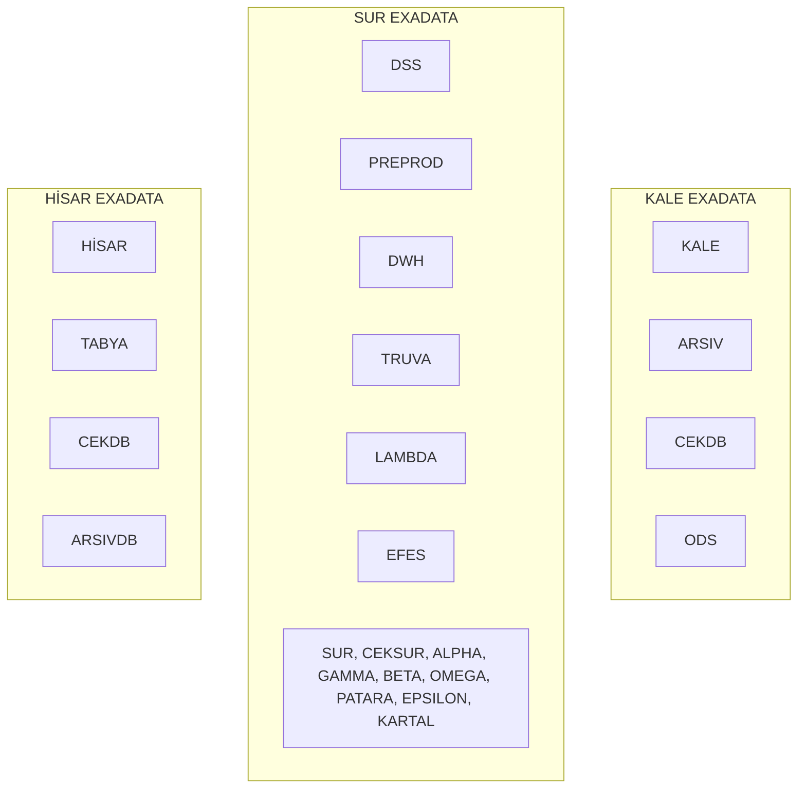

# DWH Sunum Aralık 2024

Takasbank iç sunumu **Takasbank Data Warehouse Alt Yapısı Oluşturma Çalışması Durum Bilgilendirmesi-3 — Aralık 2024** üzerinden hazırlanmış toplantı notları. Bu not **sunumun aktardığı görüşme özeti, kurum değerlendirmeleri ve kapasite görüntülerini** kaydeder; güncel ortamın teyidi değildir. Önceki sunum: [[DWH Sunum Eylül 2024]]. Sonraki sunum: [[DWH Sunum Temmuz 2025]].

> [!info] Kaynak ve kapsam
> Dört ekran fotoğrafından metinler aktarılmış; **15 slaydın tamamı** ayrı görseller olarak kırpılıp perspektifleri düzeltilmiştir. Ekranda görünen PDF yolu: `Documents/DWH/3 - DWHBilgilendirmeSunum_Aralik2024.pdf`. Gizlilik: **Kurum İçi**. Slayt 2, **03/12/2024 tarihli toplantıyı** özetler. Kapasite grafiklerinde **11–17 Aralık 2024** tarihleri görünür; sunumun tamamının 3 Aralık'ta yapıldığı varsayılmamıştır.

> [!note] Aktarım yöntemi
> Kurum karşılaştırmalarında **Artı Yönleri / Eksi Yönleri** sınıflandırması sunumdaki haliyle korunmuştur. Grafiklerin basılı sayısal etiketleri metne alınmış; etiketsiz çubuk ve çizgilerden okunan değerler yaklaşık olarak belirtilmiştir. CPU thread numaraları ve her ölçüm noktasının değeri fotoğraflardan güvenilir biçimde çıkarılamadığından görseller korunmuştur.

## Toplantı özeti

- **ODS'in KALE Exadata**, **DWH'ın SUR** üzerinde konumlandırılması ele alınmıştır. ODS'in SUR'da kurulması halinde performans testlerinde sorun olabileceği belirtilmiş ve KALE'de konumlandırılması uygun görülmüştür.
- **ETL'in ODS ile aynı yerde bulunması** daha uygun değerlendirilmiştir. DSS'in ODS olarak kullanılması ve geçiş süresince DSS'in yaşatılması seçenekleri aktarılmıştır.
- **Vakıfbank, Merkezi Kayıt Kuruluşu ve Borsa İstanbul** uygulamaları artı/eksi yönleriyle incelenmiştir.
- Takasbank için KALE'de yoğunlaşan, temiz ve kaliteli veri ile piyasa/ürün bazında aşamalı geçiş imkânı avantaj olarak belirtilmiştir.
- **Anlık operasyonel raporlama**, **semantik katman**, **UG analistlerinin modellemeye katılımı** ve **DWH/ETL deneyimli personel ihtiyacı** çalışılması gereken başlıklardır.
- Exadata disk, bellek ve CPU kullanım görselleri sunulmuştur. Sunumda kişi bazında sorumlu, termin veya onaylanmış uygulama takvimi bulunmamaktadır.

## Slayt 1 — Kapak

![[_sources/DWH Toplantı Aralık 2024/slide-01.jpg]]

**TAKASBANK DATA WAREHOUSE ALT YAPISI OLUŞTURMA ÇALIŞMASI DURUM BİLGİLENDİRMESİ-3 — ARALIK 2024**

## Slayt 2 — 03/12/2024 tarihli toplantının özeti

![[_sources/DWH Toplantı Aralık 2024/slide-02.jpg]]

- [[ODS]]'in **KALE isimli Exadata** üzerinde konumlandırılabileceği belirtilmiştir. KALE, ARSIV ve CEKDB yanında **dördüncü veri tabanı** olarak eklenebilir.
- **DWH'ın SUR**, **ODS'in KALE** üzerinde konumlandırılabileceği belirtilmiştir.
- ODS'in **SUR'da kurulması durumunda performans testlerinde sorun olabileceği** belirtilmiş; **KALE'de konumlandırılması uygun görülmüştür**.
- **ETL** bağımsız bir sunucuda da olabilir; ancak **ODS'in konumlandırıldığı yerde** olmasının daha uygun olduğu ifade edilmiştir.
- **DSS ortamının ODS ortamı olarak kullanılabileceği** belirtilmiştir.
- ODS devreye alınıp **son servis kapanana kadar DSS'in yaşatılabileceği** belirtilmiştir. Bu süreçte **T-1 datası** görülmeye devam edilebilir.

İlgili notlar: [[ODS]] · [[Fiziksel Topoloji - Teknik Taraf]].

## Slayt 3 — Exadata yerleşimi

![[_sources/DWH Toplantı Aralık 2024/slide-03.jpg]]

Sunumdaki yerleşim; **ODS ve DWH yeşil kutularla** gösterilmiştir:

- **KALE EXADATA:** KALE, ARSIV, CEKDB, **ODS**.
- **SUR EXADATA:** DSS, PREPROD, **DWH**; TRUVA, LAMBDA, EFES; SUR, CEKSUR, ALPHA, GAMMA, BETA, OMEGA, PATARA, EPSILON, KARTAL.
- **HİSAR EXADATA:** HİSAR, TABYA, CEKDB, ARSIVDB.

Diyagram ortamların Exadata üzerindeki dağılımını gösterir; veri aktarım akışı olarak yorumlanmamıştır.

## Slayt 4 — Vakıfbank

![[_sources/DWH Toplantı Aralık 2024/slide-04.jpg]]

**Artı yönleri — sunumdaki sınıflandırma**

- **T-1 verisi** kaynak sistemden alınarak **ETL ile DWH veri tabanına** aktarılmaktadır.
- **ETL Developer, UG Analisti ve İş Zekası Analisti birlikte** çalışmaktadır.

**Eksi yönleri — sunumdaki sınıflandırma**

- **Anlık veri raporlama ihtiyacı bulunmamaktadır.** DWH'dan T-1 ve öncesi data raporlanmaktadır.
- **ODS katmanı vardır ancak ODS üzerinden rapor verilmemektedir.** ODS ara katman olarak kullanılmakla birlikte her zaman kullanılmamaktadır.
- Bütün raporlama işlemleri **Raporlama Müdürlüğü** tarafından yapılmaktadır. Bu durum tüm bilgi birikiminin (**know-how**) tek ekipte toplanmasına neden olmuştur.

## Slayt 5 — Merkezi Kayıt Kuruluşu

![[_sources/DWH Toplantı Aralık 2024/slide-05.jpg]]

**Artı yönleri — sunumdaki sınıflandırma**

- **Geçmiş tarihli data veri ambarından** raporlanmaktadır.
- **ODS katmanı** vardır.
- **Microstrategy raporlarının %99'u DWH üzerinden** raporlama yapmaktadır.

**Eksi yönleri — sunumdaki sınıflandırma**

- **Güncel data ana veri tabanından** raporlanmaktadır.
- DWH altyapısı **MKK'nın kurulduğu zamandan itibaren** oluşturulduğundan ilişkisel tabloların belirlenmesi ve **mapping işlemleri etkin biçimde yapılabilmiştir**.
- Anlık data aktarımlarında **replika aracı kullanılmamaktadır**. Data **SQL scriptleriyle** aktarılmakta; ayrıca **ETL aracı** da kullanılmaktadır.

> [!note] Kaynak sınıflandırması
> Kuruluş aşamasında DWH oluşturulmasının ilişkisel tablo ve mapping çalışmalarını kolaylaştırdığı ifadesi olumlu içerik taşımasına rağmen kaynak slaytın **Eksi Yönleri** sütununda yer almaktadır; sütun yerleşimi değiştirilmemiştir.

## Slayt 6 — Borsa İstanbul

![[_sources/DWH Toplantı Aralık 2024/slide-06.jpg]]

**Artı yönleri — sunumdaki sınıflandırma**

- DWH veri tabanında **T-1 ve öncesine ait data** tutulmaktadır.
- Kaynak veri doğrudan **ODS katmanında** saklanmaktadır.
- **Replika veri tabanı Dataguard ile** beslenmektedir.
- Gün içinde **Replika DB ve ana veri tabanından anlık raporlar** alınmaktadır.
- DWH projesinden önce **Microstrategy** kullanılmaktadır. DWH oluşturulduktan sonra **aşamalı olarak model üzerinden raporlar** oluşturulmaya başlanmıştır.

**Eksi yönleri — sunumdaki sınıflandırma**

- Gün içinde belirli saatlerde çalışan **ETL'lerle anlık datanın DWH'a yazıldığı** durumlar vardır.
- **Farklı uygulamaların veri kaynaklarından** veri toplanarak DWH'a aktarılmaktadır.
- DWH altyapısı **tüm sistem için tek seferde** tasarlanmıştır.

## Slayt 7 — Takasbank: artı yönlerimiz

![[_sources/DWH Toplantı Aralık 2024/slide-07.jpg]]

- Verilerin büyük kısmı **KALE veri tabanında** tutulmaktadır. Veri ambarı kurulması halinde farklı veri kaynaklarından veri toplanması ihtiyacı öngörülmemektedir.
- **Borsa DWH sisteminden raporlama amacıyla çekilen data ODS'e** aktarılabilecektir.
- DWH'a aktarılacak data herhangi bir **cache sisteminden değil, tablolar üzerinden** alınacağından modelleme daha kolay yapılabilecektir.
- **Geçmiş tarihli büyük verilerin DWH'da tutulması** kaynağın daha etkin kullanımına imkân verebilecektir.
- Birçok piyasaya ilişkin çok çeşitli analizlere imkân verebilecek nitelik ve nicelikte **kaliteli data** bulunmaktadır. DWH, veriyi daha kolay erişilebilir ve analiz edilebilir hale getirebilir.
- Takasbank'ta tutulan data **temiz ve kaliteli** olduğundan DWH datası oluşturulurken **veri temizleme ve normalizasyon ihtiyacının minimum düzeyde** olacağı belirtilmiştir.
- Farklı piyasa ve/veya ürünlerin datası **farklı şemalarda** tutulmaktadır. Ortak ana tablolar dışındaki tablolar piyasa bazında ayrıldığından **DWH'a geçiş piyasa ve ürün bazında aşamalı** yapılabilir.

## Slayt 8 — Takasbank: çalışılması gereken yönlerimiz

![[_sources/DWH Toplantı Aralık 2024/slide-08.jpg]]

- **Anlık operasyonel raporlama ihtiyacı yüksektir.** Sunumda DWH, anlık veri raporlamaya değil **analiz amaçlı raporlamaya** yönelik konumlandırılmıştır. Anlık verinin **ana veri kaynağından veya ODS katmanından** raporlanmaya devam edeceği belirtilmiştir.
- İş birimleri **operasyonel amaçlı raporlar** kullanmaktadır. **Semantik katman üzerinden rapor oluşturma kültürü bulunmadığı** belirtilmiştir. Semantik katman oluşturulduktan sonra mevcut **Microstrategy raporları** bu katman üzerinden oluşturulabilecektir.
- **Modelin sağlam kurulması** çok önemlidir. Sistemin bütününü, iş biriminin isteklerini, mevcut tabloları ve tablolar arası ilişkileri bilen **analistlerle** süreç yürütülmelidir.
- Mevcut analistler farklı **UG ekiplerinde** görev yapmaktadır. DWH kurulurken **İZV ekibiyle birlikte modelleme çalışmasına aktif katılımları** gerekecektir.
- **DWH, ETL ve modelleme konularında deneyimli, DWH konusunda yetkin personel** ihtiyacı karşılanmalıdır.

İlgili notlar: [[Proje Planı]] · [[Aktif Sorular]].

## Slayt 9 — Exadata kapasite kullanım istatistikleri: disk

![[_sources/DWH Toplantı Aralık 2024/slide-09.jpg]]

Grafik başlığı: **Current Disk Group Usage (GB)**. Etiketler **Free** ve **System** olarak verilmiştir. Aşağıdaki sayılarda Türkçe sayı biçimi kullanılmıştır:

- **KALE:** Free **565.459,52 GB**, System **61.480,48 GB**. Pasta grafiğinde **%90 boş**, yaklaşık **%10 System**.
- **SUR:** Free **483.715,14 GB**, System **143.224,86 GB**. Pasta grafiğinde **%77 boş**, **%23 System**.
- **HİSAR:** Free **508.202,77 GB**, System **118.737,23 GB**. Pasta grafiğinde **%81 boş**, **%19 System**.

Yüzdeler sunumdaki yuvarlatılmış gösterimlerdir. **%90 / %77 / %81 değerleri kullanılan değil, boş alanı gösterir.**

## Slayt 10 — KALE bellek kullanımı

![[_sources/DWH Toplantı Aralık 2024/slide-10.jpg]]

- Başlık: **KALE MEMORY KULLANIMI / Memory Utilization**.
- **Week**, **Day** ve **Last hrs** görünümleri yan yana verilmiştir.
- Haftalık eksende **11–17 Aralık 2024**, günlük görünümde **16–17 Aralık 2024**, son saatler görünümünde **17 Aralık 2024** tarihleri yer almaktadır.
- Grafiksel okumayla bellek kullanımı yaklaşık **%65–70** seviyesinde, dönem boyunca büyük ölçüde yatay görünmektedir.
- Kesin nokta değerleri etiketlenmediğinden bu aralık yaklaşık okumadır; ölçüm serisinin yerine geçmez.

## Slayt 11 — SUR ve HİSAR bellek kullanımı

![[_sources/DWH Toplantı Aralık 2024/slide-11.jpg]]

**SUR MEMORY KULLANIMI**

- **Memory Utilization**; haftalık, günlük ve son saatler görünümleri.
- Grafiksel okumayla kullanım yaklaşık **%65–70** bandında ve büyük ölçüde yataydır.

**HİSAR MEMORY KULLANIMI**

- **Memory Utilization**; haftalık, günlük ve son saatler görünümleri.
- Grafiksel okumayla kullanım yaklaşık **%60–65** bandında ve büyük ölçüde yataydır.

Her iki grafikte de haftalık görünüm **11–17 Aralık 2024**, günlük görünüm **16–17 Aralık 2024**, son saatler görünümü **17 Aralık 2024** dönemini gösterir. Yüzdeler yaklaşık görsel okumadır.

## Slayt 12 — KALE CPU kullanımı

![[_sources/DWH Toplantı Aralık 2024/slide-12.jpg]]

- Üst bölüm: **CPU Utilization**, haftalık (**Week**), günlük (**Day**) ve son saatler (**Last hrs**) görünümleri.
- Alt bölüm: **CPU Threads Utilization**, thread bazında **Usage (%)** dağılımı.
- Günlük grafikte kullanım dalgalıdır; en yüksek çubuk yaklaşık **%25** düzeyindedir.
- Son saatler grafiği daha düşük düzeyde dalgalanma gösterir.
- Thread bazlı grafikte bazı çubuklar yaklaşık **%100** seviyesine ulaşırken çoğu daha düşük görünmektedir. Bu değerler **genel CPU kullanımıyla aynı ölçüm değildir**.
- Tarih etiketleri Aralık 2024 dönemine, son saatler görünümü **17 Aralık 2024** tarihine aittir. Sayısal yorumlar yaklaşık grafik okumalarıdır.

## Slayt 13 — SUR CPU kullanımı

![[_sources/DWH Toplantı Aralık 2024/slide-13.jpg]]

- Üst bölüm: **CPU Utilization**, haftalık, günlük ve son saatler görünümleri.
- Alt bölüm: **CPU Threads Utilization**, thread bazında **Usage (%)** dağılımı.
- Günlük kullanım grafiksel okumayla çoğunlukla yaklaşık **%6–10**, tepe noktaları yaklaşık **%12** düzeyindedir.
- Son saatler grafiğinde kullanım dar bir bantta dalgalanmaktadır.
- Thread bazında bazı çubuklar yaklaşık **%100** düzeyindedir; çoğu thread daha düşük kullanım gösterir.
- Haftalık eksen **11–17 Aralık 2024**, günlük görünüm **16–17 Aralık 2024**, son saatler görünümü **17 Aralık 2024** dönemini gösterir. Yüzdeler yaklaşık okumadır.

## Slayt 14 — HİSAR CPU kullanımı

![[_sources/DWH Toplantı Aralık 2024/slide-14.jpg]]

- Üst bölüm: **CPU Utilization**, haftalık, günlük ve son saatler görünümleri.
- Alt bölüm: **CPU Threads Utilization**, thread bazında **Usage (%)** dağılımı.
- Genel kullanım grafiksel okumayla çoğunlukla yaklaşık **%2–3** düzeyindedir; günlük grafikte yaklaşık **%12–13** seviyesine çıkan belirgin bir tepe görülür.
- Son saatler grafiği düşük seviyede, kısa süreli küçük yükselişler gösterir.
- Thread bazlı grafikte en yüksek çubuklar yaklaşık **%12–13** düzeyindedir.
- Haftalık eksen **11–17 Aralık 2024**, günlük görünüm **16–17 Aralık 2024**, son saatler görünümü **17 Aralık 2024** dönemini gösterir. Yüzdeler yaklaşık okumadır.

> [!note] Kapasite görsellerinin kapsamı
> Bu slaytlar belirli bir dönemin kullanım görüntüleridir. Sunum bu grafiklerden hareketle yeni DWH/ODS yükünün kesin kapasite ihtiyacını, performans testinin sonucunu veya hizmet seviyesi garantisini bildirmemektedir.

## Slayt 15 — Kapanış

![[_sources/DWH Toplantı Aralık 2024/slide-15.jpg]]

**Teşekkürler** — TAKAS İSTANBUL.

## Kaynak fotoğraflar

Orijinal HEIC dosyaları değiştirilmemiştir. Tam kare JPEG kopyaları:

- [[_sources/DWH Toplantı Aralık 2024/IMG_7764.jpg|IMG_7764 — Slayt 1–4]]
- [[_sources/DWH Toplantı Aralık 2024/IMG_7765.jpg|IMG_7765 — Slayt 5–8]]
- [[_sources/DWH Toplantı Aralık 2024/IMG_7766.jpg|IMG_7766 — Slayt 9–12]]
- [[_sources/DWH Toplantı Aralık 2024/IMG_7767.jpg|IMG_7767 — Slayt 13–15]]

İlgili notlar: [[DWH Sunum Eylül 2024]] · [[DWH Sunum Temmuz 2025]] · [[DWH]] · [[ODS]] · [[Kale]] · [[Dataguard vs Goldengate]] · [[Proje Planı]] · [[Aktif Sorular]] · [[Fiziksel Topoloji - Teknik Taraf]]
