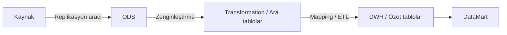

# DWH Sunum Eylül 2024

Takasbank iç sunumu **Takasbank Data Warehouse Alt Yapısı Oluşturma Çalışması Durum Bilgilendirmesi — 2024** üzerinden hazırlanmış toplantı notları. Bu not **sunumda aktarılan mevcut durum, değerlendirme ve önerileri** kaydeder; güncel ortamın veya sonradan alınmış kararların teyidi değildir. Devam sunumu: [[DWH Sunum Temmuz 2025]].

> [!info] Kaynak ve kapsam
> Altı ekran fotoğrafından metinler aktarılmış, slaytlar ayrı görseller olarak kırpılıp perspektifleri düzeltilmiştir. Ekrandaki dosya yolu: `Documents/DWH/2 - DWHSunum_Eylül2024.pdf`. Sunum **18 slayt**; fotoğraflarda **1–17** mevcut. Gizlilik: **Kurum İçi**. Eylül 2024 bilgisi klasör ve sunum dosyası adından alınmıştır; kesin toplantı günü ve kişi bazında katılımcı listesi görünmemektedir.

> [!warning] Eksik ve yinelenen görüntüler
> **Slayt 18 fotoğraflarda yok.** IMG_7760 ve IMG_7761 aynı 9–12. slaytları gösterir; daha okunaklı IMG_7761 esas alınmıştır. Slayt 15'te küçük diyagram yazılarının bazıları net değildir. Kaynakta öneri veya değerlendirme olarak geçen ifadeler kesinleşmiş karar olarak aktarılmamıştır.

## Toplantı özeti

- İşlem ve raporlama yükünün [[Kale]] üzerinde birleşmesi, büyüyen veri hacmi ve tarihsel verinin saklanması DWH/ODS çalışmasının başlıca gerekçeleridir.
- Hedeflenen faydalar: raporlama yükünü ayırmak, semantik katmanla rapor üretimini kolaylaştırmak, farklı piyasalardaki ortak verileri birleştirmek ve detaylı analiz yapabilmek.
- **Obase**, ihtiyaçların DWH yerine **[[ODS]]** ile daha etkili karşılanabileceğini değerlendirmiştir. **Ondata**, BES veya TEFAS gibi büyük veri hacimli bir alanda **POC** önermiştir.
- Direktörler ve UG ekipleriyle yöntemlerin değerlendirilmesi, ortak yol haritası ve eğitim planlaması sunumda sonraki adımlar olarak ele alınmıştır.
- Fotoğraflarda kesin araç seçimi, onaylanmış proje takvimi, kişi bazında sorumlu veya termin belirtilmemiştir.

## Slayt 1 — Kapak

![[_sources/DWH Toplantı Eylül 2024/slide-01.jpg]]

**TAKASBANK DATA WAREHOUSE ALT YAPISI OLUŞTURMA ÇALIŞMASI DURUM BİLGİLENDİRMESİ — 2024**

## Slayt 2 — İçerik

![[_sources/DWH Toplantı Eylül 2024/slide-02.jpg]]

1. Data Warehouse (Veri Ambarı) Nedir
2. Veri Ambarı Süreçleri
3. Takasbank'ta Mevcut Durum
4. Takasbank ve Veri Ambarı
5. DWH Altyapısı Oluşturulması Kapsamında Görüşülen Firmalar
6. DWH Çalışması Süreci
7. DWH Çalışması Yol Haritası
8. DWH Altyapısı Kurulması Kapsamında Değerlendirilmesi Gereken Hususlar

## Slayt 3 — Data Warehouse (Veri Ambarı) nedir?

![[_sources/DWH Toplantı Eylül 2024/slide-03.jpg]]

- **Data Warehouse (DWH)**, büyük miktarda veriyi toplamak, saklamak, yönetmek, analiz etmek ve raporlamak için kullanılan merkezi bir veri tabanıdır. Operasyonel sistemlerden ayrı bir ortam sağlar.
- Farklı kaynaklardaki verinin entegrasyonu sağlanır.
- Raporlamalar nedeniyle ana veri tabanına yüklenilmesinin önüne geçer.
- Büyük miktardaki verinin yönetilmesini ve analiz edilmesini kolaylaştırır.
- Kapsamlı veri analizi yapılabilmesini sağlar.

## Slayt 4 — Veri ambarı süreçleri

![[_sources/DWH Toplantı Eylül 2024/slide-04.jpg]]

**Kaynak → ODS → Transformation (Ara tablolar) → DWH (Özet Tablolar) → DataMart**

- Kaynaktaki data bir replikasyon aracı (**Goldengate vb.**) ile ODS'e aktarılır.
- ODS'de data zenginleştirilir; dönüştürme yapılarak ara tablolarda tutulur.
- Ardından **ETL** aracı ile eşleştirme (**mapping**) yapılarak DWH'a aktarılır.
- DWH'daki data özet tablolara aktarılarak **Datamartlar** oluşturulur.
- **Microstrategy** ile raporlama yapılırken Datamart'taki data kullanılır. Sürükle bırak yöntemiyle, yeni SQL yazmadan rapor alınabilmesi amaçlanır.

## Slayt 5 — Veri ambarı terminolojisi

![[_sources/DWH Toplantı Eylül 2024/slide-05.jpg]]

- **ODS (Operasyonel Veri Deposu):** Gerçek zamanlı veya gerçek zamanlıya çok yakın veri sağlayan merkezi veri tabanı. Veriler sonraki işlemler ve raporlama için veri ambarına aktarılabilir.
- **ETL — Extract, Transform, Load:** Ayıklama, Dönüştürme ve Yükleme. Verilerin veri ambarına aktarılmadan önce ayrı bir işleme sunucusunda dönüştürülmesini ifade eder.
- **ELT — Extract, Load, Transform:** Ayıklama, Yükleme ve Dönüştürme. Ham veriler doğrudan veri ambarına gönderilir; dönüşüm veri ambarının içinde gerçekleştirilir.
- Sunumda sıralanan **ETL araçları:** Informatica PowerCenter (**MKK'da** kullanıldığı belirtiliyor), Oracle Data Integrator — ODI (**Borsa İstanbul'da** kullanıldığı belirtiliyor), Microsoft SQL Server Integration Services — SSIS, Talend, Apache NiFi, IBM DataStage, Pentaho Data Integration — PDI.
- **Dönüştürme:** Veri temizleme, tekilleştirme, format revizyonu, veri türetme, birleştirme, bölme, özetleme, şifreleme vb. işlemler.
- **Veri Eşleme (Mapping):** Kaynak verinin hedef sistemdeki veri yapısına nasıl dönüştürüleceğini ve yerleştirileceğini belirleyen süreç. Veri; hedef tablolara, kolonlara ve veri modellerine uygun hale getirilir.

## Slayt 6 — Takasbank'ta mevcut durum: veri tabanları

![[_sources/DWH Toplantı Eylül 2024/slide-06.jpg]]

Sunum tarihindeki durum:

- Takasbank'ta tüm verilerin **KALE** veri tabanında tutulduğu; işlemlere ilişkin kayıtların ve raporlamanın bu veri tabanı üzerinde bulunduğu belirtilmiştir.
- KALE verileri günsonlarında yedeklenerek yine KALE'deki **backup şemalarında** tutulmaktadır.
- Eski yıllara ait data **ARSIV** veri tabanında; çek takasında kullanılan çek fotoğrafları **CEKDB** veri tabanında tutulmaktadır.
- **DSS** ve **PREPROD** adlı iki ayrı **UAT** ortamı bulunmaktadır.
- Her gün günbaşında UAT ortamları KALE verileriyle beslenmektedir.

## Slayt 7 — Takasbank'ta mevcut durum: hacim ve raporlama

![[_sources/DWH Toplantı Eylül 2024/slide-07.jpg]]

- KALE'de yaklaşık **10.000 tablo** bulunur: **7.000 ana tablo**, yaklaşık **3.000 backup tablosu**.
- KALE verileri **Exadata** üzerinde depolanır. Önceden **1/8 ölçekli** Exadata kullanılırken **1/4 ölçekli** Exadata'ya geçilmiştir.
- Raporların büyük bölümü **React** ekranlarından alınır.
- Karar destek amaçlı iş zekâsı raporları, **Microstrategy** ürünü olan **Pusula** uygulaması üzerinden raporlanır.
- Borsa tarafındaki **Bistech Replica BIDB** üzerinde Takasbank datası bulunmaktadır.
- Günsonlarında raporlama ve bazı muhasebesel işlemlerin tamamlanması için Replica DB'den alınan data, bazen birebir bazen işlenerek KALE'deki yeni tablolara atılmaktadır.

## Slayt 8 — Takasbank'ta mevcut durum: erişim diyagramı

![[_sources/DWH Toplantı Eylül 2024/slide-08.jpg]]

Diyagram iki yapıyı yan yana gösterir:

1. **React / Pusula → KALE ve Arşiv.**
2. **React / Pusula → KALE, DSS ve Arşiv**; KALE'den DSS'e aktarım **Dataguard (t-1)** olarak etiketlenmiştir.

Bu slaytta iki yapının devreye alınma tarihleri veya geçişin tamamlanma durumu belirtilmemiştir. Araç karşılaştırması için: [[Dataguard vs Goldengate]].

## Slayt 9 — Takasbank ve veri ambarı: gerekçeler

![[_sources/DWH Toplantı Eylül 2024/slide-09.jpg]]

- Veriler KALE'de tutulduğundan, veri ambarı kurulması durumunda **farklı veri kaynaklarından veri toplanması ihtiyacı öngörülmemektedir**.
- Operasyon kullanıcıları veri tabanından doğrudan data çekmemekte; sunulan raporlar aracılığıyla veriye erişmektedir.
- DWH ile sağlanabilecek **semantik katman**, raporlama araçlarında **sürükle bırak yöntemiyle rapor oluşturma** imkânı sunabilecektir.
- İşlemler ve raporlama sorguları aynı kaynak üzerinde çalışmaktadır. Rapor sorgularının DWH ortamında yapılması kaynağın daha etkin ve verimli kullanımını sağlayabilir.
- **Geçmiş tarihli büyük verilerin** DWH'da tutulması kaynak kullanımını iyileştirebilir.

## Slayt 10 — Takasbank ve veri ambarı: hesaplama ve analiz

![[_sources/DWH Toplantı Eylül 2024/slide-10.jpg]]

- Büyük montanlı piyasa verilerinden rapor üretmek için UG ekiplerinin **günsonunda çalıştırdığı prosedürler**, hesaplanan verileri KALE'deki yeni tablolara yazmaktadır. Raporlar bu tablolardan alınmaktadır.
- DWH altyapısı kurulduğunda bu tür işlemler DWH üzerinde yapılabilecektir.
- Çeşitli piyasalara ilişkin nitelik ve nicelik bakımından kaliteli veri mevcuttur; bu veriler detaylı analizlere imkân sunabilir. Operasyon ekiplerinin ihtiyacı olması halinde DWH, verileri daha erişilebilir ve analiz edilebilir hale getirebilir.
- Sunumda **Halkbank, Garanti Bankası, Ziraat Bankası, TEB**, **Merkezi Kayıt Kuruluşu** ve **Borsa İstanbul** DWH kullanan kurumlar olarak anılmıştır.

## Slayt 11 — Görüşülen firmalar

![[_sources/DWH Toplantı Eylül 2024/slide-11.jpg]]

- **Obase Bilgisayar ve Danışmanlık Hizmetleri**
- **Ondata Bilgi Teknolojileri ve Danışmanlık Hizmetleri**
- **BI Technology**

## Slayt 12 — DWH çalışması süreci: yapılan çalışmalar

![[_sources/DWH Toplantı Eylül 2024/slide-12.jpg]]

- **Haziran ayı itibarıyla** DWH altyapısının kurulmasına yönelik firma toplantılarına başlanmıştır.
- Toplantılar **İş Zekası Veri Analitiği Ekibi** öncülüğünde; **BT Mimari Ekibi**, **Veri Tabanı ve Orta Katman Yönetim Ekibi** ve **tüm UG ekiplerinin** katılımıyla gerçekleşmiştir.
- Ekiplerde DWH farkındalığı oluşturmak ve altyapı oluşturma süreçleri hakkında bilgi edinmek amaçlanmıştır.
- Takasbank'ın veri tabanı yapısı, BT mimarisi, raporlama süreçleri, veri çeşitliliği, veri büyüklüğü ve tarihçeleme mantığı hakkında genel bilgilendirme yapılmıştır.
- İhtiyaçlar değerlendirilmiş; firmalardan uygun yöntemler ve izlenebilecek yol haritasına ilişkin değerlendirme ve öneriler alınmıştır.
- **İZV Ekibi** DWH kurulum süreçleri ve yapıları hakkında kaynakları incelemiş, eğitim videolarını izlemiş ve farkındalık çalışması yürütmüştür.

## Slayt 13 — Firma değerlendirmeleri: ODS ve POC

![[_sources/DWH Toplantı Eylül 2024/slide-13.jpg]]

**Obase değerlendirmesi**

- Obase bir değerlendirme raporu sunmuştur.
- Hızla büyüyen veri hacmi, buna bağlı muhtemel performans gereksinimleri ve **anlık datanın izlenmesi** ihtiyacı dikkate alınmıştır.
- Bu gereksinimler nedeniyle **veri ambarı kurulumu yerine ODS kullanımının** ihtiyaçları daha etkili karşılayabileceği değerlendirilmiştir.

**Ondata önerisi**

- **BES veya TEFAS** gibi büyük miktarda veri tutulan hizmetlerin datası için **POC çalışması yapılarak DWH süreçlerinin işletilmesi** önerilmiştir.

Bu ifadeler firma görüşleridir; slayt kesinleşmiş kurum kararını bildirmemektedir.

## Slayt 14 — DWH çalışması süreci: önerilen sonraki adımlar

![[_sources/DWH Toplantı Eylül 2024/slide-14.jpg]]

- Direktörlere ve UG ekiplerine firmaların önerdiği yöntemler hakkında bilgi verilerek Takasbank için uygun yöntemler birlikte değerlendirilecektir.
- Direktörler ve UG ekipleriyle **TEFAS vb. uygun bir proje seçilerek POC yapılması değerlendirilebilir**.
- DWH kurulumu, tüm UG ekipleri ile Veri Tabanı ve BT Mimari ekiplerinin ortak katılımını gerektirdiğinden **ortak yol haritası** oluşturulması önemlidir.
- Çalışmada görev alabilecek tüm personel için **eğitim planlaması yapılabilir**.

İlgili not: [[Proje Planı]]. Sunumda bu adımlar için kişi bazında sorumlu ve termin verilmemiştir.

## Slayt 15 — DWH çalışması yol haritası

![[_sources/DWH Toplantı Eylül 2024/slide-15.jpg]]

Diyagramdaki dört aşamanın metin karşılığı:

1. **KALE + Arşiv:** React ve Pusula'nın KALE ve Arşiv'e eriştiği yapı.
2. **DSS'in eklenmesi:** KALE → DSS aktarımı **Dataguard (t-1)**; React/Pusula tarafında KALE, DSS ve Arşiv bağlantıları gösterilir.
3. **DSS/Arşiv üzerinden raporlama:** KALE → DSS/Arşiv aktarımı **Goldengate** ile gösterilir. React ve Pusula DSS/Arşiv'e bağlanır; **özet tablolar / günsonu raporları** bu katmanda yer alır.
4. **DWH'ın eklenmesi:** KALE → DSS aktarımında **Goldengate**, DSS → DWH aktarımında **ETL** gösterilir. React DSS'e; Pusula DSS ve DWH'a bağlanır. DSS yanında **özet tablolar / günsonu raporları**, DWH yanında veri işleme adımları listelenir.

> [!note] Küçük yazılar
> DWH yanındaki kutuda modelleme, temizleme, tekilleştirme, çıkarma, bölme, birleştirme, standartlaşma ve dönüştürme adımları seçilebilmektedir. Goldengate ve ETL etiketlerinin yanındaki küçük zaman gösterimleri fotoğrafta yeterince net olmadığından kesin metin olarak aktarılmamıştır. Diyagram planlanan aşamaları gösterir; tamamlanma tarihleri verilmemiştir.

## Slayt 16 — Değerlendirilmesi gereken hususlar: ETL ve replikasyon

![[_sources/DWH Toplantı Eylül 2024/slide-16.jpg]]

**1. ETL ve Replica Araçlarının Kullanımı**

- ODS katmanına **T-1 datası** aktarılırken bir **ETL aracı** kullanılması ihtiyacı olabilir.
- Anlık datayı raporlama ihtiyacı nedeniyle **near real time** datanın da aktarılması söz konusu olabilir.
- Near real time datayı replike etmek için bir **replikasyon aracı** kullanılabilir.
- Replikasyon için **Goldengate veya başka bir muadil ürün** değerlendirilebilir.

## Slayt 17 — Ortak verilerin birleştirilmesi ve tarihsel veri

![[_sources/DWH Toplantı Eylül 2024/slide-17.jpg]]

**2. Takasbank'ta farklı piyasalara ilişkin benzer verilerin farklı şemalarda / tablolarda tutulması**

- Farklı piyasalara ilişkin benzer yapıdaki veya ortak veriler farklı şema ve tablolarda tutulmaktadır.
- DWH ile ortak datanın **tek tabloda takip edilmesi** sağlanabilir. **Üye, teminat ve kıymet tabloları** örnek gösterilmiştir.
- **SPK, MASAK vb. kurumlara raporlama** yapılırken farklı piyasalardaki verinin **konsolidasyonu** gerekmektedir.
- Takasbank'ın **MKT** görevi kapsamında farklı piyasalardaki risklerin toplam değerinin raporlanması gibi ihtiyaçlar, benzer verilerin farklı tablolardan derlenmesini gerektirebilmektedir.
- DWH altyapısıyla benzer veriler tek tabloda tutularak raporlamaya konu edilebilir.

**3. Geçmiş tarihli büyük miktardaki verinin KALE'den DWH'a taşınması**

- Geçmiş tarihli büyük miktardaki verinin **KALE ortamından çıkarılıp DWH ortamında tutulması**, kaynakların daha etkin kullanılmasını sağlayabilir.

## Kaynak fotoğraflar

Orijinal HEIC dosyaları değiştirilmemiştir. Aşağıdaki bağlantılar fotoğrafların tam kare JPEG kopyalarına gider:

- [[_sources/DWH Toplantı Eylül 2024/IMG_7758.jpg|IMG_7758 — Slayt 1–4]]
- [[_sources/DWH Toplantı Eylül 2024/IMG_7759.jpg|IMG_7759 — Slayt 5–8]]
- [[_sources/DWH Toplantı Eylül 2024/IMG_7760.jpg|IMG_7760 — Slayt 9–12, ilk çekim]]
- [[_sources/DWH Toplantı Eylül 2024/IMG_7761.jpg|IMG_7761 — Slayt 9–12, esas alınan çekim]]
- [[_sources/DWH Toplantı Eylül 2024/IMG_7762.jpg|IMG_7762 — Slayt 13–16]]
- [[_sources/DWH Toplantı Eylül 2024/IMG_7763.jpg|IMG_7763 — Slayt 17]]

İlgili notlar: [[DWH Sunum Temmuz 2025]] · [[DWH]] · [[ODS]] · [[Kale]] · [[Dataguard vs Goldengate]] · [[Proje Planı]] · [[Aktif Sorular]] · [[Fiziksel Topoloji - Teknik Taraf]]
