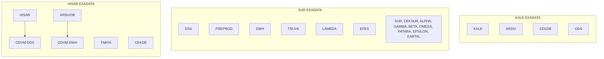
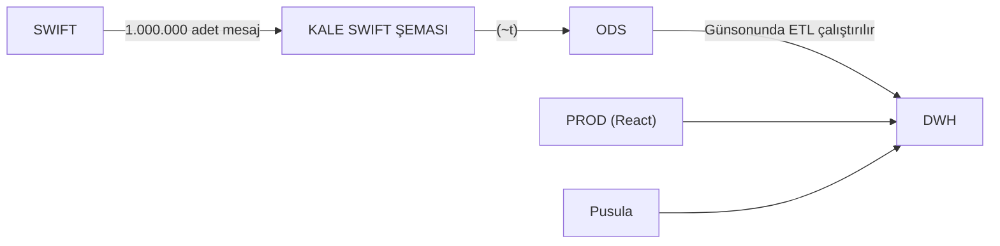
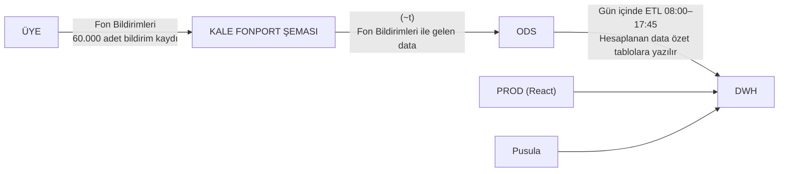
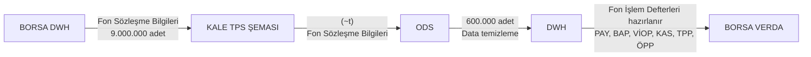
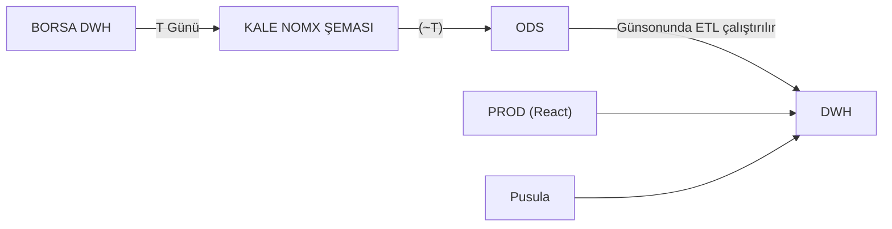

# DWH Sunum Temmuz 2025

Takasbank iç sunumu *DWH Sunum_Temmuz2025* (25 slayt). Bu not **sunumun söylediklerinin** sahibidir. Ortam gerçekleri [[Fiziksel Topoloji - Teknik Taraf]], ODS kapsamı [[ODS]], faz/pilot [[Proje Planı]], açık kararlar [[Aktif Sorular]].

> [!info] Kaynak
> Fotoğraflar ekrandan çekildi; tarayıcı çubuğu da karede. PDF yolu: `Documents/DWH/4 - DWHSunum_Temmuz2025.pdf`. Gizlilik: **Kurum İçi**. Logo: TAKAS ISTANBUL (sol üst), Borsa İstanbul Grubu (sağ alt).

> [!warning] Eksik slaytlar
> Fotoğrafta yok: **1–3, 7, 9, 25**.

## Slayt 4 — Önceki toplantı özeti

![[_sources/DWH Sunum Temmuz 2025/slide-04.jpg]]

- [[DWH]] yapısı kurulurken [[ODS]] ara katmanının da kurulması değerlendirilmiş olup **ODS kurulmasına** karar verilmiştir.
- [[Kale]] databaseindeki datanın **replikasının ODS** ortamına taşınması amacıyla kullanılabilecek araçların neler olabileceği tartışılmıştır. (Dataguard, Goldengate vb.) — [[Dataguard vs Goldengate]]
- **DSS** veri tabanının **ODS** ortamı olarak kullanılabileceği değerlendirilmiştir.
- **Realtime** datanın **ODS** katmanında, **T-1** datasının **DWH** katmanında tutulması değerlendirilmiştir.
- ODS'nin **KALE isimli exadata** üzerinde konumlandırılabileceği belirtilmiştir. KALE, ARSIV, CEKDB yanında 4. bir veritabanı olarak eklenebilir.
- **DWH**'ın **SUR** üzerinde, **ODS**'nin **KALE** üzerinde konumlandırılabileceği belirtilmiştir.
- **ETL**'in bağımsız bir sunucuda da olabileceği belirtilmiş olup **ODS'in konumlandırıldığı yerde** olmasının daha uygun olduğu ifade edilmiştir.

## Slayt 5 — Yaklaşım

![[_sources/DWH Sunum Temmuz 2025/slide-05.jpg]]

- MKK, Borsa, Vakıfbank gibi görüşme yapılan kurumlardaki DWH süreçleri hakkında bilgi verilmiştir. Takasbank olarak **artı** ve **eksi yönlerimiz** değerlendirilmiştir.
- DWH kurulması çalışmaları sürecinde UG'ler ile birlikte çalışılması gerektiği ifade edilmiş olup, DWH kurulması çalışmaları **UG ekipleri ile birlikte** yapılacaktır.
- DWH alt yapısı oluşturulması çalışmasının **fazlara ayrılarak** yapılıp yapılmayacağı değerlendirilmiştir.
- **Örnek uygulamalar** üzerinden sürecin değerlendirilmesine karar verilmiştir. **Pilot bir proje seçilerek** bu proje kapsamında DWH yapısının kurulmasına karar verilmiştir.
- **4 örnek uygulama** seçilerek bu uygulamalar için tasarlanacak DWH sürecinin akışları değerlendirilmiştir.
- DWH altyapısı kurulması kapsamında **ODVM** mimarisinin de çalışılmasına karar verilmiştir.

## Slayt 6 — Amaç ve hedefler

![[_sources/DWH Sunum Temmuz 2025/slide-06.jpg]]

**AMAÇ ve HEDEFLER**

- Takasbank'ta **iş birimleri operasyonel amaçlı raporlar** kullanmaktadır. Takasbank'ta DWH altyapısının oluşturulması sonucunda **semantik katman** üzerinden rapor oluşturulabilmesi amaçlanmaktadır.
- **Semantik** katman oluşturulduktan sonra halihazırda kullanmakta olduğumuz **Microstrategy raporlarının** semantik katman üzerinden oluşturulması hedeflenmektedir.
- **Geçmiş tarihli büyük verilerin** DWH ortamında tutulması kaynağın daha etkin kullanımına imkan verebilecektir. Geçmiş tarihli datanın DWH üzerinden raporlanması ile KALE veri tabanının daha etkin şekilde kullanılabilmesi amaçlanmaktadır.
- Raporlama amaçlı kullanılacak veri tabanı ile işlemler için kullanılacak veri tabanı **birbirinden ayrılmış olacaktır.**
- Mevcut durumda Takasbank'ın elinde birçok piyasaya ilişkin çok çeşitli **analize imkan sunabilecek** nitelik ve nicelikte **kaliteli bir data** mevcuttur. Bu data üzerinden **detaylı analizler yapılması** mümkün olup DWH altyapısıyla verinin daha kolay erişilebilir ve analiz edilebilir bir forma getirilmesi amaçlanmaktadır.
- Veri ambarı **yapay zeka modelleri** için veri hazırlık katmanı olarak görev yapmaktadır. Semantik katmanın oluşturulması ile yapay zeka tabanlı çalışmalar için altyapı oluşturulması amaçlanmaktadır.

## Slayt 8 — Exadata yerleşimi

![[_sources/DWH Sunum Temmuz 2025/slide-08.jpg]]

Sunumun önerdiği yerleşim. Güncel ortam notu: [[Fiziksel Topoloji - Teknik Taraf]]. Yeşil kutular ODS/DWH hedefleri.

- **KALE EXADATA:** KALE, ARSIV, CEKDB, **ODS**
- **SUR EXADATA:** DSS, PREPROD, **DWH**; TRUVA, LAMBDA, EFES; SUR, CEKSUR, ALPHA, GAMMA, BETA, OMEGA, PATARA, EPSILON, KARTAL
- **HISAR EXADATA:** HISAR, TABYA, CEKDB, ARSIVDB; HISAR altında **ODVM ODS**, ARSIVDB altında **ODVM DWH**

## Slayt 10 — DWH üzerinde geliştirilebilecek projeler

![[_sources/DWH Sunum Temmuz 2025/slide-10.jpg]]

**DWH Altyapısı Üzerinde Geliştirilebilecek Projeler** — sunumun 4 örnek uygulaması:

1. SWIFT İşlemlerine İlişkin Yasal Raporların DWH Ortamında Oluşturulması
2. Fon Bilgilendirme Platformu Datasının DWH Ortamında Oluşturulması
3. Fon İşlem Defterleri Datasının DWH Ortamında Oluşturulması
4. BISTECH Piyasalarına İlişkin SPK Raporlarının DWH Ortamında Oluşturulması

## Slayt 11 — SWIFT yasal raporlar

![[_sources/DWH Sunum Temmuz 2025/slide-11.jpg]]

**SWIFT İşlemlerine İlişkin Yasal Raporların DWH Ortamında Oluşturulması**

- SPK, BDDK, MASAK, Hazine ve Maliye Bakanlığı, Mahkemeler vb. kurumlardan Takasbank'ta ilgili kimliğe ilişkin varlık ve işlem bilgileri sorgulanmak üzere kimlik bilgileri iletilmektedir.
- İletilen kimlik bilgilerine ilişkin SWIFT üzerinde yapılan işlemler, belirli bir formatla ilgili kurumlara iletilmektedir.
- Mevcut durumda her bir SWIFT işlemi için bir SWIFT mesajı oluşturulmakta ve bir mesaj numarası ile takip edilmektedir.
- SWIFT mesajları, bir SWIFT mesajı için mesaj detay tablosunda **birden fazla satırda data tutulacak** şekilde tasarlanmıştır.

## Slayt 12 — SWIFT hacim

![[_sources/DWH Sunum Temmuz 2025/slide-12.jpg]]

- Herbir mesaj türüne göre mesaja konu satır sayısı değişmekte olup bir mesaj için ortalama **50 satır** kayıt bulunmaktadır.
- Günlük olarak ortalama **1 milyon** adet mesaj kaydı oluşmaktadır. Yılda ortalama olarak toplam **250 milyon** kayıt oluşmaktadır. 2013 yılından itibaren yaklaşık **2 milyar satır** data (**120 GB** veri + **50 GB** index alanı) oluşmuştur.
- SWIFT mesajlarında kimlik bilgisi mesaja konu serbest alanlar içinde yer almakta olup, sorgulama yapılırken ilgili serbest alan içinde ilgili kimlik numarası aranmaktadır.

## Slayt 13 — SWIFT yeni yapı

![[_sources/DWH Sunum Temmuz 2025/slide-13.jpg]]

- Yeni yapıyla birlikte DWH database'inde, her bir mesaj için **tek satırda kayıt** oluşturulacak şekilde özet bilginin tutulduğu tablo yaratılacaktır. (Böylece 2 milyar satırlı datanın yaklaşık **24 milyon satıra** düşürülmesi mümkün olabilmektedir.)
- Bu şekilde kayıt sayısı azaltılacak, aranan datanın filtrelenmiş data içinden taranması sağlanmış olacak ve raporların daha performanslı çalışması sağlanacaktır.
- [[Kale]] veri tabanındaki SWIFT mesajları [[ODS]] ortamına aktarıldıktan sonra günsonunda ETL aracı çalıştırılarak DWH ortamındaki özet tablolara yazılacaktır.

## Slayt 14 — SWIFT akış diyagramı

![[_sources/DWH Sunum Temmuz 2025/slide-14.jpg]]

DWH çıktısı: **T-1 datası**.

## Slayt 15 — Fon Bilgilendirme Platformu

![[_sources/DWH Sunum Temmuz 2025/slide-15.jpg]]

**Fon Bilgilendirme Platformu Datasının DWH Ortamında Oluşturulması**

- Fonların içeriğindeki varlık, fiyat vb. bilgiler **Fon Bilgileri** dosyası ile fonlar tarafından Takasbank'a bildirilmektedir.
- Fon bildirimleri her gün Takasbank ekranları aracılığı ile dosya okutularak yapılmaktadır.
- Bazı fon türleri eğer fonun içeriğindeki varlık, fiyat vb. bilgilerde bir değişiklik olmuş ise, düzeltme amaçlı tekrar dosya gönderebilmektedir.
- Her gün **08:00–17:45** saatleri arasında, **iletilen fon bilgileri** üzerinden hesaplama yapılarak raporlamaya konu olacak fon bilgileri ile hesaplanan getiri bilgilerini içeren **data ilgili rapor tablolarına yazılmaktadır.**

## Slayt 16 — Fon Bilgilendirme: mevcut ve yeni yapı

![[_sources/DWH Sunum Temmuz 2025/slide-16.jpg]]

- Raporlama aşamasında herhangi bir hesaplama yapılmamakta, sadece rapor tablolarından sorgu ile data çekilmektedir.
- Rapor tablolarına data atıldıktan sonra, gün içinde saat 17:45'e kadar düzeltme kayıtları gönderilebilmektedir. Bu nedenle daha önceden hesaplanmış olan değerler ilgili fon için tekrar hesaplanarak rapor tabloları güncellenmektedir.
- Yeni yapıyla birlikte **fonlar bildirimlerini yaptıklarında** data **KALE** ortamına yazılacak ve KALE ortamına yazılan data **ODS** ortamına anlık olarak aktarılacaktır.
- 08:00–17:45 saatleri arasında ODS'deki data üzerinden hesaplamalar yapılarak elde edilen sonuçlar **DWH'daki raporlama tablolarına** yazılacaktır.

## Slayt 17 — Fon Bilgilendirme: teslimat

![[_sources/DWH Sunum Temmuz 2025/slide-17.jpg]]

- Fon bilgilendirme platformundaki raporlar DWH üzerinden alınacaktır.
- Projenin devreye alınma aşamasında daha önceki yıllara ait raporlamaya konu data DWH'da ilgili raporlama tablolarına aktarılacaktır.
- Bu çalışmanın sonunda **10 yıllık tarihsel verinin DWH üzerinden CSV ile verilmesinin** yanında **webservis ile de verilmesi** planlanmaktadır.
- 10 yıllık tarihsel verinin webservis ile performanslı olarak verilebilmesi sağlanmış olacaktır.

## Slayt 18 — Fon Bilgilendirme akış diyagramı

![[_sources/DWH Sunum Temmuz 2025/slide-18.jpg]]

PROD (React) tarafı: Fon Bilgilendirme Platformu · web servis · dosya.

## Slayt 19 — Fon işlem defterleri

![[_sources/DWH Sunum Temmuz 2025/slide-19.jpg]]

**Fon İşlem Defterleri Datasının DWH Ortamında Oluşturulması**

- PAY, BAP, VİOP, KAS piyasaları için Borsa DWH sisteminden fonlara ilişkin sözleşme bilgileri gün içinde sürekli olarak Takasbank sistemine alınmaktadır.
- PAY, BAP, VİOP, KAS, TPP ve ÖPP piyasalarının kapanış saatine göre her bir piyasa için günde 2 kere olmak üzere fonlara işlem defterleri oluşturulmaktadır.
- Sözleşme bilgileri üzerinden fon bazında oluşturulan işlem defterleri hem fon hizmet birimleri hem de kurucu üyeler için dosya şeklinde hazırlanmaktadır.
- Oluşturulan dosyalar borsanın Verda sistemine yüklenmektedir.
- Borsadan alınan sözleşmeler 5 gün boyunca sistemde saklandıktan sonra silinmektedir.
- Yeni yapıyla **Borsa DWH'dan** alınan data **KALE**'ye yazıldıktan sonra **ODS**'e aktarılacaktır.

## Slayt 20 — Fon işlem defterleri: ODS / ETL

![[_sources/DWH Sunum Temmuz 2025/slide-20.jpg]]

- ODS'e aktarılan data içinde, hesap kodu bilgisi ilgili fona ait olmayan kayıtlar tespit edilerek **ODS katmanında temizlenecektir.**
- Temizlenmiş data üzerinden **ETL çalıştırılıp kontroller ODS üzerinde yapılacak** ve özet hesaplamalar yapılıp **hesaplanan değerler DWH tablolarına** yazılacaktır.
- Piyasa kapanış saatlerinde fon işlem defteri dosyaları DWH üzerinden oluşturularak Verda'ya yazılacaktır.
- Yeni yapıyla birlikte her yeni sözleşme bildirimi yapıldığında kontrol ve hesaplama yapan taskler **KALE'de çalışmayacaktır.** Hesaplamalar ETL üzerinde yapılacaktır.
- ODS katmanında **data temizlendikten sonra** hesaplama yapılacağından daha az datayla çalışılmış olacaktır.
- Data DWH'a alındıktan sonra ODS'den silinerek temizlenecektir.

## Slayt 21 — Fon işlem defterleri akış diyagramı

![[_sources/DWH Sunum Temmuz 2025/slide-21.jpg]]

ODS → DWH: ETL çalıştırılır; hesaplanan data özet tablolara yazılır.

## Slayt 22 — BISTECH SPK raporları: kaynaklar

![[_sources/DWH Sunum Temmuz 2025/slide-22.jpg]]

**BISTECH Piyasalarına İlişkin SPK Raporlarının DWH Ortamında Oluşturulması**

- Mevcut durumda SPK'ya **13 adet rapor** verilmektedir.
- Raporlara konu datanın bir kısmı Takasbank [[Kale]] veri tabanında **NOMX** şemasında, bir kısmı Borsa tarafında **Replica BIDB** şemasında bulunmaktadır.
- **5 rapor için:** Kaynak = Replica BIDB → Hedef = KALE
- **7 rapor için:** Kaynak = KALE Nomx şeması → Hedef = KALE
- **1 rapor için:** Kaynak = KALE Nomx şeması ve Replica BIDB → Hedef = KALE

## Slayt 23 — BISTECH SPK: yeni yapı

![[_sources/DWH Sunum Temmuz 2025/slide-23.jpg]]

- Rapor tablolarına atılan data için db link ile **DB_ARSIV** veri tabanında view oluşturularak data SPK kullanıcılarına sunulmaktadır. SPK yetkili kullanıcısı DB_ARSIV databaseindeki viewlara erişebilmektedir.
- Yeni yapıyla birlikte **SPK'ya iletilen 13 rapora** ilişkin hesaplanmış **T-1 gününe** ait data DWH veritabanı üzerinde tutulacaktır.
- Bu yapıda KALE veritabanında hesaplanmış datanın olduğu tablolar Takasbank DWH veritabanında aynı formatla oluşturulacaktır.
- Takas UG **günsonu adımları tamamlandıktan sonra** KALE veri tabanındaki data **ODS üzerinden** Takasbank DWH tablolarına **ETL aracı ile** aktarılacaktır.
- Sonrasında view tabloları oluşturularak SPK'ya bu view tablolarına erişim için yetki verilecektir.

## Slayt 24 — BISTECH SPK akış diyagramı

![[_sources/DWH Sunum Temmuz 2025/slide-24.jpg]]

DWH çıktısı: **T-1 datası**.

İlgili notlar: [[DWH]] · [[ODS]] · [[Kale]] · [[Proje Planı]] · [[Aktif Sorular]] · [[Fiziksel Topoloji - Teknik Taraf]]
