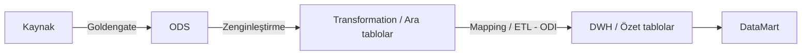
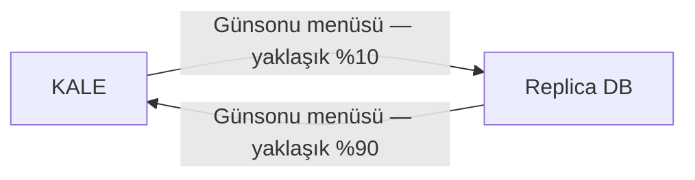

# Firmalarla Yapılan DWH Görüşmeleri

**BI Technology, Ondata ve Obase** ile yapılan DWH görüşmelerinin altı sayfalık kaynak nottan aktarımı. Bu not **görüşmelerde söylenenleri ve kaynakta kaydedilen değerlendirmeleri** içerir; güncel ürün özelliklerini, lisans koşullarını veya kurumun kesinleşmiş kararlarını teyit etmez.

> [!info] Kaynak ve kapsam
> `Firmalarla Yapılan DWH Toplantıları.pdf` dosyasının **6 sayfasının tamamı**, IMG_7779–IMG_7784 fotoğraflarında bulunmaktadır. Sayfalar ayrı görseller olarak kırpılıp perspektifleri düzeltilmiş; **5 mimari/akış/proje görseli ayrıca çıkarılmıştır**. Belgede açıkça görülen tarihler **05/07/2024** ve **12/07/2024**'tür. Diğer toplantıların tarihleri belirtilmemiştir.

> [!note] Kaynak ifadeleri ve belirsizlikler
> Yazım ve noktalama okunabilirlik için düzenlenmiştir. Kaynaktaki “Click”, “mangoy”, “Jdbs” ve “IRD” gibi ürün/terim yazımları ilgili yerde işaretlenmiştir. Dataguard, Goldengate, ETL/ELT ve lisanslamaya ilişkin ifadeler konuşmacıların/toplantı notunun beyanları olarak aktarılmıştır. Sayfa 5'teki “DBA mail ile sor” gibi eylem ifadeleri belgenin takip maddeleridir; bu aktarım kapsamında iletişim kurulmamıştır.

## Görüşmelerin özeti

- Ortak mimari yaklaşım: **Kaynak → ODS → Transformation / ara tablolar → DWH / özet tablolar → Datamart**.
- **ODS** üzerinden anlığa yakın raporlama, **DWH/Datamart** üzerinden tarihsel ve analitik raporlama ele alınmıştır.
- BI Technology görüşmesinde **Talend/Informatica**, bileşenler, lisanslama ve replikasyon araçları konuşulmuştur.
- Ondata görüşmelerinde **ODI**, **ETL/ELT**, kaynak/hedef topolojisi, mapping, dönüşüm ve modelleme ayrıntılandırılmıştır.
- Obase görüşmelerinde **Bankacılık UG, DBA, Takas UG ve BT Mimari** bakışlarıyla mevcut veri yapısı, **BIDB–Replica BIDB–KALE ilişkisi**, ERD eksikliği ve modelleme ihtiyacı kaydedilmiştir.
- Goldengate için **7/24 izleme/destek**, replikasyonun durması ve kritik raporların etkilenmesi endişeleri belirtilmiştir.

## Sayfa 1 — BI Technology / Ahmet Kaplan görüşmesi

![[_sources/Firmalarla Yapılan DWH Görüşmeleri/page-01.jpg]]

**Kaynakta adı geçen kişi:** Ahmet Kaplan. **Tarih:** belirtilmemiş.

### Ürün, çalıştırma ve veri kalitesi

1. Informatica'nın **on-premises ürün satmadığı, yalnızca cloud ürün sattığı** ifade edilmiştir. Kaynakta on-premises, yazılım ve uygulamanın kurumun bilgi işlem ortamında kurulup çalıştırılması olarak açıklanır.
2. **Data içeride, sorgu yönetimi cloud'da** şeklinde bir yapı anlatılmıştır.
3. Agent'ların kurulduğu, agent erişim arayüzü bulunmadığı ve **agent tetiklemesinin kurum içinden** yapıldığı belirtilmiştir.
4. **Informatica ETL'e yatırım yapılmadığı**, bu kararın “geçen yıl” çıktığı kaydedilmiştir. Toplantı tarihi verilmediğinden göreli yıl kesinleştirilmemiştir.
5. Talend'in “**Click** platformunda” olacağı belirtilmiştir; ürün/platform adı kaynakta bu şekilde yazılmıştır.
6. Talend'in önceden açık kaynak olduğu, “**Ocak'tan beri lisanslı**” olduğu aktarılmıştır. Yıl belirtilmemiştir.
7. **Data migration, data governance, veri kalitesi ölçümü ve anlık veri raporlaması** için ayrı bir ETL altyapısı bulunduğu belirtilmiştir.
8. **Application API entegrasyonu:** Ürün ailesi içinde ayrı sunucuda API oluşturulduğu anlatılmıştır.
9. **Veri kalitesi:** Semantik kurallar tanımlanır; örneğin TCKN'nin 11 haneli olması kuralına uymayan veya boş haneli/tutarsız kayıtlar tespit edilir.
10. **ELT ve ETL farkı** konuşulmuştur. Kaynak notta ELT için, güçlü olması halinde kaynak Oracle üzerinde önce loading yapılıp sonra DWH'a transfer edildiği ifadesi yer alır; bu ifade toplantı notunun anlatımıdır.
11. Talend'de her biri farklı görev yapan **component'ler** vardır; join ve eşleştirme örnek verilmiştir.
12. Talend ETL üzerinde **Java ve PL/SQL** çalıştırılabildiği belirtilmiştir.
13. Ürün **object-oriented** olarak tanımlanmıştır.

### Lisanslama ve açık soru

14. **Aktif-aktif çalışabilir mi?** sorusu sorulmuştur. **Failover/recovery konusunda geri dönüş yapılacağı** kaydedilmiştir; cevap belgede yoktur.
15. **Kullanıcı bazlı lisanslama**, minimum **2 kullanıcı**, **admin ve developer** lisansları, yetkiyle yönetim ve **yıllık lisans kiralama** anlatılmıştır. CPU ve data miktarının önemli olmadığı, kullanıcı bazlı kaynak desteği sağlandığı ifade edilmiştir.
16. Danışmanlık ve ürün alımının **BI Teknoloji'den yapılacağı** not edilmiştir. Belgede satın alma/onay belgesi bulunmamaktadır.

### Replikasyon, ODS ve Datamart

17. Near real time replikasyon araçlarının **veri tabanı loglarına bakarak yazdığı** anlatılmıştır.
18. Near real time için replikasyon aracı gerektiği; **Goldengate** ile replikasyon yapıldığı belirtilmiştir.
19. Goldengate'de **her tablonun ayrı çalıştığı** ifade edilmiştir.
20. Veri tabanı sunucusuna **yük getirmediği** iddia edilmiştir; bu, görüşme beyanıdır.
21. Dataguard'ın veriyi replike ettiği; Goldengate'in **insert/update/delete değişiklik bilgisini** de taşıdığı ve silinen verinin Datamart'tan da silinmesine ilişkin işlem mantığı anlatılmıştır. **Goldengate ve Dataguard sorumluluğu DBA** olarak kaydedilmiştir.
22. Dataguard'ın farkı raporladığı; Goldengate'in değişen verinin **flag'ine göre işlem belirlediği** anlatılmıştır.
23. **T-1 → DSS aktarımının Dataguard** ile yapıldığı belirtilmiştir.
24. **Near real time / T verisinin Goldengate** ile aktarıldığı belirtilmiştir.
25. “**Click Replicate — Talend'in ürünü**” ifadesi yer alır; kaynak yazımı korunmuştur.
26. **ODS katmanına ihtiyaç olduğu**, veriyi çoklatmadan veri ambarı ve raporlamaya özel Datamart kurulması konuşulmuştur. ODS, anlığa çok yakın ve kısa süreli veriyi tutan, yeni veriyle ezilebilen katman; veri ambarı ise daha kararlı ve geçmiş veri üzerinde arama yapılabilen katman olarak açıklanmıştır. ODS'nin İngilizce açılımı kaynakta “Operational Data Storage” yazılmıştır.
27. “**IRD diyagramı çıkarılacak**” notu vardır. Kısaltma kaynakta IRD'dir; belgenin diğer bölümlerinde ERD geçer.
28. Veri ambarının doğrudan rapora açılmayacağı; **Datamart'lar oluşturulup bunlardan raporlama** yapılacağı belirtilmiştir. Datamart, veri ambarının genellikle bir iş koluna veya takıma yönelik alt kümesi olarak tanımlanmıştır.

## Sayfa 2 — Ondata / Süleyman Akkum görüşmesi

![[_sources/Firmalarla Yapılan DWH Görüşmeleri/page-02.jpg]]

**Kaynakta adı geçen kişi:** Süleyman Akkum. Bu ilk bölüm için ayrı tarih verilmemiştir; aşağıdaki **05/07/2024** başlığı ayrı bir toplantı bölümüdür.

1. **Kaynak → ODS → Veri Ambarı → Datamart** akışı ele alınmıştır.
2. **ETL mi, ELT mi?** sorusu değerlendirilmiştir.
3. ETL'de verinin kaynaktan çekildiği, dönüştürüldüğü ve yüklendiği; işlemin kendi sunucusunda ve onun kaynaklarıyla çalıştığı anlatılmıştır.
4. **ODI'nin ELT yapabilmesinin performans sağladığı**, ETL mimarisinin ELT'ye göre dezavantajları olduğu ifade edilmiştir.
5. ODI için **repository'de bir şema kurulduğu** belirtilmiştir.
6. ODI yedeği alındığında şema yedeğinin alındığı ve ODI'nin kendi üzerinde veri tuttuğu not edilmiştir.
7. **SQL, FTP, SAP, “mangoy”, Hyperion** bağlantıları ve yaklaşık **100 uygulama** desteğinden söz edilmiştir. “mangoy” kaynak yazımıdır; ürün adı kesinleştirilmemiştir.
8. Yalnızca bağlantı tanımlandığı ve bir driver ile bağlanıldığı belirtilmiştir; driver adı kaynakta “**Jdbs**” yazılmıştır.
9. Topolojide **veri kaynağı ve veri hedefi** tanımlanır; her şema için bir model tasarlanır.
10. **ODI lisansının veri ambarı lisansıyla**, verinin insert edildiği yerin **core sayısına göre** lisanslandığı ifade edilmiştir.
11. Veri tabanına bağlanarak tabloların, alanların ve kolonların topolojiye getirildiği anlatılmıştır.
12. Modeller tasarlanır.
13. Hedef tabloya yazacak **mapping'ler** gerekir; kaynak notta “ETL → Mapping” ifadesi vardır.
14. ETL sırasında mevcut prosedürün içindeki **script'in aynen kullanılabildiği** belirtilmiştir.
15. **Borsa DWH'a bağlanarak oradaki datanın da alınabileceği** ifade edilmiştir.

## 05/07/2024 — Ondata ve diğer ekipler: ODS ve replikasyon

Kaynak: **sayfa 2, ikinci bölüm**; devamı sayfa 3.

1. **Model mimarisi görseli** paylaşılmıştır.
2. Ana veri tabanından/kaynak sistemden alınan data **Goldengate ile birebir ODS'e** aktarılacaktır. ODS raporlamasının kaynak sistemden ayrılması ve ana veri tabanına gitmeden **anlığa yakın canlı datanın ODS'den raporlanması** anlatılmıştır.
3. Goldengate ile ODS'e aktarımdan sonra **raporlama amacıyla kaynak sisteme gidilmeyeceği** belirtilmiştir.
4. Goldengate konumlandırılırsa ana veri tabanına tekrar gitme ihtiyacının kalmayacağı ifade edilmiştir.
5. Dataguard'ın **read-only** olduğu, yeni kolon eklenemediği ve bu nedenle bu senaryoda Goldengate kullanılması gerektiği anlatılmıştır. “Real time raporlama için Dataguard yeterli değil” değerlendirmesi kaydedilmiştir.
6. Goldengate'in **DBA ekibinin sorumluluğunda** olduğu, genel kurulumun veri tabanı ekibi tarafından yapılacağı belirtilmiştir.
7. **Takasbank DBA ekibi**, Goldengate'in sorun çıkarabilen bir araç olduğunu; kurulursa **7/24 destek gerektireceğini**, replikasyonun durmasının kritik raporları etkileyebileceğini belirtmiştir. Parantez içindeki karşı görüşte, **7/24 kontrolün bütün sistemlerde gerekli olduğu** söylenmiş ve bu ifade kaynakta **Smartmind** adına bağlanmıştır.
8. Sonraki aşama **transformation** olarak açıklanmıştır.

## Sayfa 3 — Ondata toplantısının devamı: dönüşüm, DWH ve model

![[_sources/Firmalarla Yapılan DWH Görüşmeleri/page-03.jpg]]

Kaynakta 05/07/2024 bölümünün **9–16. maddeleri**:

9. Transformation aşamasında veri tabanındaki bir şema içinde **ara tablolar** oluşturulur; bunlar DWH'a aktarımdan önceki tablolardır.
10. Kaynaktan gelen tablolara **join, hata kontrolleri, zenginleştirme, tekilleştirme ve KPI oluşturma** işlemleri uygulanabilir. Bu aşamada özet tablolar olmadığı; **özet tabloların DWH'da** olacağı belirtilmiştir.
11. Ardından **veri ambarı**, **partition tablolar** ve **Datamart katmanı** oluşturulur. Geçmiş veriyi raporlarken aynı sorgunun her seferinde çalıştırılmaması ve sürecin **ODI ile otomasyonu** anlatılmıştır.
12. DWH aşamasında **mapping'ler** yapılır.
13. Özet tabloların DWH'da bulunduğu; kaynak tabloların ilişkili biçimde tutulduğu yapının DWH/Datamart olduğu kaydedilmiştir.
14. Akış: **Kaynak → ODS → Transformation (Ara tablolar) → DWH (Özet Tablolar) → DataMart**. Kaynak–ODS arasında **Goldengate**; dönüşümde **zenginleştirme**; mapping tarafında **ETL/ODI** belirtilmiştir.
15. **Microstrategy**, Datamart verisiyle sürükle-bırak raporlama sağlar. Free-form SQL ile alınan raporların yeni SQL yazmadan Microstrategy üzerinden alınabilmesi anlatılmıştır.
16. Analizde **bütüncül bakış**, model tasarımında ise **proje proje ilerleme** önerilmiştir.

### Çıkarılan görsel — Financial DW Model Architecture

![[_sources/Firmalarla Yapılan DWH Görüşmeleri/financial-dw-model-architecture.jpg]]

Görseldeki ana başlıklar:

- Üst yönetim katmanı: **Data Integration & Metadata Management**.
- **Operational Systems** kaynakları: Loans, Dep, ACC.
- **Analytical Systems:** ODS / Data Lake → Transformation → DW Model → Datamart Models.
- ODS / Data Lake içinde kaynak tabloları; Transformation içinde **Temp Tables** gösterilir.
- **Data Mining / D.M. Apps.** altında **Segment, Churn, Propensity** örnekleri yer alır.
- Tüketim alanları: **Operational Reporting, Analytical Reporting, Data Mining**.
- Kullanıcı grupları: **Operators; Finance, Sales; Analysts, Explorers**.

## Sayfa 4 — Proje adımları ve Obase görüşmeleri

![[_sources/Firmalarla Yapılan DWH Görüşmeleri/page-04.jpg]]

### Çıkarılan görsel — Proje adımları

![[_sources/Firmalarla Yapılan DWH Görüşmeleri/proje-adimlari.jpg]]

Proje yaklaşımı, birbirini takip eden ve paralel de yapılabilen **iteratif analiz, tasarım, geliştirme ve test** süreci olarak açıklanmıştır. Görseldeki dört aşama:

1. **Analiz:** İş birimi toplantıları; kaynak sistem tablolarının analizi; kullanılan DWH tablolarının analizi; teknik analizler.
2. **Model Tasarımı:** Veri modeli tasarımı; kaynak sistem mapping; veri aktarım yönteminin belirlenmesi.
3. **ETL Geliştirme:** İlk yükleme; ETL eşleştirme (mapping); birim testleri.
4. **Rapor Geliştirme:** Rapor geliştirme; rapor test; rapor UAT.

Kaynakta belirtilen toplantı düzeni: **her sabah günlük planlama**, **iki haftada bir proje değerlendirme**, **ayda bir yönlendirme komitesi** toplantısı.

### Obase — Bankacılık UG

**Kaynakta listelenen isimler:** Ozan Balaban, Serdar Karaman, Sedat Oran. **Tarih:** belirtilmemiş.

- Bankacılıkta ön yüz **React**, backend **Java**.
- Takasbank'ın tüm tabloları **PowerDesigner** içinde bulunmaktadır; **ERD (Entity Relationship Diagram) yoktur**.
- **1996–2022** yılları verisi Arşiv veri tabanında; **2023 → bankaold**, **2024 → banka** olarak not edilmiştir.
- **Arşiv veri tabanı ayrıdır.**
- Günsonunda hesaplama yapılarak bir tabloya yazıldığı ve bunun **fact tablo** olarak adlandırıldığı anlatılmıştır. **Fact (Gerçek) / Dimension (Boyut)** tablolarından söz edilmiştir.
- **TEFAS'ta yoğun talimat kaydı** bulunur; data talimat tablosundan çekilir.
- Anlığa en yakın verinin **DWH yerine ODS katmanından** verileceği belirtilmiştir.
- **Kerim Bey**, kavramsal veri modeli bulunmadığını belirtmiştir.

### Obase — DBA toplantısı

**Tarih:** belirtilmemiş. Bölüm sayfa 5'te devam eder.

- **KALE, ARSIVDB, ÇekDB ve ODVM** tarafı konuşulmuştur.
- **DSS ve Preprod read/write** kullanılmaktadır.
- Gece **04:00'te senkronizasyon** yapıldığı belirtilmiştir.
- **Dataguard kullanıldığı** kaydedilmiştir.
- Goldengate replikasyonunun durmasına karşı **7/24 çalışacak izleme ekibinin olmadığı** belirtilmiştir.
- **Serdar Bey**, Goldengate'de bug'lar bulunduğunu söylemiştir.
- Goldengate'in yalnızca **anlık data ihtiyacı olanlar için** kullanıldığı belirtilmiştir.
- Dataguard'ın **iki şekilde kullanıldığı** not edilmiştir; türler sonraki sayfadadır.

## Sayfa 5 — DBA devamı ve 12/07/2024 Obase–Takas UG

![[_sources/Firmalarla Yapılan DWH Görüşmeleri/page-05.jpg]]

### DBA toplantısının devamı

- Dataguard kullanım biçimleri: **anlık çekilip anlık yazılması** ve **sabah bir kez beslenmesi**.
- Dataguard tarafında gün içinde tablonun **drop edilebildiği/değiştirilebildiği** ifade edilmiştir. Bu beyan ile sayfa 2'deki read-only anlatımı farklı bağlamlarda aktarılmıştır; kaynak kullanım modu ayrımını açıklamamaktadır.
- Dataguard ile **tüm veri tabanının**, Goldengate ile **tablo bazında** replikasyon yapılabildiği belirtilmiştir.
- Obase, replikasyon için **Kafka'nın da kullanılabileceğini** söylemiştir.
- **DSS'in ikinci veri tabanı olarak kullanılabileceği ve DWH'ın orada kurgulanabileceği** değerlendirilmiştir.
- Yaklaşık **10.000 tablo** vardır: **7.000 ana tablo**, yaklaşık **3.000 backup tablosu**.
- **Takip maddesi:** En fazla veri bulunan tablolar ve veri miktarları **DBA'ya e-posta ile sorulacak**. Belgede sonuç/cevap bulunmamaktadır.

### Obase — Takas UG Bölümü, 12/07/2024

![[_sources/Firmalarla Yapılan DWH Görüşmeleri/bidb-mimarisi.jpg]]

Görsel ve metindeki mimari açıklamalar:

- **Aktif DB:** “Read Only” ve **30 günlük aktif data** ifadeleri yer alır.
- **BIDB:** Zenginleştirilmiş data ile **T0 ve tarihçe datası** tutulur.
- **Replica BIDB:** Anlık data alır; hem zenginleştirilmiş hem **T0 datası** içerir.
- Ana şema **Aktif DB → BIDB → Replica BIDB** ilişkisini gösterir. Metinde **BIDB'den Replica BIDB'ye Dataguard ile aktarım** anlatılmıştır.
- **BIDB Application**, ara uygulama olarak BIDB'ye yazar; BIDB'nin doğrudan main application ile beslenmediği not edilmiştir. Şemanın alt uygulama okları görselde korunmuştur.
- BIDB Application **query'ler çalıştırır, broadcast'ler çalıştırır ve dosyalar okur**.
- Replica BIDB'yi **%99 Takasbank'ın kullandığı** ifade edilmiştir; oranın ölçüm tanımı verilmemiştir.
- Ayrıca **BIST Exadata** vardır ve Takasbank'ın bunu kullanmadığı belirtilmiştir. Aktif DB'den **Goldengate ile Exadata DWH'a** aktarım anlatılmıştır.
- Günsonlarında Replica DB'den alınan data **KALE tablolarına** yazılır; bazen birebir, bazen işlenerek yeni tablolara aktarılır.
- Günsonu ekranının bir tarafı **Replica BIDB**, diğer tarafı **KALE** bağlantılıdır. Prosedür Replica DB'den alıp sonucu KALE'ye yazar.
- Ters yönde, **KALE'den Replica DB'yi besleyen** durumlar da vardır. Kaynakta yaklaşık **%10 KALE → Replica DB**, **%90 Replica DB → KALE** olarak anlatılmıştır.
- Replica DB'de **200 tablo ve 200 prosedür** bulunduğu belirtilmiştir.

### Çıkarılan görsel — KALE / Replica DB günsonu akışı

![[_sources/Firmalarla Yapılan DWH Görüşmeleri/kale-replica-akisi.jpg]]

## Sayfa 6 — Takas UG devamı ve BT Mimari görüşmesi

![[_sources/Firmalarla Yapılan DWH Görüşmeleri/page-06.jpg]]

### Takas UG toplantısının devamı

- **İlişkisel veri modeli olmadığı**, prosedürlerin **logic üzerinden** oluşturulduğu belirtilmiştir.
- **Hasan Bey**, KALE ve Replica DB verisinin birleştiği durumlarda **tek yerden veri çekilmesini tercih ettiğini** söylemiştir.
- Bu bölümde **T-1 datası** oluştuğu not edilmiştir.

### Obase — Faruk Bey, Kerim Bey ve BT Mimari, 12/07/2024

Kaynak başlığında firma adı “OBESE” yazılmıştır; belgedeki diğer Obase görüşmeleriyle birlikte **Obase** başlığı altında aktarılmıştır.

1. **Modelleme PowerDesigner'da yapılacak**; bu noktada **BT Mimari ile çalışılacak**.
2. Mevcut durumda **iş etki analizi yapılmadığı** belirtilmiştir.
3. **ERD olmadığı** kaydedilmiştir.

### Çıkarılan görsel — BT Mimari bağlantıları

![[_sources/Firmalarla Yapılan DWH Görüşmeleri/bt-mimari-baglantilar.jpg]]

Görselde **ÜYE → KALE**, **OPR → KALE**, **SFTP → KALE**, **MSTR → KALE**, **MSTR → BIST DWH** ve ayrı bir **API → ÜYE** bağlantısı gösterilir. Bunlar kaynak çizimdeki ok yönleridir; veri akışının ayrıntıları ayrıca açıklanmamıştır.

**“Bağlantı sağlanan kurumlar” başlığı altında verilen liste:**

- EPIAS, MKK, MB, SWIFT, SBM, KKB, EGM, KIK, NOTER BİRLİĞİ, TAPU.
- BES, TEFAS, TPP, ÖPP, KAMUTEM, KITLEFON, TAPU, TAŞIT, ENERJİ, TURIB, PYSGF.

Kısaltmalar kaynak yazımlarıyla korunmuş; kurum, piyasa ve hizmet adları kaynakta aynı başlık altında listelendiği için yeniden sınıflandırılmamıştır.

## Kaynakta açık kalan takip maddeleri

- **BI Technology:** Aktif-aktif çalışma ve failover/recovery hakkında geri dönüş.
- **DBA:** En fazla veri içeren tabloların ve veri miktarlarının paylaşılması.
- **Modelleme:** Kaynakta “IRD” olarak anılan diyagramın çıkarılması; ERD/kavramsal model eksikliğinin ele alınması; PowerDesigner çalışmasında BT Mimari katılımı.
- **İşletim:** Goldengate için 7/24 izleme/destek ve replikasyon durması senaryosunun değerlendirilmesi.

Bu maddeler kaynakta geçen açık soru, plan ve ihtiyaçların derlemesidir. Tamamlanma durumu ve terminler belgede belirtilmemiştir.

## Kaynak fotoğraflar

Orijinal JPEG dosyaları değiştirilmemiştir. Vault içine alınan tam kare kopyaları:

- [[_sources/Firmalarla Yapılan DWH Görüşmeleri/IMG_7779.JPEG|IMG_7779 — Sayfa 1]]
- [[_sources/Firmalarla Yapılan DWH Görüşmeleri/IMG_7780.JPEG|IMG_7780 — Sayfa 2]]
- [[_sources/Firmalarla Yapılan DWH Görüşmeleri/IMG_7781.JPEG|IMG_7781 — Sayfa 3]]
- [[_sources/Firmalarla Yapılan DWH Görüşmeleri/IMG_7782.JPEG|IMG_7782 — Sayfa 4]]
- [[_sources/Firmalarla Yapılan DWH Görüşmeleri/IMG_7783.JPEG|IMG_7783 — Sayfa 5]]
- [[_sources/Firmalarla Yapılan DWH Görüşmeleri/IMG_7784.JPEG|IMG_7784 — Sayfa 6]]

İlgili notlar: [[DWH Sunum Eylül 2024]] · [[DWH Sunum Aralık 2024]] · [[DWH Sunum Temmuz 2025]] · [[DWH]] · [[ODS]] · [[Kale]] · [[Dataguard vs Goldengate]] · [[Proje Planı]] · [[Aktif Sorular]] · [[Fiziksel Topoloji - Teknik Taraf]]
