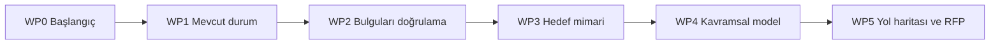

# Komtaş Future-Ready Data Platform Teklifi Ağustos 2026

Komtaş’ın **Takasbank Future-Ready Data Platform** başlıklı, **17.08.2026** tarihli ticari teklif sunumunun fotoğraflardan çıkarılmış notu. Bu belge **satıcının önerdiği kapsamı, teslimatları ve varsayımları** aktarır; toplantı tutanağı veya Takasbank’ın onaylanmış uygulama planı değildir.

> [!info] Kaynak ve kapsam
> 11 HEIC ekran fotoğrafından tam kare JPEG kopyaları ve **1–44. slaytların ayrı görselleri** çıkarıldı. PDF görüntüleyici **51 slayt** gösteriyor; **45–51 fotoğraflarda bulunmuyor**. Slayt 21–28’in iki ekran fotoğrafı (IMG_7773–IMG_7774) hareket bulanıklığı nedeniyle ayrıntılı metin için okunaksız. Kaynak PDF dosya adı ekrandan aktarıldı; asıl PDF bu çalışmada mevcut değildi.

> [!warning] Ticari teklifin son bölümü eksik
> Gündemde **Referanslar** ve **Ticari Teklif Özeti** var; ancak **45–51. slaytlar fotoğraflanmadığı için** bu bölümlerdeki referans, bedel, koşul veya geçerlilik bilgileri aktarılamaz. Fotoğraflardaki kapsam ve süre teklif beyanı olarak okunmalıdır.

## Teklif özeti

- Hedef: gelecekteki veri, analitik ve yapay zekâ ihtiyaçları için ölçeklenebilir veri platformunun tasarımını hazırlamak.
- Önerilen çalışma: **yaklaşık üç ay**, WP0–WP5 kapsamındaki mevcut durum analizi, doğrulama, hedef mimari, kavramsal veri modeli ve dönüşüm yol haritası.
- Başlıca çıktılar: mevcut durum/iş isterleri raporları, hedef ekosistem mimarisi, kavramsal model, önceliklendirilmiş yol haritası ve sonraki veri platformu projesi için **RFP**.
- Kritik bağımlılıklar: Takasbank’ın erişim ve dokümantasyon sağlaması, ilgili ekiplerin çalıştay ve onaylara katılması, önerilen kısa inceleme süreleri.
- Bu slaytlar **tasarım ve hazırlık fazını** ayrıntılandırır; gelecekteki platformun kurulup işletildiğini göstermez.

## Sunumdaki yaklaşım

İş paketleri grafikte kısmen paralel gösterilmiştir. WP2–WP3 ara detaylarının bir kısmı fotoğraflarda okunaksız olduğundan yukarıdaki adlar **slayt 9–10’daki genel plandan** alınmıştır.

## Slayt 1 — Kapak

![[_sources/Komtaş Toplantısı/slide-01.jpg]]

Komtaş × Takas İstanbul: **Takasbank Future-Ready Data Platform**. Teklif tarihi **17.08.2026**.

## Slayt 2 — Gündem

![[_sources/Komtaş Toplantısı/slide-02.jpg]]

Takasbank ihtiyacı; Komtaş proje yaklaşımı; proje planı ve detayları; temel proje ekibi; kritik başarı faktörleri; referanslar; ticari teklif özeti.

## Slayt 3 — Takasbank ihtiyacı

![[_sources/Komtaş Toplantısı/slide-03.jpg]]

Gelecekteki veri, analitik ve yapay zekâ ihtiyaçlarını karşılayacak, ölçeklenebilir ve “Future-Ready” bir veri platformu hedefleniyor. İlk adımda mevcut veri ekosistemi ve iş birimlerinin üst düzey ihtiyaçları incelenecek; veri kaynakları ve temel veri ihtiyaçları belirlenecek. Ardından referans mimari/topoloji, alternatif teknolojiler ve kavramsal veri modeli çalışılacak. Sonuçta öncelikli projelerle dönüşüm yol haritası ve sonraki veri platformu projesi için **RFP dokümanı** hazırlanması öneriliyor.

## Slayt 4 — Beklenen temel çıktılar

![[_sources/Komtaş Toplantısı/slide-04.jpg]]

**Hedef Teknoloji Mimari Dokümanı**, **Mantıksal Model Tasarımı**, **Kapsam ve Fazlandırma Raporu**, **Dönüşüm Yol Haritası**. Bunlar teklifin hedef çıktılarıdır; teslim edilmiş belgeler olarak gösterilmemiştir.

## Slayt 5 — Gündem: proje yaklaşımı

![[_sources/Komtaş Toplantısı/slide-05.jpg]]

“Komtaş Proje Yaklaşımı” bölümü başlıyor.

## Slayt 6 — Dönüşüm programı genel yaklaşımı

![[_sources/Komtaş Toplantısı/slide-06.jpg]]

**Tasarım ve Mimari Fazı:** current state analysis, future design, conceptual model ve roadmap/RFP ile kapsam, kavramsal model, mimari ve yol haritasını netleştirme. **Geliştirme Fazı:** tasarım fazı çıktılarını ve öncelikli planı dikkate alarak iterasyonlar halinde uygulama. Bu ticari teklifin ayrıntılı planı tasarım ve mimari fazına odaklanıyor.

## Slayt 7 — Komtaş / Takasbank proje yaklaşımı

![[_sources/Komtaş Toplantısı/slide-07.jpg]]

Komtaş, gelişen teknolojilere hâkim deneyimli mimari ekip; veri platformu ve veri modellemede uzmanlık; dönüşüm yol haritası ve kapsam tasarımı deneyimi sunduğunu belirtiyor. Bunlar sağlayıcının teklif beyanlarıdır.

## Slayt 8 — Gündem: proje planı

![[_sources/Komtaş Toplantısı/slide-08.jpg]]

“Proje Planı ve Detayları” bölümü başlıyor.

## Slayt 9 — Üst düzey proje planı

![[_sources/Komtaş Toplantısı/slide-09.jpg]]

Teklifte **üç aylık zaman çizelgesi** gösteriliyor. İş Paketleri **0–5** kısmen paralel ilerliyor: başlangıç/onboarding; mevcut durum analizi; bulguların doğrulanması; gelecek durum/mimari tasarım; kavramsal veri modeli; son bölümde yol haritası ve RFP. Kesin başlangıç/bitiş tarihi slaytta verilmemiştir.

## Slayt 10 — İş paketleri ve temel aktiviteler

![[_sources/Komtaş Toplantısı/slide-10.jpg]]

**WP1 Mevcut Durum Analizi:** üst düzey rapor, iş ekipleriyle atölyeler, IT analizi. **WP2 Değerlendirme/Uyumlanma:** analiz raporlarının onayı, beklenti ve isteklerin netleştirilmesi. **WP3 Mimari Tasarım:** referans mimari, topoloji ve teknoloji önerileri. **WP4 Kavramsal Model:** veri kaynakları, veri alanları ve model. **WP5 Roadmap & RFP Design:** projeler/öncelikler ve RFP. WP0 proje başlangıcıdır.

## Slayt 11 — İş Paketi 0 başlığı

![[_sources/Komtaş Toplantısı/slide-11.jpg]]

**Proje Başlangıcı** bölümünün ayırıcı slaydı.

## Slayt 12 — WP0 detaylı aktiviteler

![[_sources/Komtaş Toplantısı/slide-12.jpg]]

Takasbank tarafından mevcut ortam erişimlerinin ve yetkilerinin sağlanması; iş analizi toplantı planının yapılması; veri modelleme araçlarının belirlenip ayarlanması.

## Slayt 13 — WP0 aktivite bazlı ekip dağılımı

![[_sources/Komtaş Toplantısı/slide-13.jpg]]

Erişim, iş analizi toplantı planı ve modelleme araçları için görev matrisi gösterilir. Roller: project manager, principal DWH architect, AI architect, senior data modeller, business/data analyst, senior data engineer ve senior BI engineer. Hücrelerdeki çarpılar görselde korunmuştur.

## Slayt 14 — WP0 teslimatlar

![[_sources/Komtaş Toplantısı/slide-14.jpg]]

**Proje Planı ve İş Ekipleri Çalıştay Planı**; **Proje Başlangıç Sunumu**.

## Slayt 15 — WP0 varsayımlar

![[_sources/Komtaş Toplantısı/slide-15.jpg]]

Mevcut veri ortamlarına tüm erişim ve yetkilerin Takasbank tarafından sağlanması; en çok **beş iş ekibinin** kapsama alınması; kritik toplantıların yeniden gözden geçirme amacıyla kayda alınması.

## Slayt 16 — İş Paketi 1 başlığı

![[_sources/Komtaş Toplantısı/slide-16.jpg]]

**Mevcut Durum Analizi** bölümünün ayırıcı slaydı.

## Slayt 17 — WP1 detaylı aktiviteler

![[_sources/Komtaş Toplantısı/slide-17.jpg]]

İş gereksinimleri ve analitik vizyon; mevcut durum/zorluk/gelişim alanları; **real-time ve batch entegrasyon**, veri dönüşümü, veri saklama, query federation, MLOps, BI/API/data product sunum katmanı, ana veri, referans veri, veri kataloğu, veri yönetimi, scheduling, veri modeli ve veri ambarı mimarisinin analizi.

## Slayt 18 — WP1 aktivite bazlı ekip dağılımı

![[_sources/Komtaş Toplantısı/slide-18.jpg]]

WP1 analiz faaliyetleri için project manager, DWH/AI mimarları, veri modelleyici, iş/veri analistleri, veri mühendisi ve BI mühendisi rollerinin katılım matrisi gösterilir.

## Slayt 19 — WP1 teslimatlar

![[_sources/Komtaş Toplantısı/slide-19.jpg]]

**Mevcut Durum Analiz Raporu** ve **İş İsterleri Analiz Raporu**.

## Slayt 20 — WP1 varsayımlar

![[_sources/Komtaş Toplantısı/slide-20.jpg]]

Mevcut veri ortamı erişim ve yetkileri proje başlangıcından önce sağlanacak. Takasbank iş analistleri, mimari ekip ve DBA sorumluları planlı toplantılara katılacak. Kritik toplantılar kayda alınacak; mevcut veri ambarı dokümantasyonunun yükleniciyle paylaşılması bekleniyor.

## Slayt 21 — İş Paketi 2 başlığı — okunaksız

![[_sources/Komtaş Toplantısı/slide-21.jpg]]

Fotoğraf hareket bulanıklığı nedeniyle başlık ve ayrıntılar güvenilir biçimde okunamıyor. Önceki genel planda WP2 “Değerlendirme/Uyumlanma” olarak adlandırılmıştır.

## Slayt 22 — WP2 aktivite listesi — okunaksız

![[_sources/Komtaş Toplantısı/slide-22.jpg]]

Tablo fotoğrafta mevcut; satırlar bulanık. İçerik uydurulmadan görsel korunmuştur.

## Slayt 23 — WP2 ekip dağılımı — okunaksız

![[_sources/Komtaş Toplantısı/slide-23.jpg]]

Rol matrisi fotoğrafta mevcut; satırlar ve işaretler güvenilir biçimde okunamıyor.

## Slayt 24 — WP2 teslimatlar — okunaksız

![[_sources/Komtaş Toplantısı/slide-24.jpg]]

Teslimat slaydı fotoğrafta mevcut, ancak madde metni hareket bulanıklığı nedeniyle doğrulanamıyor.

## Slayt 25 — WP2 varsayımlar — okunaksız

![[_sources/Komtaş Toplantısı/slide-25.jpg]]

Fotoğraf hareket bulanıklığı nedeniyle bu slayt güvenilir biçimde çözümlenemiyor.

## Slayt 26 — İş Paketi 3 başlığı — okunaksız

![[_sources/Komtaş Toplantısı/slide-26.jpg]]

Genel iş paketi özetinde WP3 **Mimari Tasarım** olarak geçiyor. Bu fotoğrafın metni bulanık.

## Slayt 27 — WP3 detaylı aktiviteler — okunaksız

![[_sources/Komtaş Toplantısı/slide-27.jpg]]

Tablo mevcut; ayrıntılı metin fotoğraftan güvenilir biçimde çıkarılamıyor.

## Slayt 28 — WP3 ekip dağılımı — okunaksız

![[_sources/Komtaş Toplantısı/slide-28.jpg]]

Rol matrisi mevcut; ayrıntılar fotoğraftan güvenilir biçimde çıkarılamıyor.

## Slayt 29 — WP3 mimari tasarım teslimatları

![[_sources/Komtaş Toplantısı/slide-29.jpg]]

**Hedef Ekosistem Mimarisi Tasarımı** altında: high-level kavramsal mimari, mantıksal mimari dokümanı ve referans teknoloji dokümanı.

## Slayt 30 — WP3 varsayımlar

![[_sources/Komtaş Toplantısı/slide-30.jpg]]

Takasbank ekipleri mimari tasarım raporunu inceleyip geri bildirim verecek. Onaya sunulan çıktılar, karmaşıklığına bağlı olarak en çok **3 gün** içinde incelenerek onay süreci ilerletilecek; bu, teklif varsayımıdır.

## Slayt 31 — İş Paketi 4 başlığı

![[_sources/Komtaş Toplantısı/slide-31.jpg]]

**Kavramsal Veri Modeli Tasarımı** bölümünün ayırıcı slaydı.

## Slayt 32 — WP4 detaylı aktiviteler

![[_sources/Komtaş Toplantısı/slide-32.jpg]]

Paydaşlar ve iş gereksinimleri; temel iş metrikleri/KPI’lar; veri kaynakları; başlıca varlıklar (entities); kavramsal modelin tamamlanması; modelin incelenmesi ve onaylanması. İş varlıkları için müşteri, ürün ve kanal örnekleri kullanılır.

## Slayt 33 — WP4 ekip dağılımı

![[_sources/Komtaş Toplantısı/slide-33.jpg]]

Altı modelleme aktivitesi için DWH/AI mimarları, senior data modeller, iş/veri analistleri ve diğer mühendis rollerinin katılım matrisi gösterilir.

## Slayt 34 — WP4 teslimatlar

![[_sources/Komtaş Toplantısı/slide-34.jpg]]

**Kavramsal Model ve Tasarım Dokümanı**; **Takasbank Veri Modeli Özet Raporu** (entity ve attribute sayıları gibi).

## Slayt 35 — WP4 varsayımlar ve kapsam

![[_sources/Komtaş Toplantısı/slide-35.jpg]]

Modelleme metodolojisi Takasbank ekibiyle analizlerde seçilecek: **Bill Inmon / Enterprise Data Warehouse**, **Ralph Kimball / Dimensional Modelling** ve **Dan Linstedt / Data Vault** seçenekleri listelenmiş. Modelin Level 0 genel bankacılık kavramlarını ve **en fazla 100 major subject area** içermesi öngörülüyor. Sonraki mantıksal/fiziksel modelleme ve RFP için entity/attribute kapsam ölçüleri özetlenecek. Seçenekler karara bağlanmış olarak sunulmamış.

## Slayt 36 — İş Paketi 5 başlığı

![[_sources/Komtaş Toplantısı/slide-36.jpg]]

**Dönüşüm Yol Haritası** bölümünün ayırıcı slaydı.

## Slayt 37 — WP5 detaylı aktiviteler

![[_sources/Komtaş Toplantısı/slide-37.jpg]]

Değerlendirme sonrası projelerin önceliği ve üst düzey uygulama planlarının belirlenmesi; dönüşüm yol haritasının zaman planıyla tamamlanması; sonraki **Future-Ready Data Platform RFP** dokümanının hazırlanması. Her proje için kapsam, varsayım, kaynak, çıktı ve tahmini süre üst düzeyde ele alınacak.

## Slayt 38 — WP5 ekip dağılımı

![[_sources/Komtaş Toplantısı/slide-38.jpg]]

Üç yol haritası/RFP aktivitesi için project manager, principal DWH architect ve business/data analyst rollerinin katılımı gösteriliyor.

## Slayt 39 — WP5 teslimatlar

![[_sources/Komtaş Toplantısı/slide-39.jpg]]

**Projeler ve Öncelik Sıralaması Raporu**, **Dönüşüm Yol Haritası**, **Future-Ready Data Platform RFP Dokümanı**.

## Slayt 40 — WP5 varsayımlar

![[_sources/Komtaş Toplantısı/slide-40.jpg]]

Yol haritası çalışma süresindeki değerlendirmelere dayanacak. Proje öncelikleri Takasbank iş ve teknoloji öncelikleriyle birlikte belirlenecek. RFP teknik kapsam ve gereksinimleri içerecek; ihale sürecinin ticari, hukuki ve satın alma şartları Takasbank tarafından sağlanacak.

## Slayt 41 — Gündem: temel proje ekibi

![[_sources/Komtaş Toplantısı/slide-41.jpg]]

Temel Proje Ekibi bölümüne geçiş.

## Slayt 42 — Proje ekibi

![[_sources/Komtaş Toplantısı/slide-42.jpg]]

Organigram: **Project Manager**; onun altında **Principal Data Modeller**, **Principal DWH Architect** ve **Business/Data Analyst Leader**. DWH Architect altında **Senior AI Architect** ve **Senior Data Engineer**; analyst lideri altında **Senior Business/Data Analyst** ve **Senior BI Engineer**.

## Slayt 43 — Gündem: kritik başarı faktörleri

![[_sources/Komtaş Toplantısı/slide-43.jpg]]

Kritik Başarı Faktörleri bölümüne geçiş.

## Slayt 44 — Kritik başarı faktörleri

![[_sources/Komtaş Toplantısı/slide-44.jpg]]

Dört başlık: **Teknoloji** (legacy/yeni, açık kaynak/kurumsal, bulut/on-prem seçenekleri); **Metodoloji** (program yaklaşımı, finans veri modeli ve şablonlar); **Deneyimli Kaynak** (yerel ve global proje kaynakları); **Yönetişim ve Hizalanma** (düzenli yönetim planı ve başarıya yönelik aksiyonlar).

## Kaynak fotoğraflar

Orijinal HEIC dosyaları değiştirilmedi. Tam kare JPEG kopyaları:

- [[_sources/Komtaş Toplantısı/IMG_7768.jpg|IMG_7768 — Slayt 1–4]]
- [[_sources/Komtaş Toplantısı/IMG_7769.jpg|IMG_7769 — Slayt 5–8]]
- [[_sources/Komtaş Toplantısı/IMG_7770.jpg|IMG_7770 — Slayt 9–12]]
- [[_sources/Komtaş Toplantısı/IMG_7771.jpg|IMG_7771 — Slayt 13–16]]
- [[_sources/Komtaş Toplantısı/IMG_7772.jpg|IMG_7772 — Slayt 17–20]]
- [[_sources/Komtaş Toplantısı/IMG_7773.jpg|IMG_7773 — Slayt 21–24 — hareket bulanıklığı; metin eksik]]
- [[_sources/Komtaş Toplantısı/IMG_7774.jpg|IMG_7774 — Slayt 25–28 — hareket bulanıklığı; metin eksik]]
- [[_sources/Komtaş Toplantısı/IMG_7775.jpg|IMG_7775 — Slayt 29–32]]
- [[_sources/Komtaş Toplantısı/IMG_7776.jpg|IMG_7776 — Slayt 33–36]]
- [[_sources/Komtaş Toplantısı/IMG_7777.jpg|IMG_7777 — Slayt 37–40]]
- [[_sources/Komtaş Toplantısı/IMG_7778.jpg|IMG_7778 — Slayt 41–44]]

İlgili notlar: [[Firmalarla Yapılan DWH Görüşmeleri]] · [[DWH Sunum Eylül 2024]] · [[DWH Sunum Aralık 2024]] · [[DWH Sunum Temmuz 2025]] · [[Proje Planı]] · [[Aktif Sorular]]
